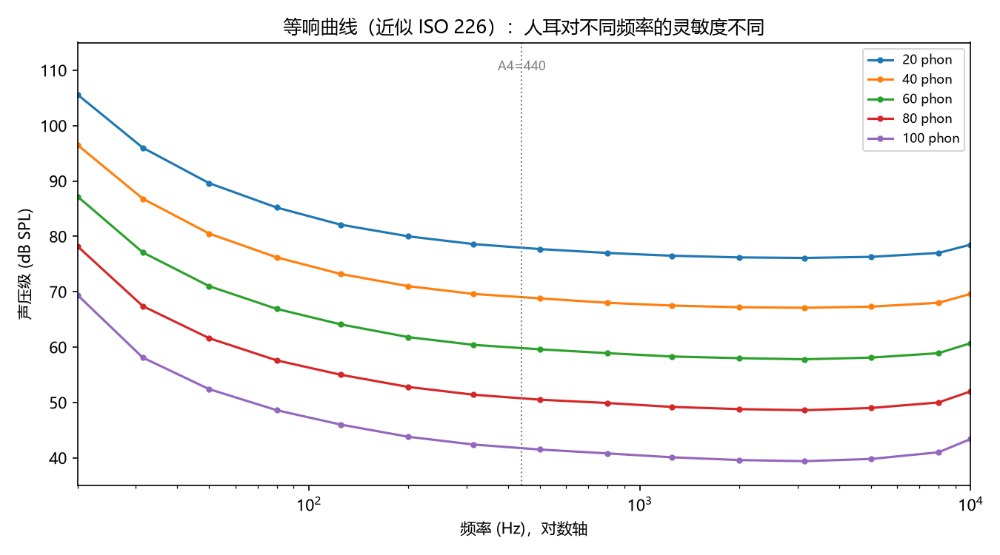
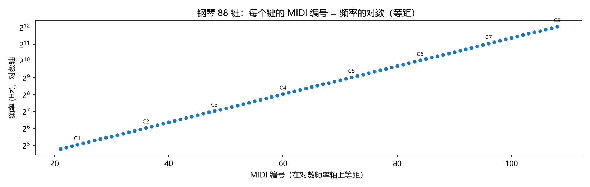
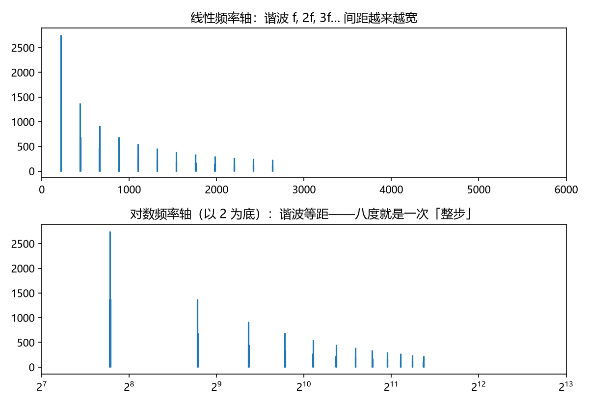

# 对数频率轴：音乐的天然坐标
> ⬆ [上一章：傅里叶变换：音色 = 频谱](02-fourier-and-timbre.md)

Ch1、Ch2 证明了"一个音 = 基频 + 谐波谱"，但我们还在用**赫兹**这种线性刻度思考音乐。本章给出全书视角的转折：**音乐不是在频率的线性轴上展开的，而是在对数频率轴上展开的。** 八度翻倍"听感相同"，音程是"比值"而非"差值"，音名是对数轴的刻度——一切都在提示：$\log f$ 才是音乐的天然坐标。

## 人耳为什么按比例感知频率

把一段音乐整体频率翻倍（八度上移），我们觉得它"还是那首歌，只是更高了"；翻倍再翻倍（再上八度）还是如此。这种**平移不变性**在频率的线性轴上完全看不出来——220 Hz 到 440 Hz 差了 220 Hz，440 Hz 到 880 Hz 差了 440 Hz，两个"间距"差了整整一倍；可在对数轴上它们一样长：

$$\log_2(440/220) = \log_2(880/440) = 1 \quad (\text{一个八度}).$$

这是心理物理学的一条普遍规律：**对强度、频率这类物理量，主观感受近似与其对数成正比**（韦伯—费希纳定律；更精确的现代说法是 Stevens 幂律，见尾声）。频率轴的"正确"画法是取对数，于是：

$$c = 1200\,\log_2\left(\frac{f_2}{f_1}\right).$$

单位取"音分"（cents）：平均律一个半音恰为 100 音分，一个八度 1200 音分。**乘法（频率比）在对数轴上变成加法（音分差）**——这是本书最重要的一句话。

等响曲线（下图，`demo_03` 生成）是这条心理物理规律的另一个投影：同一响度级（phon）在不同频率下需要不同的声压级——人耳对约 3–4 kHz 最灵敏、对低频与极高频最不灵敏。它说明"主观感受是频率的函数"，正与"频率用对数轴标度"共享同一生理依据：

> **乐理小注**：对照 `keywords.md` 第一讲「音域与音区」。教材说音域就是一个人或一件乐器"能唱/能发的音的范围"——在对数轴上，这就是**可用频率区间**。中央 C 到钢琴最低音 A0 是 4 个多八度（约 27.5–261.6 Hz），A0 的频率只是中央 C 的约 $2^{-3.25}$ 倍，但听感上是"同一族"的音。所谓"同一族"，指的是**每隔一个八度（×2）就回到同一个音名**：C4、C3、C2 频率差了很多倍，却都叫"C"，听上去"是同一个音，只是高低不同"。这就是下面要讲的八度算子 $\mathcal{O}: f\mapsto 2f$ 的轨道。

## 音名、音组与八度算子

八度对应频率比 $2:1$。定义**八度算子**

$$\mathcal{O}: f \longmapsto 2f,$$

音乐记谱的"音名 + 音组"就是这算子的轨道标签：**半音**（semitone）是音名之间的最小步——平均律下恰好 100 音分；一个八度内有 **12 个半音**，于是有 12 个音名。它们按固定顺序循环：C, C♯, D, D♯, E, F, F♯, G, G♯, A, A♯, B——其中♯读作"升号"，表示把某个音升高一个半音（比如 C♯ 就是"比 C 高半音的那个音"，Ch7 会正式讨论它）。这里有个常见的阅读障碍：C 和 B 之间只有半音（没有 C♭/B♯ 这个位置），E–F 同理，所以白键不是均匀分布的——这张表就是全部 12 个音名：

| 半音序号 | 0 | 1 | 2 | 3 | 4 | 5 | 6 | 7 | 8 | 9 | 10 | 11 |
|---|---|---|---|---|---|---|---|---|---|---|---|---|
| 音名 | C | C♯/D♭ | D | D♯/E♭ | E | F | F♯/G♭ | G | G♯/A♭ | A | A♯/B♭ | B |
| 距 C 的音分 | 0 | 100 | 200 | 300 | 400 | 500 | 600 | 700 | 800 | 900 | 1000 | 1100 |

> 注：♯=升半音、♭=降半音。每个黑键有两个名字（如 C♯ 与 D♭ 是同一个键），这叫**等音**，Ch8 展开。

唱名"do re mi fa sol la si（ti）"就是大调音阶的前七个音，落到音名上是固定的对应关系（以 C 大调为例）：

| 唱名 | do | re | mi | fa | sol | la | si |
|---|---|---|---|---|---|---|---|
| 音名 | C | D | E | F | G | A | B |
| 半音序号 | 0 | 2 | 4 | 5 | 7 | 9 | 11 |

> 中文语境常用"宫商角徵羽"对应五声音阶，见 Ch11；这里先把唱名 ↔ 音名这对最常用的映射钉死，后面讲音阶、调式（Ch11–12）直接引用。

**度数**（音名序列里的"第几个"）与**音数**（半音数）是两个常被混淆的尺子，先在这里给一次定义，Ch8 会展开成完整的音程理论：C→E 是两个音名之间"数过 3 个音名"（C、D、E），所以叫**三度**，但它包含 4 个半音——"三度"是度数，"4 个半音"是音数。一句话：**度数数音名，音数数半音。**

八度序号记作**音组**（C0, C1, …, C4, …, C8）。中央 C 写作 C4，频率约定为

$$f_{\mathrm{C4}} = 261.63\,\mathrm{Hz}.$$

> **乐理小注**：教材第一讲说"音名是音的高度名称，音组是八度的分组"。对照 `keywords.md` 第一讲「音名与音组」——音名 = 对数轴上的格点标签，音组 = 第几个八度。一个八度内 12 个音的来源要到 Ch6（十二平均律）才给出数学论证。

一张钢琴键盘图把"音名 + 音组 + 对数等距"一次性看清楚——88 键从 A0 到 C8 在对数轴上等距排列（`demo_03` 生成）：

**标准音 A4 = 440 Hz 是约定，不是物理常数。** 它是 1939 年国际标准化的结果；历史上 A415（巴洛克）、A430、A440 长期并存，文艺复兴到古典时期音高并不统一。

> **为什么要标准音，却更常提中央音 C4？** 两者的角色不同。**A4=440 Hz 是"调音的基准零点"**——乐团对音、键盘出厂都从 A4 开始；**C4=中央 C 是"记谱与叙述的中央参照"**——五线谱的谱号、人体嗓音的中部、音域的坐标轴都以 C4 为原点。一个负责"定标"，一个负责"定位"：没有 A4 大家都对不上弦，没有 C4 讨论"高音/低音"就没有了中间点。这两者并不矛盾，就像"米原器"（基准）与"我身高 1.7 米"（参照）可以并存。

> **乐理小注**：教材第二讲讲"标准音"。请务必把 A4=440 Hz 当作**坐标系的零点刻度**而非自然规律——这与你把米当作长度单位是同一回事。对照 `keywords.md` 第二讲「标准音和中央 C」。

## MIDI 编号：把对数轴变成整数刻度

把对数轴离散化：每个**半音**占一格（一格 = 100 音分，平均律下频率比为 $2^{1/12}\approx1.0595$）。MIDI 标准正是如此——它给每个半音一个整数编号 $m$（中央 C = 60，标准音 A4 = 69，往下/往上递增），编号 $m$ 与频率的关系就是"每加 12，频率翻倍"的对数刻度：

$$m = 69 + 12\log_2\!\left(\frac{f}{440}\right),
\qquad f = 440 \cdot 2^{(m-69)/12}.$$

下图把三种刻度放在一起对比——同一组谐波 220/440/660/880 Hz，在**线性**轴上间距越来越宽、在**对数**轴（音分/MIDI）上等距，这正是"谐波构成一个泛音族"的几何原因（`demo_03` 生成）：

C4 = MIDI 60，A4 = MIDI 69。`demo_03 --print-tables` 输出标准 MIDI ↔ 频率表，正文所有数值以它为准：

| MIDI | 音名 | 频率 (Hz) |
|---|---|---|
| 21 | A0 | 27.500 |
| 24 | C1 | 32.703 |
| 36 | C2 | 65.406 |
| 48 | C3 | 130.813 |
| 60 | C4 | 261.626 |
| 69 | A4 | 440.000 |
| 72 | C5 | 523.251 |
| 84 | C6 | 1046.502 |
| 96 | C7 | 2093.005 |
| 108 | C8 | 4186.009 |

注意对数值的整齐：**MIDI 编号每 +12，频率翻倍**。

这里有一个值得对照的**两种表述**：音分公式说"**音分每 +1200，频率翻倍**"（$c=1200\log_2(f_2/f_1)$），MIDI 公式说"**编号每 +12，频率翻倍**"（$m=69+12\log_2(f/440)$）。它们说的是同一件事，只是单位刻度不同：MIDI 一格 = 1 个半音 = 100 音分，所以 1200 音分 = 12 个 MIDI 号 = 1 个八度。以后看到"+100 音分"与"+1 个 MIDI 号"要立刻认成同一个量——一个用于**音程**的描述，一个用于**音符**的编号。

## 埋一个伏笔：一个音名，几个频率？

把对数轴想成一张白纸。现代音乐的习惯是：先在纸上画好 12 条等距的线（十二平均律），每条线钉死一个音名——所以"音名对应一个频率"看起来天经地义。

但这只是我们选的画法。到 Ch4 你会看到：纯律要求同一个 D 在不同和弦里用两个不同的频率（9:8 和 10:9），那时"音名 → 频率"这张表就不再是函数了。

平均律用每处约 2 音分的妥协，换来"每个音名只有一个频率"的简洁与自由移调。为什么偏偏这么画——这是 Part II 的全部主题。

> 一句话记住：**对数轴是音乐的"底图"，十二平均律是画在上面的格点**；格点凭什么这么画，是全书 Part II 的主题。

## 练习

**选择题**（答案见 [练习答案](answers.md#ch03)）：

1. 人耳大致按什么方式感知频率？
   - A. 差值　B. 比例　C. 乘积　D. 平方
2. 一个八度等于多少音分？
   - A. 100　B. 600　C. 1200　D. 2400
3. A4=440 Hz 是什么？
   - A. 物理常数　B. 历史约定　C. 数学推导的结果　D. 人耳决定的
4. C4 的 MIDI 编号是多少？
   - A. 48　B. 60　C. 69　D. 72
5. 平均律下一个半音等于多少音分？
   - A. 100　B. 90.22　C. 111.73　D. 50

**问答题**：

1. 为什么说"对数频率轴是音乐的天然坐标"？音程、移调、转调分别对应什么几何操作？
2. A4（标准音）与 C4（中央 C）的角色有何不同？
3. 为什么平均律能保证"一个音名一个频率"，纯律做不到？

> 答案见 [练习答案](answers.md#ch03)。

## 本章小结

- 听觉近似按比例感知频率 ⟹ 对数频率轴是音乐的天然坐标。
- 音分 $c = 1200\log_2(f_2/f_1)$：乘法变加法。
- 八度算子 $f\mapsto 2f$；音名/音组是对数轴的格点标签。
- A4=440 Hz 是历史约定，非物理常数。
- 平均律保证"一个音名一个频率"；纯律做不到——伏笔留给 Ch4。

### 乐理 ↔ 频率 对照表（第 3 章）

| 乐理术语 | 频率语言 | 数值/公式 | 讲次 |
|---|---|---|---|
| 八度 | 频率比 $2:1$ | $\mathcal{O}:f\mapsto 2f$ | 第一讲 |
| 音分 | 对数频率差 | $c=1200\log_2(f_2/f_1)$ | — |
| 音名 / 音组 | 对数轴格点 / 八度序号 | C4 = MIDI 60 | 第一讲 |
| 中央 C / 标准音 | 约定刻度 | C4=261.63 Hz, A4=440 Hz | 第二讲 |
| 音域 / 音区 | 对数频率区间 | 例：A0 27.5 Hz – C8 4186 Hz | 第一讲 |

**动画**：把"同一段旋律，画在线性轴 vs 对数轴"放一起，直观看到"同样的音程，线性轴不等距、对数轴等距"：

<video controls src="animations/media/videos/ch03_log_frequency/720p30/LogFrequency.mp4"></video>

**复现**：以上图片与动画分别由 `demos/demo_03_log_axis.py`（线性 vs 对数、钢琴 88 键、等响曲线）与 `animations/scenes/ch03_log_frequency.py` 生成。

---

**下一章** → [纯律：小整数比与谐波重合](04-just-intonation.md)
