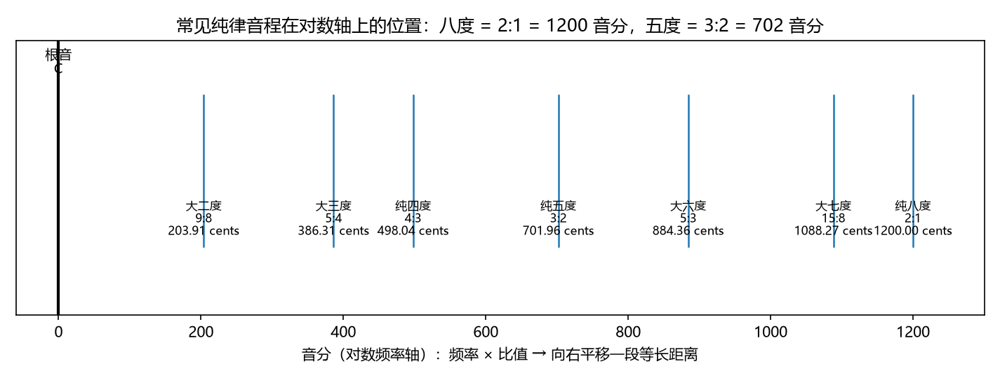
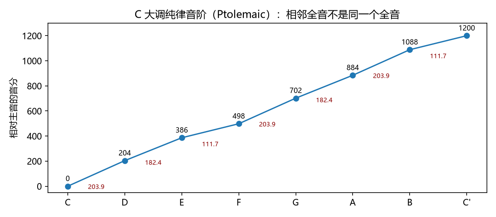
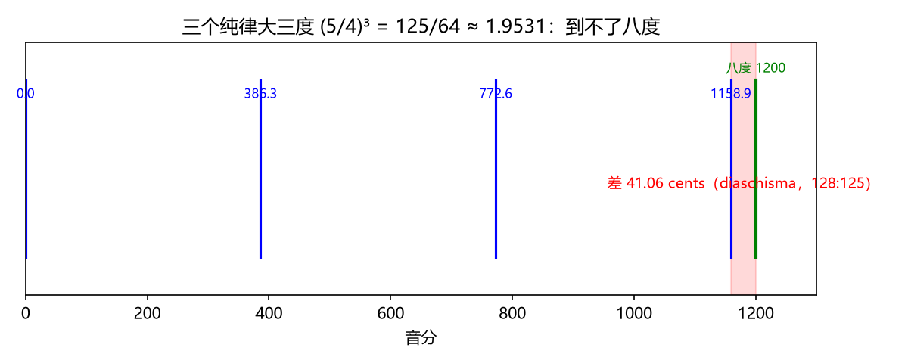
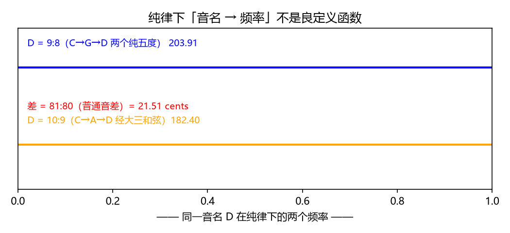

# 纯律：小整数比与谐波重合
> ⬆ [上一章：对数频率轴：音乐的天然坐标](03-log-frequency-axis.md)

从 Ch2 我们知道一个乐音是一串谐波 $f_1, 2f_1, 3f_1,\dots$。如果两个音**同时**响，它们各自的谐波会互相穿插。设想频率比 $f_2:f_1 = a:b$（约分后）：那么音 1 的第 $a$ 个谐波恰好等于音 2 的第 $b$ 个谐波——两个音的泛音在这里**重合**。

"序数"就是"第几次谐波"：比如 $3:2$ 意味着音 1 的第 3 次谐波和音 2 的第 2 次谐波恰好同一个频率。前面 Ch1 说过，**序数越小的谐波通常越强**——基频（第 1 次）最强，越往上越弱。所以重合发生在越低的序数，参与重合的两个谐波就越响、越能被耳朵抓住，两个音听起来就越**融合**（这个直觉在 Ch9 会定量化）。举两个例子：八度 $2:1$ 让音 2 的基频（第 1 次谐波，最强）和音 1 的第 2 次谐波完全重合，所以八度是最"空灵统一"的音程；纯五度 $3:2$ 用第 3 次与第 2 次谐波重合，仅次于八度，所以五度也极其融合。**纯律（just intonation）就是在所有可能的比值里，挑选这些 $a, b$ 都尽量小的比值**——它把"融合"这个听感目标翻译成了"整数尽量小"的数学条件：

| 音程 | 频率比 $a:b$ | 音分 | 重合的谐波（序数） |
|---|---|---|---|
| 纯八度 | $2:1$ | 1200.00 | 音1 第 2 谐波 = 音2 第 1 谐波 |
| 纯五度 | $3:2$ | 701.96 | 第 3 = 第 2 |
| 纯四度 | $4:3$ | 498.04 | 第 4 = 第 3 |
| 大三度 | $5:4$ | 386.31 | 第 5 = 第 4 |
| 大六度 | $5:3$ | 884.36 | 第 5 = 第 3 |
| 大二度 | $9:8$ | 203.91 | 第 9 = 第 8 |
| 大七度 | $15:8$ | 1088.27 | 第 15 = 第 8 |

注意规律：$2:1$ 完全重合（同一音），$3:2$、$4:3$ 用第 3、4 谐波，$5:4$、$5:3$ 用到第 5 谐波；比值数字越大，重合的谐波越高、越弱，融合感越差——这为 Ch9 的协和/不协和定量理论埋下伏笔。

把这些音程画到对数轴上（Ch3 的底图），每个音程就是根音右边一段**等长距离**——乘法变成平移，倍频关系一目了然：八度 $2:1$ 正好是 1200 音分，纯五度 $3:2$ 是 702 音分，纯四度 $4:3$ 是 498 音分……（`demo_04` 生成）：

> **乐理小注**：对照 `keywords.md` 第二讲「纯律」。教材说纯律"以复合音的分音为基础"，用最简单的整数比构成音阶——上面那张表就是这句话的完整形式。**音程 = 频率比**（Ch8 会正式建立这个等式）。

### 为什么用纯律：从哪来、用在哪、哪些名曲

纯律不是书斋里的发明，而是**无伴奏人声与弦乐的自然倾向**。人声没有键盘的物理约束，演唱者会下意识往"谐波完全对齐"的方向走音——这正是纯律。所以它常见于：

- **无伴奏合唱**（a cappella）与教堂合唱团：唱到长音时，人声会自然修正为纯律的大三度与小三度；
- **弦乐四重奏**等弓弦乐器：弓可以随时微调音高，演奏纯律是常态而非特例（小提琴大师常用纯律指法）；
- **文艺复兴声乐**（帕莱斯特里纳、若斯坎）与**巴洛克早期器乐**：写作建立在纯律/不等分律制上，和声的"准"由人声与提琴当场调整；
- 反过来，**管风琴、羽管键琴、钢琴**这类固定音高乐器反而用不了纯律——因为它们做不到"同一个 D 按上下文变频率"，这正埋下后文"纯律整体不自洽"的伏笔。

一句话：**纯律是最"自然"的音律，但只适合能自由微调音高的人声与弦乐；键盘等固定音高乐器必须另想办法。** 本章讲它的"好"，Ch5–7 讲"好"为什么拼不成一个能用的系统。

## 预备：和弦 = 同时响的一组频率比

下文要用到"和弦"这个词，先把它钉死。**和弦**（chord）就是几个音**同时响**组成的一组频率。每个和弦有一个**根音**（root，和弦名字的来源，通常是最低音），其余的音按"根音往上多少音程"来称呼：**三音**是根音上方三度的音，**五音**是根音上方五度的音。

- **大三和弦** = 根音、三音、五音，频率比恰为 $4:5:6$（根音:三音:五音）。例：**C 大三和弦** = C、E、G = 261.63 : 327.03 : 392.44 Hz。
- **小三和弦** = 根音、小三度、纯五度，频率比 $10:12:15$。例：**D 小三和弦** = D、F、A。

记住这两个就够了：后面"证据二"的 D 二义性、Ch10 的和弦理论都会用它们。根音/三音/五音三个词，以后每个和弦都这么拆。

## C 大调纯律音阶

选一个主音（C），把上面"最漂亮"的七个比值依次叠上去，得到 Ptolemaic 纯律大调音阶：

| 音级 | C | D | E | F | G | A | B | C' |
|---|---|---|---|---|---|---|---|---|
| 频率比 | 1 | 9:8 | 5:4 | 4:3 | 3:2 | 5:3 | 15:8 | 2 |
| 音分 | 0.00 | 203.91 | 386.31 | 498.04 | 701.96 | 884.36 | 1088.27 | 1200.00 |

（数值来自 `demos/demo_04_just_intonation.py --print-tables`；下图是音分阶梯图，每级标出实际步长。）

每个音程都是小整数比，单看任何一个都完美。但把这七个音连起来看，立刻出现第一个问题：**相邻全音不是一个全音**。图上每级阶梯标出了步长：

- C→D = 9:8 = **203.91 音分**（大全音）
- D→E = 10:9 = **182.40 音分**（小全音）

"全音"这个名称掩盖了两个不同的音程。教材（对照 `keywords.md` 第二讲「自然全音、变化全音」）把 9:8 与 10:9 分别记作**自然全音**与**变化全音**——它们是纯律的两种"一步"。

> **乐理小注**：对照 `keywords.md` 第二讲「自然全音、变化全音」。两套"全音/半音"的名字来自记谱语义，不来自频率。**自然全音/自然半音**指"相邻音级之间"（在音名意义上），**变化全音/变化半音**指"同一音级的升降变化"（C 与 #C 之间）。把"相邻"还是"变化"当作**度数描述**，把 9:8、10:9、16:15、25:24 当作**数值描述**——它们不是同一把尺子。详见 Ch7。

## 半音也有两种

纯律的"半步"同样分裂成两个：

- E→F = 4:3 ÷ 5:4 = 16:15 = **111.73 音分**（自然半音）
- C→#C = 25:24 = **70.67 音分**（变化半音）

连同前面两种全音，纯律一个八度里就有**四种"步"**。

什么叫"纯律对单音程局部最优"？意思是：**任何单个音程，纯律都给到了它最准的频率**——$3:2$ 让五度谐波完全重合，$5:4$ 让三度也完全重合，单独弹任何一个都是"最准的"。问题在于这些"局部最优"**彼此冲突**：9:8 和 10:9 都叫"全音"，却差了 21.51 音分。把互相冲突的步塞进同一个八度，整体就拼不拢——这就是纯律"每一处都完美、整体却不自洽"的代价，下面三个证据就是它的三个侧面。

## 三个独立的不自洽证据

为什么说纯律"整体不自洽"？演示三件事：

**证据一：三个大三度到不了八度。** 大三度是 5:4，连叠三个：

$$(5/4)^3 = 125/64 = 1.9531 < 2,$$

只有 1158.94 音分，离八度还差 **41.06 音分**（128:125，称为 diaschisma）。沿着三度链走，音越走越高，永远回不到起点：

**证据二：同一个音名有两个合法频率。** 音名 D 在纯律里没有唯一频率。先交代两个词：**"级"**就是音阶里的第几个音——C 大调音阶 C D E F G A B 里，C 是第一级、D 是第二级、E 是第三级……；**为什么总绕不开纯五度**？因为五度 $3:2$ 是仅次于八度的最融合音程（上面表格第 3 = 第 2 谐波重合），人声与弦乐最自然地朝它走，所以"加五度"成为构建音阶的首选步。于是同一个 D 有两条合法路线：

- **路径一：D 是 G 大三和弦的五音。** G 大三和弦 = G–B–D，D 是它的五音。先由 C→G 上纯五度（$3:2$），再由 G→D 上纯五度，折回一个八度：D $= (3/2)^2/2 = 9:8 =$ **203.91 音分**（C 大调第二级走的是这条路）。
- **路径二：D 是 D 小三和弦的根音。** D 小三和弦 = D–F–A，A 是它的纯五度。先由 C→A 上大六度（$5:3$）得到 A，再取 A 下方纯五度（除以 $3:2$）：D $= (5/3)\div(3/2) = 10:9 =$ **182.40 音分**。

两条路径都"合法"，得到的 D 却不同——这就是**普通音差**（syntonic comma）**81:80 = 21.51 音分**（下图上两条线，差一截）：

于是"音名 → 频率"在纯律下不是函数：同一个 D，旋律走到哪条路线上，频率就得跟着变。同一根 C 持续音上，先奏 $9:8$ 的 D 再奏 $10:9$ 的 D（这轨 wav 前半段 1 秒是 9:8、后半段是 10:9），21.51 音分——约一个半音的 1/5——的落差可以清楚听出来。无伴奏合唱里"看似跑调、实则微调"的分寸，就藏在这个音差里：

- D = 9:8 → D = 10:9（同一 C 上先后奏出）：
  <audio controls src="demos/audio/04_d_ambiguity.wav"></audio>
为 C 大调调音的键盘只能固定其中一个，遇到需要另一个 D 的乐句就会"跑调"——这是纯律"一个音名多个频率"在乐器上无法回避的代价。

**证据三：12 音的纯律格不能整体移调。** 先说清**"12 音全系统"**指什么：把 Ch3 那 12 个半音（C, C♯, D, …, B）**每一格都固定一个频率**的整套设定。平均律给 12 格各配一个频率（Ch6 的十二平均律）；纯律只"配得好"其中 7 格（C 大调音阶的 C D E F G A B），剩下 5 格甚至没有统一频率——回到证据二，光是 D 一个音就有两个候选。

大调音阶本身作为一条比值序列是可以平移的（把每个音乘同一个数，比值不变）——但纯律的 12 音全系统不行：既然同名音有多个频率，把整个键盘"搬"到新调，就必须为新调的每个音重新决定它该取哪个频率——而且新的选择会和旧调冲突（证据二的两个 D 就是活例子）。这就是为什么历史上纯律键盘只能为一两个调调音，转调就要换琴；很多古键盘乐器就此"锁死"在有限的几个调上。

## 局部与整体：纯律的平均律对比

纯律的"好"是局部的。`demo_04` 生成两个 C 大三和弦，先听再谈理论（两轨都只含前 4 次谐波）：

- 纯律（4:5:6，E=327.03 Hz）：
  <audio controls src="demos/audio/04_triad_just.wav"></audio>
- 平均律（E=329.63 Hz，三度高 13.69 音分）：
  <audio controls src="demos/audio/04_triad_et.wav"></audio>
| | C | E | G |
|---|---|---|---|
| 纯律（4:5:6） | 261.63 Hz | 327.03 Hz | 392.44 Hz |
| 平均律 | 261.63 Hz | 329.63 Hz | 392.00 Hz |

纯律的 E 与 G 让 5 谐波、2 谐波与泛音完全对齐；平均律把 E 抬高 13.69 音分（329.63 对 327.03）、把 G 压低 1.96 音分。单独弹纯律和弦，音准无懈可击；平均律和弦能感觉到 E 略"紧"。但 Ch6 将证明：**就是这 13.69 音分的让步，买来了全 12 调的完全一致与自由移调。**

## 练习

**选择题**（答案见 [练习答案](answers.md#ch04)）：

1. 纯律大三度等于哪个频率比？
   - A. 5:4　B. 4:3　C. 3:2　D. 81:64
2. 普通音差等于多少？
   - A. 21.51 音分　B. 23.46 音分　C. 41.06 音分　D. 27.26 音分
3. Ptolemaic 大调音阶中 C–D 的全音等于多少？
   - A. 9:8（203.91c）　B. 10:9（182.40c）　C. 16:15　D. 5:4
4. 三个大三度（5:4）叠起来比两个八度差多少？
   - A. 21.51 音分　B. 23.46 音分　C. 41.06 音分　D. 1.96 音分
5. 纯律 12 音系统为什么不能整体移调？
   - A. 格子太密　B. 整套网格不自洽　C. 频率太高　D. 谐波太多

**问答题**：

1. 为什么说纯律是"单音程局部最优"？它付出的整体代价是什么？
2. 大三和弦 4:5:6 里，E 的 5 谐波与 C 的 4 谐波重合意味着什么？
3. 同一个 D：C→G→D 与 C→A→D 两条路径为什么算出差 21.51 音分的两个 D？

> 答案见 [练习答案](answers.md#ch04)。

## 本章小结

- 纯律 = 挑选小整数比音程，让两音谐波大量重合。
- Ptolemaic 大调音阶：1, 9:8, 5:4, 4:3, 3:2, 5:3, 15:8。
- 两种全音（9:8 与 10:9）、两种半音（16:15 与 25:24）——"步"不统一。
- 三个不自洽证据：三度不闭合（41.06c）、同名音二义性（21.51c）、12 音系统不可整体移调。

### 乐理 ↔ 频率 对照表（第 4 章）

| 乐理术语 | 频率语言 | 数值/公式 | 讲次 |
|---|---|---|---|
| 纯律 | 小整数比音程体系 | 大三 5:4、纯五 3:2… | 第二讲 |
| 自然全音 / 变化全音 | 大全音 9:8 / 小全音 10:9 | 203.91c / 182.40c | 第二讲 |
| 自然半音 / 变化半音 | 16:15 / 25:24 | 111.73c / 70.67c | 第二讲 |
| 普通音差 | 81:80 | 21.51c | — |
| （三度不闭合） | 125:64 ≠ 2 | 差 41.06c | — |

**动画**：纯律用五度（×3/2）与三度（×5/4）两个"步"张成二维网格——沿五度链连走四次得到 E=81:64，与直接取三度得到的 E=5:4 相差普通音差 81:80=21.51c（证据二"同名音有两个频率"的画面版）：

<video controls src="animations/media/videos/ch04_just_intonation/720p30/JustIntonation.mp4"></video>

**复现**：以上图片、音频与动画分别由 `demos/demo_04_just_intonation.py` 与 `animations/scenes/ch04_just_intonation.py` 生成。

---

**下一章** → [五度相生律：3/2 的幂链](05-pythagorean-tuning.md)
