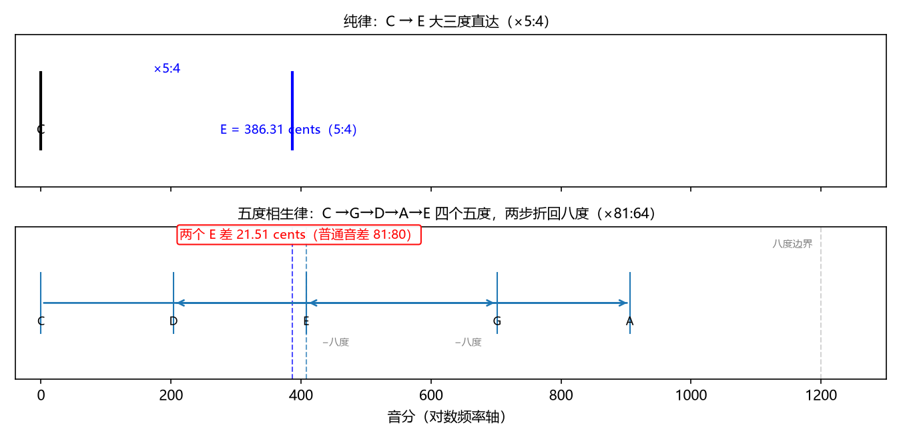
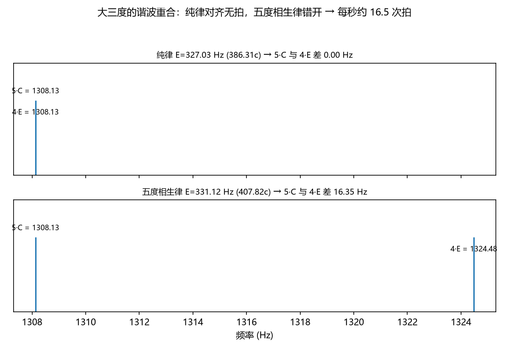
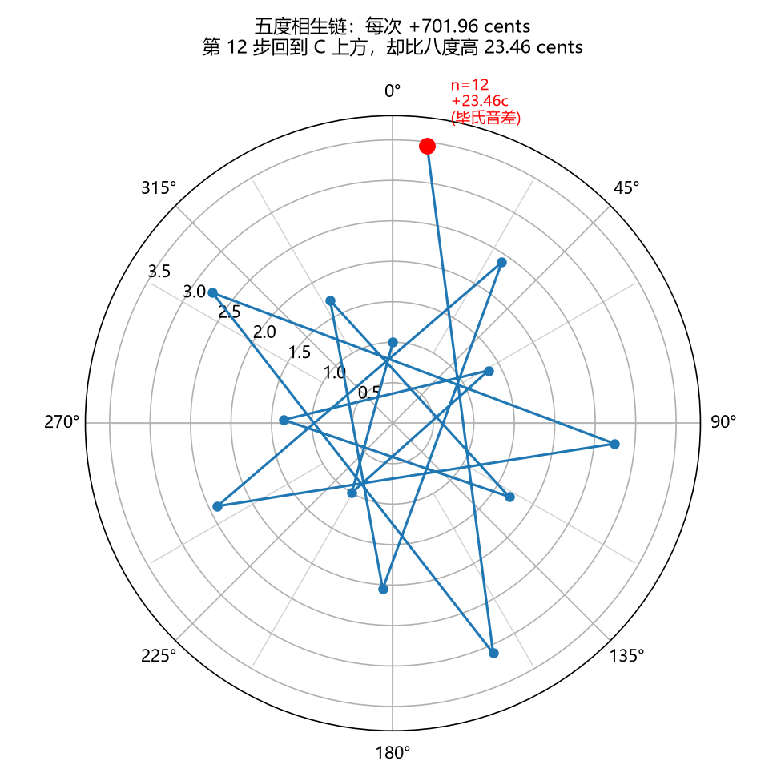
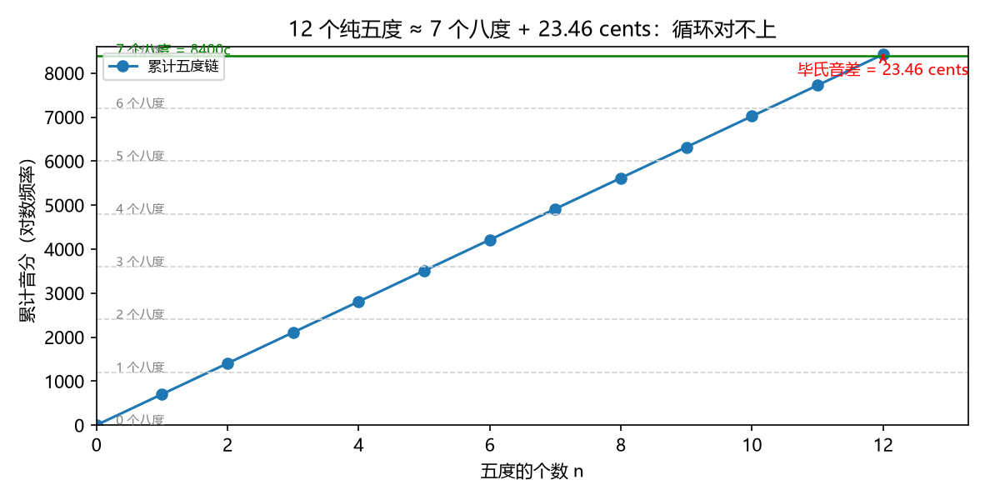

# 五度相生律：3/2 的幂链
> ⬆ [上一章：纯律：小整数比与谐波重合](04-just-intonation.md)

纯律选了"每个音程都小整数比"，结果整体拼不拢。另一种思路：**只认一个音程，其余全部由它生成**。毕达哥拉斯学派挑的是纯五度 3:2——除八度外最小的整数比，也是谐波重合最多（第 3 谐波对第 2 谐波）的非八度音程。从任一音出发，反复"×3/2、再折叠回八度"，就得到一串音：

$$f,\quad \frac32 f,\quad \left(\frac32\right)^2 f,\quad \dots,$$

每一步折叠：超过八度就除以 2。展开到对数轴（音分）上更清楚，五度相生律就是

$$n\ \text{个五度} \longmapsto n \times 701.955\ \text{音分} \pmod{1200}.$$

> **乐理小注**：对照 `keywords.md` 第二讲「五度相生律」。教材说五度相生律"以纯五度为基础，向上或向下连续产生各音"——"向上"= 每次乘 3/2，折叠回八度是那个 $\bmod 1200$。教材还给出同名的**自然半音**（256:243）与**变化半音**（2187:2048），下面会分别从五度链里读出它们。

## 从五度链长出大调音阶

七个音分别取"离 C 最近的几个五度"（教科书惯例：C=0，上行取 D、E、B、A、G 的 +2、+4、+5、+3、+1 个五度，下行取 F 的 −1 个五度），得到与纯律音名相同的七声音阶，数值却不同：

| 音级 | C | D | E | F | G | A | B |
|---|---|---|---|---|---|---|---|
| 五度链位置 | 0 | +2 | +4 | −1 | +1 | +3 | +5 |
| 音分 | 0.00 | 203.91 | 407.82 | 498.04 | 701.96 | 905.87 | 1109.78 |

与纯律表逐格对比（`demo_05 --print-tables`）：

- D、F、G 与纯律**完全相同**（203.91 / 498.04 / 701.96）——纯五度 3:2 是两家共同的地基；
- **E 变成 81:64 = 407.82 音分**，比纯律 386.31 高 **21.51 音分**（= 普通音差）——这是五度相生律对三度的"牺牲"：E 是从 C 走四个五度得到的 $81:64 = 1.2656$，而纯律要的是 $5:4 = 1.25$；
- A、B 也各有 21.51 音分的偏差。

同一根 C 上，两种 E 各听一遍——纯律的 E 与 C 谐波对齐、安静；五度相生律的 E 偏高，和 C 叠在一起会"嗡嗡"地抖（拍频）：

- 纯律大三度（E=327.03 Hz，无拍）：<audio controls src="demos/audio/05_third_just.wav"></audio>
- 五度相生律大三度（E=331.12 Hz，偏高 21.51c）：<audio controls src="demos/audio/05_third_pyth.wav"></audio>

两条路线画到同一根音分轴上，差异一目了然（`demo_05` 生成）：上面是纯律的直达箭头（×5:4），下面是五度链 C→G→D→A→E（两步越过八度边界、折叠回来），两个 E 之间那截红线就是 21.51 音分：

> **乐理小注**：教材第二讲在讲音律前先讲"复合音与分音列"——请对比这两种求 E 的方式：纯律让 E 的 5 谐波与 C 的 4 谐波重合（Ch4），五度相生律让 E 走"四个五度"的链（C→G→D→A→E）。**纯律对齐频谱，五度相生律对齐比例链**——这是两种世界观的分歧点。

## 听出来的差别：大三度在"打架"

E 的差别不是纸面上的——上面两轨音频已经听出差别。`demo_05` 的纯律 E = 327.03 Hz，五度相生律的 E = 331.12 Hz。两音叠加时，C 的第 5 谐波（$5\times261.63=1308.1$ Hz）与 E 的第 4 谐波（$4\times331.12=1324.5$ Hz）错开，产生每秒 $|1308.1-1324.5|\approx 16.4$ 次的拍（下图两行频谱：上行纯律对齐无拍，下行五度错开 16.35 Hz）：

**什么是"粗糙/紧张"？** 拍频低（每秒几次）时我们听到"呜——呜"的起伏，还算柔和；但当两音分得再开些、拍频升到每秒 20 次上下，耳朵就再也分辨不出"起伏"，只感到刺耳的"沙沙"抖动——这就是**粗糙感**（roughness），听感是"紧张、不干净"。对照第 2 章 440 与 442 Hz（拍频 2 Hz，柔和），这里 16 Hz 的拍已经偏向紧张。**16 Hz 的拍正是"粗糙/紧张"的源头**——Ch9 会用 Plomp–Levelt 曲线给这句话定量。

## 毕氏音差：循环对不上

五度相生律的致命问题在**循环处**：前面说"反复加五度就能回到同名音"，可回到的真的是起点吗？

先交代"12 个五度"和"7 个八度"这两个数从哪来。**12 个五度**：五度链每走一步都落在一个新的音级上，走 12 步恰好把 12 个音级（Ch3 的音名表）各走一遍、回到 C——这是"五度圈"最早的观测，Ch12 会正式展开。**7 个八度**：每个五度 701.955 音分，12 个共 $12\times701.955=8423.46$ 音分；一个八度 1200 音分，$8423.46\div1200=7.02$——所以 12 个五度**约等于** 7 个八度，再多出一点点。

多一点？用频率比看。12 个五度是 $(3/2)^{12}$，7 个八度是 $2^7$，两者之比（"12 个五度 ÷ 7 个八度"）：

$$\frac{(3/2)^{12}}{2^7} = \frac{531441}{524288} = 1.01364.$$

也就是说，**12 个五度 = 7 个八度 × 1.01364**——比整整 7 个八度高出 1.4%。换成音分（每个八度 1200 音分）：

$$12 \times 701.955 - 7 \times 1200 = \mathbf{23.46}\ \text{音分}.$$

这 23.46 音分就是**毕氏音差**（Pythagorean comma）：五度链走到第 12 步，回不到起点，比起点高了 23.46 音分。两条可视化都能看到这个缺口——螺旋图上，每步 +701.96 音分、沿圆周走 7 格，十二步后回到 C 的方位，却已经比起点高了 7 个八度再**多 23.46 音分**，螺旋不闭合；投影到一维坐标上，五度链每一步都对不上八度格，误差在第 12 步累计到 23.46 音分：

## 狼五度

既然 12 个"五度"里有 11 个是纯的，最后一个就是"还债"的那个。五度链第 12 步的间隔

$$1200 - (11 \times 701.955 \bmod 1200) = \mathbf{678.49}\ \text{音分}$$

比正常五度窄 23.46 音分，听起来怪异刺耳，史称**狼五度**（wolf fifth）。`demo_05` 生成的音频把两种五度连在一起，前 1 秒是纯五度、后 1 秒是狼五度，后半段明显更"刺"：

- 纯五度（C+G，701.96c）→ 狼五度（C + C 上方 678.49c 的音）：<audio controls src="demos/audio/05_wolf_fifth.wav"></audio>

## 两个半音从链中来

教材列出的两种半音也在五度链上有明确位置：

- 相邻音级间的**自然半音** E→F：F 在 −1 个五度（+701.96−1200=−498.04+1200... 折叠回 498.04），E 在 +4 个五度（407.82），差 $4-(-1)=5$ 个五度再折叠，$1200-5\times701.955\bmod1200 = 90.22$ 音分，即 **256:243**；
- 同音级升降的**变化半音** C→#C：#C 在 +7 个五度（113.69 音分，即 **2187:2048**），与 C 差 113.69 音分。

两种半音相差 23.46 音分——正好又是一个毕氏音差。**五度相生律里所有"差一点"都出自同一个源头：12 次 3:2 不等于 7 次 2:1。**

## 练习

**选择题**（答案见 [练习答案](answers.md#ch05)）：

1. 毕氏音差等于多少？
   - A. 21.51 音分　B. 23.46 音分　C. 41.06 音分　D. 1.96 音分
2. 狼五度等于多少音分？
   - A. 678.49　B. 700　C. 701.96　D. 702
3. 五度相生律的大三度是哪个比值？
   - A. 5:4　B. 81:64　C. 4:3　D. 10:9
4. "12 个五度 = 7 个八度 × ？"中的倍数是？
   - A. 1　B. 531441/524288　C. 2　D. 81/80
5. 五度相生律对哪种音程绝对忠实？
   - A. 三度　B. 五度　C. 半音　D. 全音

**问答题**：

1. 为什么 12 个五度回不到起点？比 7 个八度高出了多少？
2. 狼五度是怎么产生的？
3. 五度相生律的两种半音各是多少音分？为什么它们不同？

> 答案见 [练习答案](answers.md#ch05)。

## 本章小结

- 五度相生律 = 只认 3:2，其余全部由幂链生成。
- 对五度绝对忠实；对三度牺牲 21.51 音分（81:64 而非 5:4）。
- 毕氏音差 23.46 音分：12 五度 ≠ 7 八度，螺旋不闭合。
- 狼五度 678.49 音分、两种半音（90.22 / 113.69 音分）都来自同一处缺口。

### 乐理 ↔ 频率 对照表（第 5 章）

| 乐理术语 | 频率语言 | 数值/公式 | 讲次 |
|---|---|---|---|
| 五度相生律 | 3/2 幂链 | $n\times701.955 \bmod 1200$ | 第二讲 |
| 相生大三度 | $81:64$ | 407.82c（偏高纯律 21.51c） | 第二讲 |
| 自然半音 | $256:243$ | 90.22c | 第二讲 |
| 变化半音 | $2187:2048$ | 113.69c | 第二讲 |
| 毕氏音差 | $3^{12}/2^{19}$ | 23.46c | — |
| 狼五度 | — | 678.49c（窄 23.46c） | — |

**动画**：五度链在对数轴上一格一格往上跳，看第 12 步如何落不回起点：

<video controls src="animations/media/videos/ch05_pythagorean/720p30/PythagoreanComma.mp4"></video>

**复现**：以上图片、音频与动画分别由 `demos/demo_05_pythagorean.py` 与 `animations/scenes/ch05_pythagorean.py` 生成。

---

**下一章** → [十二平均律：2^(1/12) 与 Z12](06-equal-temperament.md)
