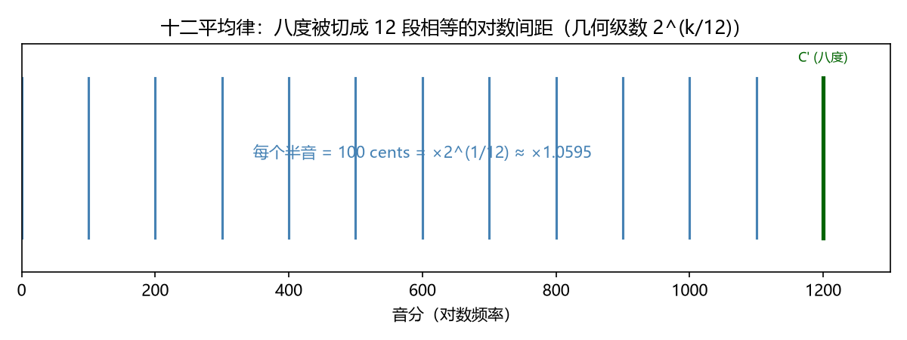
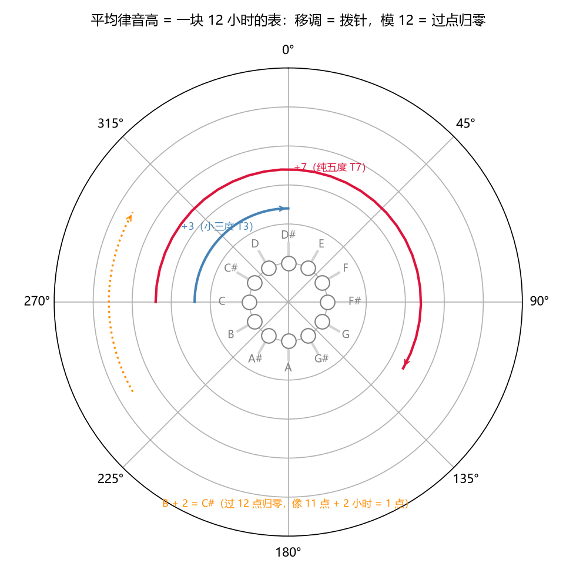
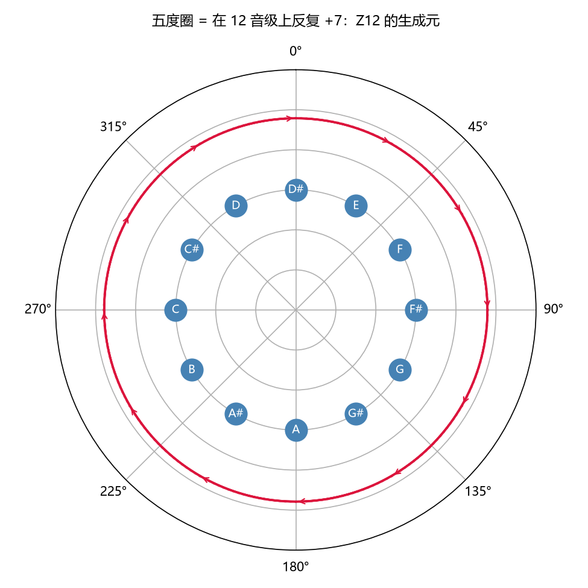
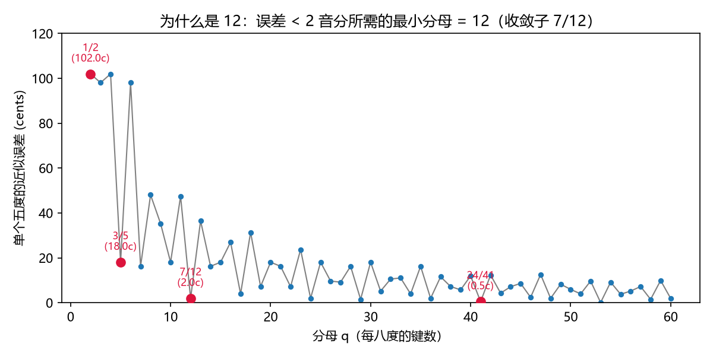

# 十二平均律：$2^{1/12}$ 与 $\mathbb{Z}_{12}$
> ⬆ [上一章：五度相生律：3/2 的幂链](05-pythagorean-tuning.md)

纯律（Ch4）和五度相生律（Ch5）各有各的好与病：纯律对齐频谱却拼不拢，五度相生律五度绝对准却牺牲三度、还留一只狼。有没有一种律制，让**每个音程都不完美、但每个音级都唯一**？答案是等距切开对数轴：**把八度均匀分成 12 份**，每份

$$s = 2^{1/12} = 1.059463,$$

即每个半音恰好 100 音分。这就是**十二平均律**（equal temperament）。`demo_06` 把八度切成 12 段等长的对数间距（下图），并合成一段半音阶，让你直接听 12 步均匀上行：

- 平均律半音阶 C4→C5 均匀上行：<audio controls src="demos/audio/06_chromatic.wav"></audio>

> **乐理小注**：对照 `keywords.md` 第二讲「十二平均律」。教材说它"将一个八度均分为 12 个相等音程"——这句话的精确数学形式就是 $2^{1/12}$ 的几何级数。注意"平均"是指**对数轴上平均**：相邻频率比恒定，频率差并不恒定（400 Hz 到 440 Hz 差 40 Hz，440 Hz 到 484 Hz 差 44 Hz，但对数间距相同）。这是 Ch3 主题的直接应用。

## 用 2 音分的五度，换 12 音的一致

平均律里各音程相对"纯值"的偏差（`demo_06 --print-tables`）：

| 音程 | 纯律/相生值 | 平均律值 | 偏差 |
|---|---|---|---|
| 纯五度 | 701.96 | 700.00 | **−1.96** |
| 大三度 | 386.31 | 400.00 | **+13.69** |
| 纯四度 | 498.04 | 500.00 | **+1.96** |
| 大六度 | 884.36 | 900.00 | **+15.64** |

平均律**主动放弃**了五度的最后 2 音分（700 对 701.96），三度则比纯律高 13.69 音分。代价不小，换来的却是 Ch3 埋伏笔的那句承诺兑现：

> **在平均律里，"音名 → 频率"是良定义函数**：同一个名字（如 D）在任何调里都是同一个频率（相差整八度）。移调、转调、任意和弦都无需重新调音。

## 群结构：$\mathbb{Z}_{12}$ 与移调算子

把 12 个音级（Ch3 那 12 个音名，这里标成数字 $0,1,\dots,11$）摆成一块**表盘**。平均律的全部规则浓缩成一句话：**音高就是表上的刻度，移调就是拨针**——把每个音级同时拨动同一个格数：

$$T_k : x \mapsto x + k \pmod{12}.$$

**什么是"模 12"？** 就是"到 12 自动归零"的算术，跟你平时看钟一模一样：11 点 + 2 小时 = 1 点（而不是 13 点）。音高也这样：B（11）上加一个全音（+2）得到 C♯（1）。之所以能这么拨，正因为平均律把八度等分成 12 格——格与格完全等价，拨到哪儿都一样（下图 `demo_06` 生成）：

这个"表盘上的加法定律"在数学里叫**循环群 $\mathbb{Z}_{12}$**：元素是 12 个音级，运算是"拨格"。它的物理意义很直接——**平均律的世界里，音乐的结构只跟"相对位置"有关、不跟"绝对位置"有关**：同一段旋律搬到任何音高，音程关系都不变（这就是 Ch13 的移调对称性）。这正是纯律做不到的：纯律的"表"格距不等（Ch4 证据二），拨了针音程就变形。

有了表盘，几个常用动作就都是"拨几下"：

- 半音上行 = $T_1$（拨 1 格）；升五度 = $T_7$（拨 7 格，即 7 个半音）；升八度 = $T_{12}=T_0$（拨满一圈回到原处）。
- **移调不变性**（Ch13 的主题）：$T_k$ 保持所有音程关系，因为对任意 $x, y$ 都有 $T_k(x)-T_k(y) \equiv x-y$。这是平均律独有的性质——纯律的移调会改变音程（Ch4 证据三）。
- 五度圈 = 反复施加生成元 $T_7$：每次拨 7 格。这里有个有趣的数学事实：**$\gcd(7,12)=1$**——通俗说，**7 和 12 互素（除了 1 没有公因数），所以每次拨 7 格会一格一格走遍全部 12 个位置，恰好第 12 次回到起点**。若换成一个与 12 有公因数的步长（比如 $T_4$，拨 4 格，$\gcd(4,12)=4$），就只在 3 个位置之间打转，永远走不全。下图就是 $T_7$ 走出的完整五度圈，这是 Ch12 五度循环的代数骨架：

> **乐理小注**：对照 `keywords.md` 第二讲「十二平均律」与第八讲「调的五度循环」。教材讲"调的五度循环"是从听觉与记谱出发的；这里给出它的代数理由：**五度 = 生成元 7，12 与 7 互素 ⟹ 五度链是 12 音级的一个满循环**。平均律让"五度循环"从近似变成精确——循环闭合了（Ch5 里 23.46 音分的缺口被"摊平"到每个五度上，每个只偏 1.96 音分）。

## 为什么偏偏是 12？

这是全书最漂亮的一个问题。要同时近似五度（3:2）与三度（5:4），一个八度应该分成几份？分法太少装不下，太多不实用。把"近似五度"翻译成数学：找一个分母 $q$（每八度的键数）和分子 $p$，使

$$q \times \log_2(3/2) \approx p,$$

即 $p/q \approx 0.58496$。$\log_2(3/2)$ 的连分数给出最佳逼近序列：

| 收敛子 $p/q$ | 五度误差 (cents) |
|---|---|
| 1/2 | 101.96 |
| 3/5 | 18.04 |
| **7/12** | **1.96** |
| 24/41 | 0.48 |
| 31/53 | 0.07 |

（数值来自 `demo_06 --print-tables`。）分母从 2、5 跳到 **12** 时，误差从 18 音分骤降到 2 音分以内；要到分母 41 才更好——41 键一音阶远超人类乐器与听觉的极限。`demo_06` 画出误差随分母的变化（下图）：**12 是"误差可接受"与"键数可行"的最优折中**。

三层递进的论证可以浓缩为：

1. **需要**：移调不变（群平移对称）⟹ 音阶必须是等距格（几何级数）。
2. **够用**：等距 12 格同时逼近五度（1.96c）与三度（13.69c，可接受）。
3. **必要**：分母 < 12 的等距格（1、2、5）对五度误差过大，无法承担和声功能。

> **乐理小注（关于巴赫）**：巴赫的《平均律曲集》书名是 *Das wohltemperierte Klavier*——"调律良好的键盘"，**并不等于**严格十二平均律；当时流行各种温律（well temperament）。本书只谈数学定义的十二平均律，不把历史书名与它画等号。对照 `keywords.md` 第二讲「十二平均律」。

## 练习

**选择题**（答案见 [练习答案](answers.md#ch06)）：

1. 平均律下一个半音等于多少音分？
   - A. 100　B. 90.22　C. 111.73　D. 96
2. 平均律的五度比纯五度（701.96c）？
   - A. 高 1.96 音分　B. 低 1.96 音分　C. 相等　D. 低 23.46 音分
3. $\gcd(7,12)=1$ 的数学含义是什么？
   - A. 连续加 7 会走遍全部 12 格　B. 连续加 7 只走 2 格　C. 12 格不可再分　D. 没有特殊含义
4. 平均律的大三度等于多少音分？
   - A. 386.31　B. 400　C. 407.82　D. 420
5. 为什么是 12 而不是别的数？
   - A. 手指的个数　B. $\log_2(3/2)\approx 7/12$　C. 十二生肖　D. 弦的根数

**问答题**：

1. 平均律用什么"代价"换来移调自由？代价具体是哪些音程、偏了多少音分？
2. 用你自己的话解释"7 和 12 互素 ⟹ 连加 7 走遍 12 格"。
3. "钟面/转格"的比喻如何对应 $\mathbb{Z}_{12}$ 的平移结构？

> 答案见 [练习答案](answers.md#ch06)。

## 本章小结

- 平均律 = 八度按 $2^{1/12}$ 等距切分，半音恒为 100 音分。
- 用 −1.96c 的五度换 13.69c 的三度，"摊平"了毕氏音差，换来移调不变。
- $\mathbb{Z}_{12}$：音级是元素，移调是平移，五度是生成元 7（与 12 互素）。
- 为什么是 12：$\log_2(3/2)\approx 7/12$，分母 < 41 时 12 是最佳且可行的逼近。

### 乐理 ↔ 频率 对照表（第 6 章）

| 乐理术语 | 频率语言 | 数值/公式 | 讲次 |
|---|---|---|---|
| 十二平均律 | 几何级数 $2^{k/12}$ | 半音 = 100c | 第二讲 |
| 半音 | 等距一格 | ×$2^{1/12}$ ≈ 1.0595 | 第二讲 |
| 五度循环 | $\mathbb{Z}_{12}$ 生成元 $T_7$ | $\gcd(7,12)=1$ | 第八讲 |
| 移调 | 平移 $x\mapsto x+k$ | $T_k(x)-T_k(y)\equiv x-y$ | 第十五讲(伏笔) |
| （为什么是 12） | 连分数收敛子 | $7/12$，误差 1.96c | — |

**动画**：把八度均匀切成 12 段，看 $2^{1/12}$ 的几何级数如何铺满一个八度：

<video controls src="animations/media/videos/ch06_equal_temperament/720p30/EqualTemperament.mp4"></video>

**复现**：以上图片、音频与动画分别由 `demos/demo_06_equal_temperament.py` 与 `animations/scenes/ch06_equal_temperament.py` 生成。

---

**下一章** → [三种音律的权衡](07-comparing-temperaments.md)
