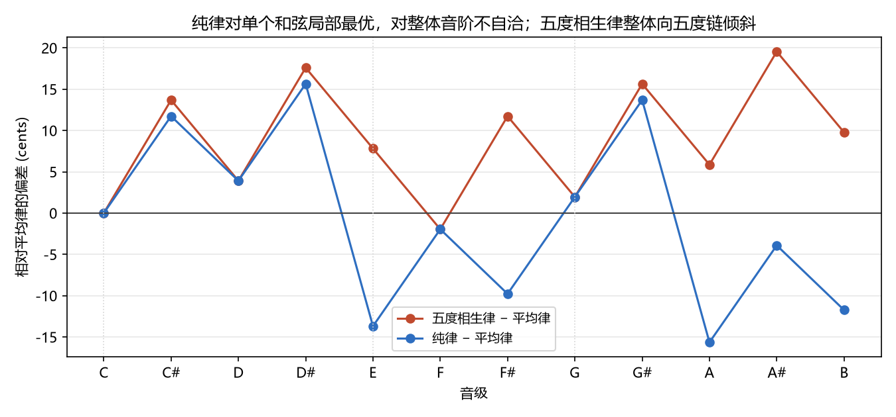
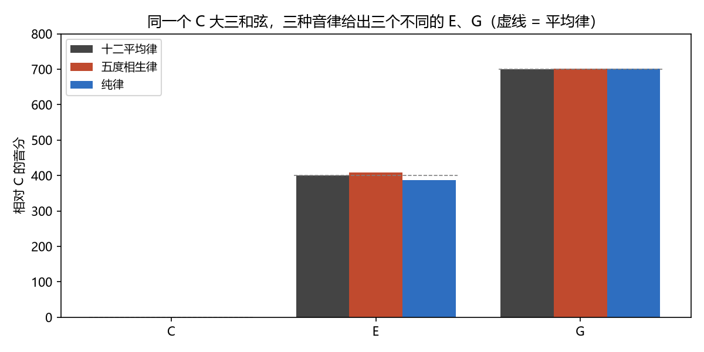

# 三种音律的权衡
> ⬆ [上一章：十二平均律：2^(1/12) 与 Z12](06-equal-temperament.md)

Ch4–6 分别讲了纯律、五度相生律、十二平均律各自的构造。现在把它们放在同一张表里正面比较。这是全书数值的**地基章**——从本章起，正文引用的所有音分、比值都取自 `demos/demo_07_compare_temperaments.py --print-tables`，**这些常量在本章冻结**，后续章节只许引用、不许改动。

## 三律 12 音主表

同一组 12 个音级（C 调），三种律制给出三个不同的频率格（单位：音分，相对 C；平均律为基准列，末两列是偏离；纯律列括号里是它每个音级的小整数比，来自 `common.py` 的 5-limit 12 音表）：

| 音级 | 音名 | 十二平均律 | 五度相生律 | 纯律（比值） | 相生−平均 | 纯律−平均 |
|---|---|---|---|---|---|---|
| 0 | C | 0.0 | 0.0 | 0.0（1:1） | +0.00 | +0.00 |
| 1 | C# | 100.0 | 113.7 | 111.7（16:15） | +13.69 | +11.73 |
| 2 | D | 200.0 | 203.9 | 203.9（9:8） | +3.91 | +3.91 |
| 3 | D# | 300.0 | 317.6 | 315.6（6:5） | +17.60 | +15.64 |
| 4 | E | 400.0 | 407.8 | 386.3（5:4） | +7.82 | −13.69 |
| 5 | F | 500.0 | 498.0 | 498.0（4:3） | −1.96 | −1.96 |
| 6 | F# | 600.0 | 611.7 | 590.2（45:32） | +11.73 | −9.78 |
| 7 | G | 700.0 | 702.0 | 702.0（3:2） | +1.96 | +1.96 |
| 8 | G# | 800.0 | 815.6 | 813.7（8:5） | +15.64 | +13.69 |
| 9 | A | 900.0 | 905.9 | 884.4（5:3） | +5.87 | −15.64 |
| 10 | A# | 1000.0 | 1019.6 | 996.1（16:9） | +19.55 | −3.91 |
| 11 | B | 1100.0 | 1109.8 | 1088.3（15:8） | +9.78 | −11.73 |

（五度相生律各音级也各有比值，但除 F=4:3、G=3:2 与纯律共享小整数比外，其余分母都很大——如 E=81:64、B=243:128——在 Ch5 已逐个给出，这里不再重复。）

`demo_07` 把三律逐音偏差画成折线（下图）：

三句话读这张表：

- **五度相生律整体向"上"倾斜**：五度相关的音（G、D、A、E、B）全部略高于平均律（+1.96 到 +9.78），因为它的格是"12 个纯五度摊不开 7 个八度"的忠实继承者；
- **纯律围绕主音 E、A 大范围下修**（−13.69、−15.64），把三度、六度拉回小整数比——代价是 F#、G# 也偏低，偏离分布极不均匀；
- **平均律每格恰好 100**，是所有误差的"平均化"：谁都不完美，谁都可移调。

## 同一个大三和弦，三种长相

**大三和弦**（根音、三音、五音，频率比 4:5:6——见 Ch4「预备：和弦」）放进三律，各音就换了位置：平均律 C、E、G 恰为 0/400/700 音分，五度相生律的 E 走五度链到 407.82，纯律的 E 回到小整数比 5:4（386.31）。`demo_07` 把三种长相画在音分轴上（下图），并合成三轨试听：

| | E | G |
|---|---|---|
| 平均律 | 400.00（329.63 Hz） | 700.00（392.00 Hz） |
| 五度相生律 | 407.82（331.12 Hz） | 701.96（392.44 Hz） |
| 纯律 | 386.31（327.03 Hz） | 701.96（392.44 Hz） |

- 平均律 C 大三和弦：
  <audio controls src="demos/audio/07_triad_equal.wav"></audio>
- 五度相生律 C 大三和弦：
  <audio controls src="demos/audio/07_triad_pyth.wav"></audio>
- 纯律 C 大三和弦：
  <audio controls src="demos/audio/07_triad_just.wav"></audio>
纯律的 E 让 5:4 谐波完全重合（最"准"），五度相生律的 E 高 21.51 音分（≈普通音差），平均律居中偏上 13.69。**注意 G 三者几乎相同**——五度是这个体系几乎一致的地基；分歧全在三度（E）上。

> **乐理小注**：对照 `keywords.md` 第二讲「音律」。教材对三种律制只给定性描述（"纯律最谐和""五度相生律转调不便""平均律转调方便"），本章把它们翻译成 12 个数字。请记住这张表——它就是 Ch8–12 所有音程、和弦、调关系数字的来源。

## 自然/变化半音：两套定义必须并列

教材里"自然半音、变化半音、自然全音、变化全音"按**音级语义**定义（对照 `keywords.md` 第二讲）：

- **自然**：相邻音级之间（如 E–F、B–C）；
- **变化**：同一音级的升降变化（如 C–#C）。♯＝升半音记号、♭＝降半音记号，在 Ch3 音名表那里已定义过。

这是**记谱语义**的标签，在任何律制里都成立。但它们对应的**频率数值**随律制而变，且与记谱标签并不一一对应：

| 类型 | 记谱语义 | 平均律 | 五度相生律 | 纯律 |
|---|---|---|---|---|
| 自然半音 | 相邻音级间（E–F） | 100.00 | 90.22（256:243） | 111.73（16:15） |
| 变化半音 | 同音级升降（C–#C） | 100.00 | 113.69（2187:2048） | 见下注 |
| 自然全音 | 相邻音级间（C–D） | 200.00 | 203.91（9:8） | 203.91（9:8） |
| 变化全音 | 同音级升降形成 | 200.00 | 203.91（9:8） | 182.40（10:9） |

> **乐理小注**：对照 `keywords.md` 第二讲「自然半音、变化半音、自然全音、变化全音」。教材只按记谱语义定义这四类（相邻音级 / 同一音级升降），从不给频率数值。本章必须并列第二套：**同一标签在三种律制下有完全不同的数值**——平均律让四类恰好两两重合（100/200c），纯律与五度相生律则分裂。这正是 Ch7 之后所有"自然/变化"讨论的基调：记谱是语义，数值是声学，二者不可互相推导。

**一个必须说破的陷阱**：教材把纯律的变化半音写作 **25:24 = 70.67 音分**。但我们的主表（common.py 的 5-limit 纯律 12 音表）里 #C 取的是 **16:15 = 111.73 音分**。哪个对？都对——纯律里 #C 本来就**没有唯一取值**（Ch4 证据二：纯律里同一音名有多个频率）：

- 作为"C 上方的变化半音"，#C = 25:24（70.67）；
- 作为"D 的导音/半音"，#C = 16:15（111.73）。

主表为了 12 音的和谐（每个音级一个数）选了后者。**这就是红线：两套定义（音级语义 vs 频率数值）必须并列，不能断言一一对应。** 平均律是唯一让"自然 = 变化"数值完全重合的律制——这正是"平均"二字的另一层含义。

<!-- 常量冻结（读者不可见）：自本章起以下数值为全书的单一数据源，正文与 demo 引用保持一致，
     不得手改——纯五度 701.96、纯四度 498.04、大三度 386.31、大六度 884.36、大二度 203.91；
     毕氏音差 23.46、普通音差 21.51、diaschisma 41.06；平均律半音 100.00、五度 700.00、三度 400.00；
     以及第 7 章主表全部 36 个音分值与偏差值。 -->

## 练习

**选择题**（答案见 [练习答案](answers.md#ch07)）：

1. 三种音律的差别集中在哪些音程上？
   - A. 五度　B. 三度/六度　C. 八度　D. 纯四度
2. 平均律的自然半音（E–F）等于多少？
   - A. 100 音分　B. 90.22 音分　C. 111.73 音分　D. 70.67 音分
3. 纯律里 #C 这个音如何？
   - A. 数值唯一　B. 有二义性（多个频率）　C. 不存在　D. 与 C 相同
4. 五度相生律的变化半音（C–#C）等于多少？
   - A. 90.22 音分　B. 113.69 音分　C. 100 音分　D. 70.67 音分
5. 三律中五度几乎一致的原因是什么？
   - A. 都以 3:2 为基础　B. 巧合　C. 人为规定　D. 音分刻度太粗

**问答题**：

1. 为什么说纯律是"局部最优 + 整体漂移"？
2. "自然半音 / 变化半音有两套定义"这句话是什么意思？
3. 平均律、纯律、五度相生律各牺牲了什么、换来了什么？

> 答案见 [练习答案](answers.md#ch07)。

## 本章小结

- 三律的差别集中在三度/六度（E、A 系）；五度（G、D、F）三律几乎一致。
- 平均律 = 误差平均化 + 移调自由；纯律 = 局部最优 + 整体漂移；五度相生律 = 五度优先 + 三度牺牲。
- 自然/变化半音、全音有两套定义（音级语义与频率数值），纯律下 #C 有二义性，不做一一对应断言。

### 乐理 ↔ 频率 对照表（第 7 章）

| 乐理术语 | 频率语言 | 数值/公式 | 讲次 |
|---|---|---|---|
| 自然半音（E–F） | 三律不同 | 100.00 / 90.22 / 111.73c | 第二讲 |
| 变化半音（C–#C） | 三律不同 | 100.00 / 113.69 /（70.67 或 111.73）c | 第二讲 |
| 自然全音（C–D） | 9:8 | 200.00 / 203.91 / 203.91c | 第二讲 |
| 变化全音 | 9:8 或 10:9 | 200.00 / 203.91 / 182.40c | 第二讲 |
| 音律比较 | 12 音 cents 表 | 见上表（数据冻结） | 第二讲 |

**动画**：三律 12 音各自铺开，看看同一组音名下三个格子的错位：

<video controls src="animations/media/videos/ch07_comparing/720p30/ComparingTemperaments.mp4"></video>

**复现**：以上图片、音频与动画分别由 `demos/demo_07_compare_temperaments.py` 与 `animations/scenes/ch07_comparing.py` 生成。

---

**下一章** → [音程 = 频率比](08-intervals.md)
