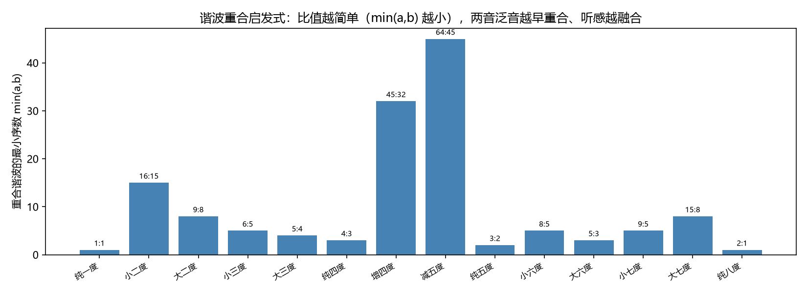
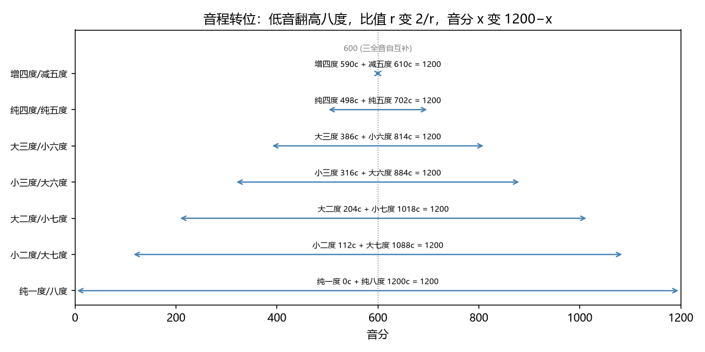

# 音程 = 频率比
> ⬆ [上一章：三种音律的权衡](07-comparing-temperaments.md)

Ch3 我们建立了音分 $c = 1200\log_2(f_2/f_1)$，Ch4–7 建立了音律。现在可以正式兑现那句话：**音程就是频率比**。两个音之间"多远"，既不是频率差 $f_2-f_1$，也不是别的，而是比值 $f_2:f_1$——在对数轴上就是一段音分距离。本章把乐理教材第六讲的全部术语逐一翻译成频率语言。

## 名称、度数、音数：把两把尺子钉死

**度数**与**音数**这两把尺子在 Ch3 已经定义过（"度数数音名，音数数半音"，以及 do/re/mi ↔ C/D/E 的对应表），这里正式兑现承诺：**音程 = 频率比**，度数、音数是它的两种记谱投影。

- **度数** = 从低音到高音数过的音级数（C→E 是"三度"）。它是记谱语义，对应音名序列里的位置差。
- **音数** = 两个音之间包含的半音数，在平均律下 = MIDI 编号之差。音数决定音程的"宽窄"，度数决定它的"名字"。

同一度数可以有不同音数（大三度 4 个半音，小三度 3 个半音；增四度 6 个半音，减五度也是 6 个——但度数不同）。这正是"音程 = 频率比"里比值唯一、名字却二义的原因。下表是 14 个基本音程的比值、音分、半音数与度数（数值来自 `demos/demo_08_intervals.py --print-tables`，**比值用纯律的小整数比**）：

| 音程 | 比值 | 音分 | 半音数 | 度数 |
|---|---|---|---|---|
| 纯一度 | 1:1 | 0.00 | 0 | 1 |
| 小二度 | 16:15 | 111.73 | 1 | 2 |
| 大二度 | 9:8 | 203.91 | 2 | 2 |
| 小三度 | 6:5 | 315.64 | 3 | 3 |
| 大三度 | 5:4 | 386.31 | 4 | 3 |
| 纯四度 | 4:3 | 498.04 | 5 | 4 |
| 增四度 | 45:32 | 590.22 | 6 | 4 |
| 减五度 | 64:45 | 609.78 | 6 | 5 |
| 纯五度 | 3:2 | 701.96 | 7 | 5 |
| 小六度 | 8:5 | 813.69 | 8 | 6 |
| 大六度 | 5:3 | 884.36 | 9 | 6 |
| 小七度 | 9:5 | 1017.60 | 10 | 7 |
| 大七度 | 15:8 | 1088.27 | 11 | 7 |
| 纯八度 | 2:1 | 1200.00 | 12 | 8 |

> **乐理小注**：对照 `keywords.md` 第六讲「音程的名称与标记」「度数、音数」。教材说音程名称由"度数和音数"决定；本章的补充是：**底层的频率比才是唯一的，度数/音数是两种投影**。增四度 45:32 与减五度 64:45 是不同比值（差 19.55 音分），却都记 6 个半音——平均律下它们数值上重合为 600 音分，这就是**等音程**（见下）。

## 谐波重合启发式：比值越简单越"融合"

Ch4 用谐波重合解释纯律偏好小整数比。这里给出定量形式：比值 $a:b$（约分后）意味着音 1 的第 $a$ 谐波 = 音 2 的第 $b$ 谐波。**重合的谐波序数 $\min(a,b)$ 越小，重合越早、越响、越融合**（`demo_08` 生成下图，越靠右的条越"晚"）：

| 音程 | 比值 | 重合谐波对 | min |
|---|---|---|---|
| 纯八度 | 2:1 | 2 与 1 | **1** |
| 纯五度 | 3:2 | 3 与 2 | **2** |
| 纯四度 | 4:3 | 4 与 3 | 3 |
| 大三度 | 5:4 | 5 与 4 | 4 |
| 小三度 | 6:5 | 6 与 5 | 5 |
| 小二度 | 16:15 | 16 与 15 | 15 |
| 增四度 | 45:32 | 45 与 32 | 32 |

$\min(a,b)$ 从五度起逐级升高，到增四度冲到 32——**这是"三全音不协和"的第一个信号**。注意：这只是**启发式**，不是严格理论——"协和"的定量解释在 Ch9（Plomp–Levelt 粗糙度曲线），简单整数比只保证谐波重合早，不等于听觉上一定协和。

> 这里先放 Ch9 的粗糙度曲线动画作预告——它直观显示两个音的粗糙度如何随音程大小起伏：**相距约一个半音（100 音分）时粗糙度最高**，三全音（600 音分）正处于"谐波重合极晚"的位置。这条曲线的定量推导在 Ch9：

<video controls src="../animations/media/videos/ch09_roughness/720p30/RoughnessCurve.mp4"></video>

## 单音程与复音程

八度之内（度数 ≤ 8）是**单音程**；超过一个八度是**复音程**。频率语言：复音程就是单音程再乘上 $2^k$（八度算子）。例如纯五度 3:2 上再叠一个八度得纯十二度 $3:2 \times 2 = 3:1$（1901.96 音分）。**"第 n 谐波"本身就是复音程**：根音的 3 谐波 $3f_1$ 就是"根音 + 纯十二度"。

**复音程用在什么地方？** 三处最常见：(1) **跨八度大跳**——旋律里从 C4 直接跳到 E5，记作大十度（大三度 + 八度），读谱和推算都要先认出"八度 + 三度"；(2) **和弦转位与宽排布**——钢琴左手低音到次中音、吉他和弦把位经常隔着复音程，判断音程性质时先把八度剥掉，剩下的单音程定性质；(3) **音域计算**——乐器的音域写成"C2–C6"这样的复音程跨度，人声"两个八度"也是复音程。一句话：**名字里带八度的音程都是复音程；认它时先剥掉八度，用剩下的单音程定性质。**

> **乐理小注**：对照 `keywords.md` 第六讲「单音程、复音程」。教材说复音程与单音程"性质相同"——频率语言里这就是：乘 2 不改变音级，只改变八度组。Ch2 的谐波 $nf_1$ 是"自然生成的复音程集合"。

## 转位：互补比

把低音翻高八度（或高音翻低八度）叫**转位**。设原音程比值 $r$（单音程，$1<r<2$），转位后

$$r \longmapsto \frac{2}{r}, \qquad x \longmapsto 1200 - x.$$

**转位 = 互补**：五度转四度（701.96 → 498.04），大三度转小六度（386.31 → 813.69），音分和恒为 1200，比值乘积恒为 2。减五度 64:45 是增四度 45:32 的转位（609.78 ↔ 590.22）——三全音是**自互补**的：$2/(45/32) = 64/45$，且音分 $600 \mapsto 600$。

> **乐理小注**：对照 `keywords.md` 第六讲「音程的转位」。教材列转位规则表（纯↔纯、大↔小、增↔减、倍增↔倍减）；公式 $r\mapsto 2/r$ 一屏就装下全部规则。口诀"互补"来自八度内两根线的对称性。

## 等音程

同一音数、不同度数的音程叫**等音程**。典型的：增四度 45:32（590.22c）与减五度 64:45（609.78c）——**比值不同，平均律音数相同（都 6 个半音 = 600c）**。频率语言看得很清楚：

- 平均律下，$2^{6/12}$ 唯一，增四 = 减五 = 三全音，等音程数值重合；
- 纯律/五度相生律下它们**不是**同一个频率（差 19.55 音分），"等音"只是记谱与平均律的产物。

这正是"音程 = 频率比"的另一面：**一个音程名字（增四度）不是唯一比值，一个比值不是唯一名字**。

## 练习

**选择题**（答案见 [练习答案](answers.md#ch08)）：

1. 大三度等于几个半音（音数）？
   - A. 2　B. 3　C. 4　D. 5
2. 音程转位后两个音程的音分之和恒为多少？
   - A. 600　B. 900　C. 1200　D. 2400
3. 三全音（600c）的转位是什么？
   - A. 五度　B. 四度　C. 它自身　D. 小三度
4. 十二度（复音程）= ？
   - A. 2:1　B. 3:1　C. 4:3　D. 6:5
5. 增四度（45:32）与减五度（64:45）在哪种音律下重合？
   - A. 纯律　B. 十二平均律　C. 五度相生律　D. 在任何音律下都不重合

**问答题**：

1. "度数"与"音数"分别衡量什么？各举一个例子。
2. 为什么说谐波 $nf_1$ 就是"自然复音程"？
3. 为什么等音程（增四/减五）只在十二平均律下重合？

> 答案见 [练习答案](answers.md#ch08)。

## 本章小结

- 音程 = 频率比；度数/音数是它的两种记谱投影。
- 单音程 ≤ 八度，复音程 = 单音程 × $2^k$；谐波 $nf_1$ 就是自然复音程。
- 转位 $r\mapsto 2/r$：音分互补，和恒 1200；三全音自互补。
- 等音程（增四/减五）在平均律下重合，在纯律/五度相生律下分裂。

### 乐理 ↔ 频率 对照表（第 8 章）

| 乐理术语 | 频率语言 | 数值/公式 | 讲次 |
|---|---|---|---|
| 音程 | 频率比 | $c=1200\log_2(f_2/f_1)$ | 第六讲 |
| 度数 / 音数 | 音级差 / 半音数 | 例：大三度 = 4 半音 | 第六讲 |
| 单/复音程 | 八度内 / ×$2^k$ | 五度 3:2 → 十二度 3:1 | 第六讲 |
| 音程转位 | 互补比 $r\mapsto 2/r$ | 五度↔四度，音分和 1200 | 第六讲 |
| 等音程 | 同音数不同比值 | 增四 45:32 ↔ 减五 64:45 | 第六讲 |
| 自然/变化音程 | 自然音级内/外 | — | 第六讲 |

**试听**：14 个基本音程从纯一度到纯八度依次上行：

<audio controls src="demos/audio/08_intervals.wav"></audio>

**动画**：音程的转位如何在八度内"互补"：

<video controls src="../animations/media/videos/ch08_intervals/720p30/IntervalsInversion.mp4"></video>

**复现**：以上图片、音频与动画分别由 `demos/demo_08_intervals.py` 与 `animations/scenes/ch08_intervals.py` 生成。

---

**下一章** → [协和与不协和：粗糙度曲线](09-consonance-and-dissonance.md)
