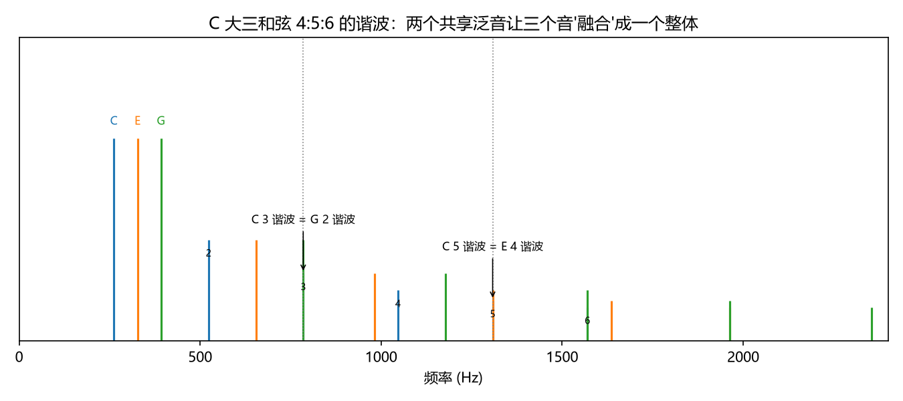
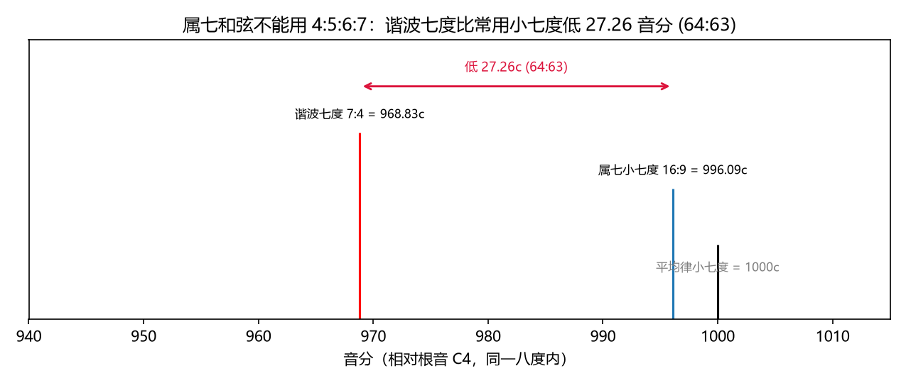
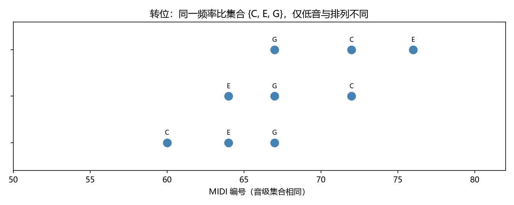

# 和弦 = 频率比集合
> ⬆ [上一章：协和与不协和：粗糙度曲线](09-consonance-and-dissonance.md)

音乐几乎不会只停留在两个音上：钢琴伴奏、合唱、弦乐四重奏，到处是”三个或更多的音**同时**响”。和弦（chord）就是这个”多音同时响”的最小单元，也是调性音乐（Ch12–15 的地基）的基本建材。在 Ch4「预备：和弦」里我们已经见过根音、三音、五音与三和弦的雏形，本章把它们正式翻译成频率语言。

**它解决什么问题？** 前两章的工具只够描述两个音（音程 = 频率比，粗糙度 = 两个音”打架”的程度），可真正的音乐几乎总是三四个音叠在一起。我们要一个能描述”一组音同时响”的框架。

**它怎么工作？** 很简单——把和弦里每个音都除以根音（最低的基准音，见 Ch4），得到一组比值。**一个和弦就是一个频率比集合**，乐理上的”和弦名称”就是这组比值集合的形状：大、小、增、减，一眼可辨。它的”好听/难听”则是 Ch9 粗糙度在多音情形下的推广。本章把教材第七讲的三和弦、七和弦、转位、等和弦逐一翻译。

## 三和弦：四个基本比值集

三种律制下同一个"大三和弦"有三个长相（Ch7 已见）；这里用纯律的小整数比作为"理想型"（数值来自 `demo_10 --print-tables`）：

| 和弦 | 频率比 | 音分（相对根音） |
|---|---|---|
| 大三和弦 | $4:5:6$ | 0, 386.31, 701.96 |
| 小三和弦 | $10:12:15$ | 0, 315.64, 701.96 |
| 增三和弦 | $16:20:25$ | 0, 386.31, 772.63 |
| 减三和弦 | $25:30:36$ | 0, 315.64, 631.28 |

- **大三**：根音大三度 + 纯五度。$4:5:6$ 是三个**连续整数**，泛音高度重合——C 的 3 谐波 = G 的 2 谐波，C 的 5 谐波 = E 的 4 谐波（下图）——"融合成一个整体"的声学根源。
- **小三**：根音小三度 + 纯五度。$10:12:15$ 里没有连续整数（12:15 = 4:5，但 10:12 = 5:6），融合度略低。
- **增三**：大三度 + 大三度（$25:16$），五度位置变成增五度 772.63 音分。
- **减三**：小三度 + 小三度（$36:25$），五度位置变成减五度 631.28 音分（正是 Ch8 的"三全音"）。

大、小三和弦连着各琶音一遍（C 上的琶音，`demo_10` 合成）——先大三后小三，请对比"明亮"与"黯淡"——两者只差三度这一个音（5:4 → 6:5）：

<audio controls src="demos/audio/10_major_minor.wav"></audio>

> **乐理小注**：对照 `keywords.md` 第七讲「三和弦」。教材按"根音与三音/五音的音程性质"给四种三和弦命名；本章给出它们的**频率比身份证**——大 = 4:5:6，小 = 10:12:15。增三、减三都包含一个"坏音程"（增五度/减五度），是粗糙度曲线（Ch9）的高点，听感紧张。

## 七和弦：属七的陷阱

七和弦 = 三和弦 + 七度音。最重要的是**属七和弦**（属音上的七和弦，第 12 讲的主角，Ch15 讲解决）。它由大三和弦 + 小七度组成，常用的纯律写法是

$$1 : \frac{5}{4} : \frac{3}{2} : \frac{16}{9}.$$

**千万不要写成 $4:5:6:7$。** 理由是声学事实：根音的第 7 谐波是 $7:4$（968.83 音分），而常用的小七度是 $16:9$（996.09 音分）——两者相差

$$\frac{16/9}{7/4} = \frac{64}{63},\qquad 27.26\ \text{音分},$$

即"七音逗号"。下图把它们画在同一张频谱上（`demo_10` 生成）：谐波七度比我们习惯的属七小七度**低 27.26 音分**，直接照搬 $4:5:6:7$ 会让七音明显偏低、和声走样。教科书属七和弦永远以 $\,1:5/4:3/2:16/9\,$ 为准；$7:4$ 只出现在"谐波序列"的讨论里。

两种写法各琶音一遍（`demo_10` 合成）：第一遍七音取 $16:9$（教科书属七），第二遍取谐波 $7:4$——后者七音明显偏低、"拽"着和声走样：

<audio controls src="demos/audio/10_dom7.wav"></audio>

> **乐理小注**：对照 `keywords.md` 第七讲「七和弦」。教材说属七和弦 = 大三和弦 + 小七度——这里的"小七度"就是 $16:9$。至于为什么谐波 7 不被采用：它是"自然泛音"里唯一一个与常用音阶严重冲突的分音，中世纪的作曲家早就发现第 7 分音"不入调"。平均律下的属七小七度是 1000 音分，比 $16:9$ 高 3.91 音分，仍在小七度的听感范围内。

## 转位：同一集合的重排

三和弦有原位、第一转位、第二转位。频率语言里的本质是：**三个音的频率比集合不变，只是根音（最低音）换了成员**：

- 原位 C–E–G：4:5:6；
- 第一转位 E–G–C'：5:6:8（除以 E 的 5:4）；
- 第二转位 G–C'–E'：3:4:5（除以 G 的 3:2）。

三个转位的音级集合都是 $\{C,E,G\}$——同一个有理点集 $\{1, 5/4, 3/2\}$ 模八度。**和弦的性质（大三/小三/……）不随转位改变，因为频率比集合不变。**（下图 `demo_10` 生成）

> **乐理小注**：对照 `keywords.md` 第七讲「原位和弦、转位和弦」。教材教"以三音为低音叫第一转位"——那是因为分母/根音变了，比值比例仍是最简整数比。转位改变的是"哪个音做低音"（倍低音，决定和弦的低音走向），不改变"集合里有哪些音"。

## 等和弦与 Z12

第七讲还提到**等和弦**：两个记法不同、音响相同的和弦（如增三和弦与属七和弦省略五音的等音写法）。这又是 Ch6 的 $\mathbb{Z}_{12}$ 商结构：平均律把 12 个音级压成 12 个"格子"，等音程/等和弦就是在说"同一格子的不同记谱"。纯律/五度相生律下（Ch7 的表）它们数值分裂，"等"不成立；平均律下才严格成立。

## 练习

**选择题**（答案见 [练习答案](answers.md#ch10)）：

1. 大三和弦等于哪个频率比集合？
   - A. 4:5:6　B. 10:12:15　C. 16:20:25　D. 25:30:36
2. 属七和弦的正确结构是哪个？
   - A. 4:5:6:7　B. $1:5/4:3/2:16/9$　C. 4:5:6　D. $1:5/4:3/2:7/4$
3. 谐波 7（7:4）比小七度（16:9）低多少音分？
   - A. 21.51　B. 27.26　C. 23.46　D. 41.06
4. 大三和弦的第一转位（六和弦）是哪个比值集合？
   - A. 4:5:6　B. 5:6:8　C. 3:4:5　D. 6:8:10
5. 小三和弦等于哪个频率比集合？
   - A. 4:5:6　B. 10:12:15　C. 16:20:25　D. 25:30:36

**问答题**：

1. 为什么说"和弦 = 频率比集合"？三和弦的根音、三音、五音如何对应到集合里？
2. 属七和弦为什么"必须解决"？请用导音与七音到主音的距离（音分）回答。
3. 转位为什么不改变化弦性质？等和弦为什么只在平均律下成立？

> 答案见 [练习答案](answers.md#ch10)。

## 本章小结

- 和弦 = 频率比集合；三和弦：大 4:5:6、小 10:12:15、增 16:20:25、减 25:30:36。
- 属七 = $1:5/4:3/2:16/9$；谐波 7（$7:4$）偏低 27.26 音分，不参与构造。
- 转位 = 同一频率比集合重排（5:6:8、3:4:5），和弦性质不变。
- 等和弦 = $\mathbb{Z}_{12}$ 商结构下的记谱重合，仅平均律严格成立。

### 乐理 ↔ 频率 对照表（第 10 章）

| 乐理术语 | 频率语言 | 数值/公式 | 讲次 |
|---|---|---|---|
| 三和弦 | 频率比集合 | 大 4:5:6、小 10:12:15 | 第七讲 |
| 属七和弦 | 大三和弦 + 小七度 | $1:5/4:3/2:16/9$ | 第七、十二讲 |
| 转位和弦 | 同集合重排 | 4:5:6 → 5:6:8 → 3:4:5 | 第七讲 |
| 等和弦 | $\mathbb{Z}_{12}$ 商 | 仅平均律成立 | 第七讲 |
| （谐波 7） | 失谐说明 | $7:4$ 低 $16:9$ 达 27.26c | — |

**动画**：大三和弦的谐波如何"咬合"成一个整体（C 的 3/5 谐波与 G、E 重合）：

<video controls src="animations/media/videos/ch10_chords/720p30/ChordsHarmonics.mp4"></video>

**复现**：以上图片、音频与动画分别由 `demos/demo_10_chords.py` 与 `animations/scenes/ch10_chords.py` 生成。

---

**下一章** → [音阶与调式：八度的离散划分](11-scales-and-modes.md)
