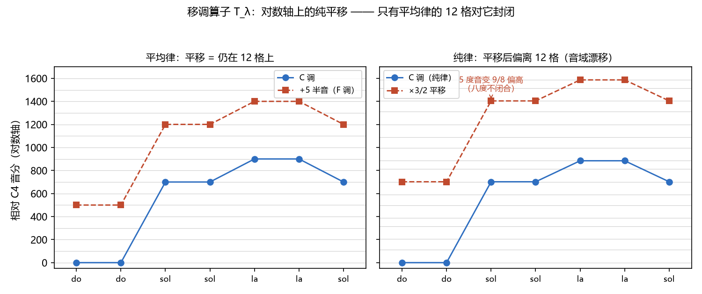
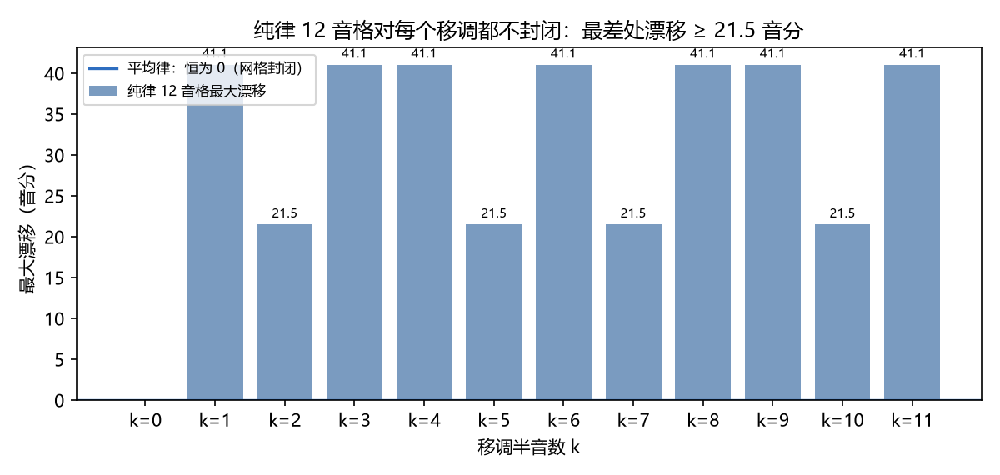

# 移调与转调：平移对称性
> ⬆ [上一章：五度循环与调关系：Z₁₂ 上的距离](12-circle-of-fifths-and-key-relations.md)

Ch3 埋下一个伏笔："移调是频率轴的平移对称性"。Ch12 给了网格，Ch13 该收束了。本章把两个看似独立的教材概念——第十五讲的**移调**与第十三讲的**转调**——统一成一个数学对象：**对数频率轴上的平移算子 $T_\lambda$**，并诚实地指出它只在十二平均律下保持"网格结构不变"。

## 移调算子：$T_\lambda: f \mapsto \lambda f$

**移调**就是把整段音乐整体升高或降低一个音程。频率语言：

$$T_\lambda: f \longmapsto \lambda f.$$

在对数频率轴上（Ch3），这只是一个**水平平移**：把每个音分值 $c$ 变成 $c + 1200\log_2\lambda$。音与音之间的**音程比**（也就是旋律的轮廓）在平移下完全不变——这是移调的第一条性质，对任何 $\lambda$、任何律制都成立。下图左半（`demo_13` 生成）用《小星星》演示：C 调与 F 调是两条完全相同的曲线，只是整体上移 500 音分（5 个半音；红点都落在灰色网格上）；右半是纯律的情形，红点**不再**落在网格上——这就是下面要讲的分水岭：

> **乐理小注**：对照 `keywords.md` 第十五讲「移调、移调的方法」。教材教"将乐曲整体移高或移低若干度"；本章把"若干度"翻译成乘法因子 $\lambda$。移调的记谱方法（改变调号、改变谱号、移高八度）在频率语言里都是同一个平移算子在不同坐标纸上的写法。

## 关键性质：网格的封闭性

移调第二条性质才是真正区分律制的分水岭。**平移算子的意义，取决于它是否把音阶/调式的网格映到自身**：

- **平均律**：12 音格 = $\{2^{k/12}\}$。把网格整体平移 $T_{2^{m/12}}$（$m$ 个半音），每个格子恰好落回另一个格子——**网格对平移封闭**。所以移调后，调式不变、和弦不变、音程不变，一切都是"干净的"（上图左半：平移后红点全部落在灰色网格上）。
- **纯律 / 五度相生律**：12 音格是不规则的（Ch7 的三律对比）。把纯律 12 音格整体平移 $T_{9/8}$（移高大二度），平移后的音符**不再落在纯律网格上**（上图右半）：整体平移后，网格与自身错开。

这是 Ch3 伏笔的兑现，也是**红线**：移调的对称性只对十二平均律严格成立。下表（数值来自 `demos/demo_13_transposition.py --print-tables`，柱状图见图后）定量化了这件事——对每个移调量 $k$，三种律制下 12 音网格的最大漂移：

| 移调 k | 平均律最大漂移 | 纯律最大漂移 |
|---|---|---|
| 0 | 0.00c | 0.00c |
| 1 | 0.00c | 41.06c |
| 2 | 0.00c | 21.51c |
| 3 | 0.00c | 41.06c |
| 4 | 0.00c | 41.06c |
| 5 | 0.00c | 21.51c |
| 6 | 0.00c | 41.06c |
| 7 | 0.00c | 21.51c |
| 8 | 0.00c | 41.06c |
| 9 | 0.00c | 41.06c |
| 10 | 0.00c | 21.51c |
| 11 | 0.00c | 41.06c |

漂移值恰好是 Ch4 的两个"小逗号"：**21.51c = 普通音差**（81:80），**41.06c = diaschisma**（128:125）。也就是说：在纯律的固定 12 音乐器上把曲子移调，最糟的那根弦会偏离新调的音格最多 41 音分——远超人耳约 5–10 音分的分辨门槛（Ch7）。**这就是"纯律不可自由移调"的精确含义**：不是旋律变难听（平移本身保持音程），而是固定网格装不下平移后的音。

用《小星星》听这个差别（`demo_13` 合成）。第一段是平均律（+5 半音 = F 调）——平移干净、旋律如初；第二段是纯律（×3/2 = G 调）——平移后音域整体上漂、新调的音格对不上，旋律明显"跑调"：

- 平均律 C→F（平移干净）：<audio controls src="demos/audio/13_transpose_et.wav"></audio>
- 纯律 C→F（漂移 41c 内）：<audio controls src="demos/audio/13_transpose_just.wav"></audio>

> **乐理小注**：对照 `keywords.md` 第二讲「纯律、五度相生律」（移调问题的根源）。教材不讲音律，直接假定"移调可行"；本章说明这个假定**默认了十二平均律**。为什么近代键盘乐器最终统一到平均律（Ch6）？其中一个直接原因就是：只有平均律允许在任何调上演奏而无需重新调音。

## 转调：把基准点搬走

**转调（modulation）**是在曲子进行中改变调——也就是**改变主音（基准点）**。用 Ch12 的语言：转调 = 把 $(序列, 主音)$ 的第二个分量换掉。频率语言里最干净的画面：

- **移调**是整首曲子平移（所有音一起动，基准和旋律都动）；
- **转调**是曲子不动、基准点移动（同一时刻，新的主音接管"0 音分"的位置）。

两者共用同一个数学对象 $T_\lambda$，区别只在**作用范围**：移调作用于整曲，转调作用于调中心。这也解释了教材为什么把转调分成"转调的意义、类别、近关系调"：

**转调的类别**，按新调在五度圈上的距离分（Ch12 的共同音数表）：转近关系调（$k\le2$，共同音 $\ge5$）最平滑，因为新旧调共享大部分音级，只需挪动少数音就能"换基准"；转远关系调（如三全音关系）则要换掉几乎全部音级，听感上"翻天覆地"。

> **乐理小注**：对照 `keywords.md` 第十三讲「转调、转调的意义、转调的类别、近关系调」。教材说"近关系调是调号相差一个的调"。本章把它与 Ch12 的共同音数挂钩：**调号相差 = 五度圈距离 = 共同音数**，三者是同一个量的三种记法。转调的意义——丰富调性、制造对比——本质上是"在五度圈上做一次短程旅行"。

## 转调与音律：为什么必须平均律

把上面两节连起来，得到一个意味深长的结论：**只要允许转调，就必然走向平均律**。原因：

1. 纯律固定 12 音格对转调不封闭（本节的 21.51c / 41.06c 漂移）；
2. 一首转调的作品要同时"在 C 大调上准"又"在 G 大调上准"，纯律需要两个网格，乐器无法同时提供；
3. 唯一的出路是**把 12 个格子做成规则的**（每个 100 音分），让所有调共用同一张网格——这正是平均律。

所以"为什么是 12"（Ch6 连分数）与"为什么必须平均律"（本章封闭性）是同一枚硬币的两面：**12 给出最经济的五度近似，平均律给出可移调可转调的均匀网格**。

> **乐理小注**：对照 `keywords.md` 第八讲「调的五度循环」、第十三讲「近关系调」。教材的调关系理论默认平均律；本章指出这一默认并非琐碎——它保证了"换基准不动乐器"。巴赫《平均律曲集》的音乐史意义（可调律内自由转调）正是这个数学性质的实践。

## 练习

**选择题**（答案见 [练习答案](answers.md#ch13)）：

1. 移调在频率语言里是什么？
   - A. 换基准点　B. 对数轴平移 $T_\lambda:f\mapsto\lambda f$　C. 时间轴缩放　D. 音程转位
2. 平移 $T_\lambda$ 保持什么不变？
   - A. 一切音程比　B. 绝对频率　C. 主音位置　D. 拍号
3. 纯律网格对非平凡移调如何？
   - A. 封闭　B. 不封闭，漂移 21.51c 或 41.06c　C. 只漂移 1.96c　D. 恒等
4. 允许自由移调需要什么样的网格？
   - A. 纯律　B. 五度相生律　C. 均匀网格（十二平均律）　D. 任意网格
5. "移调对称性"严格成立只限于哪种音律？
   - A. 纯律　B. 五度相生律　C. 十二平均律　D. 三种音律都严格成立

**问答题**：

1. 为什么说"移调对称性只对十二平均律严格成立"？
2. 移调与转调的区别是什么？
3. 纯律移调漂移的两个尺度 21.51c 与 41.06c 分别来自什么？

> 答案见 [练习答案](answers.md#ch13)。

## 本章小结

- 移调 = 对数轴平移 $T_\lambda: f\mapsto\lambda f$，保持一切音程比。
- 网格封闭性：平均律对 $T_{2^{k/12}}$ 封闭；纯律/五度相生律对任何非平凡移调不封闭（漂移 21.51c 或 41.06c）。
- 转调 = 换基准点；近关系调 = 五度圈 $\le2$ 步、共同音 $\ge5$。
- 允许转调 ⟹ 需要均匀网格 ⟹ 十二平均律。

### 乐理 ↔ 频率 对照表（第 13 章）

| 乐理术语 | 频率语言 | 数值/公式 | 讲次 |
|---|---|---|---|
| 移调 | 平移算子 | $T_\lambda: f\mapsto\lambda f$ | 第十五讲 |
| 移调的方法 | 平移在不同坐标纸上的写法 | 改调号 / 改谱号 / 移八度 | 第十五讲 |
| 转调 | 曲子不动、换基准点 | 主音更换 | 第十三讲 |
| 转调的类别 | 五度圈距离 / 共同音数 | 近关系 $k\le2$ | 第十三讲 |
| 近关系调 | 共同音 $\ge5$ | 五度圈 $\le2$ 步 | 第十三讲 |
| （纯律不封闭） | 网格对平移不封闭 | 漂移 21.51c / 41.06c | 第二、十三讲 |

**动画**：《小星星》在对数轴上平移的过程，看平均律与纯律的差别：

<video controls src="../animations/media/videos/ch13_transposition/720p30/Transposition.mp4"></video>

**复现**：以上图片、音频与动画分别由 `demos/demo_13_transposition.py` 与 `animations/scenes/ch13_transposition.py` 生成。

---

**下一章** → [节奏、速度与力度：时间格与振幅](14-rhythm-meter-and-dynamics.md)
