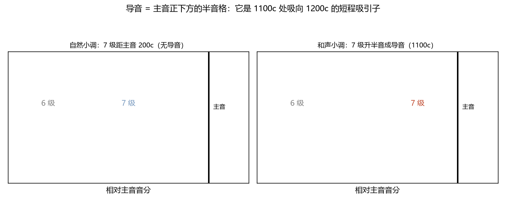
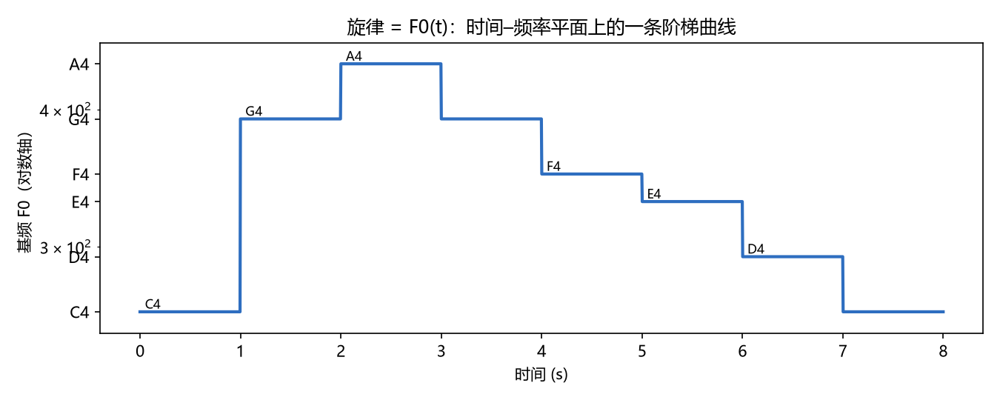
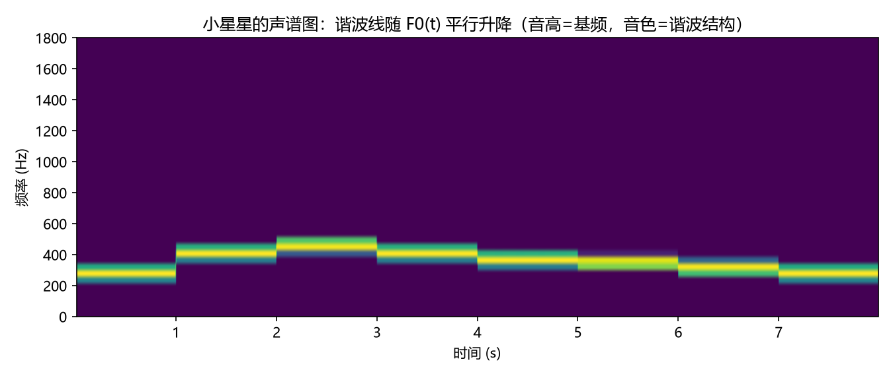

# 调式变音、导音与旋律
> ⬆ [上一章：节奏、速度与力度：时间格与振幅](14-rhythm-meter-and-dynamics.md)

本书的最后一章正文，把四讲内容拧成一条主线：**音乐是"在格子上走、偶尔偏离格子、再被吸回格子"的运动**。调式变音（第十四讲）是偏离，导音与解决（第十一、十二、十四讲）是吸引与回归，旋律（第十六讲）则是这条轨迹本身。

## 调式变音：频率格的局部修改

**调式变音**是把音阶里的某个音临时升高或降低半音。频率语言（Ch6 的 $\mathbb{Z}_{12}$）：变音记号 $\sharp/\flat$ 就是**把音级沿 12 格移动 ±100c**，相当于 $T_{+1}/T_{-1}$ 作用在单个音上——它是移调算子（Ch13）的"单点版"。

两个要点：

- 变音不改动网格本身，只改**格子上某次取值**（临时升降），或改变音阶**模板**（如和声小调升第 7 级，Ch11 的 $[2,1,2,2,1,3,1]$）；
- 第十四讲的**半音音阶**把 12 个格子全部走一遍（每步 +100c）——它是 $\mathbb{Z}_{12}$ 的"全音级游走"，只在平均律下各半音恰好相等（Ch7 已见自然/变化半音的两套定义在纯律下分裂）。听一遍这条游走（`demo_15` 合成，C→B→C' 共 13 个音，每步 +100c）：

  <audio controls src="demos/audio/15_chromatic.wav"></audio>

> **乐理小注**：对照 `keywords.md` 第十四讲「调式变音、半音音阶」。教材区分"具有典型意义的调式变音"；本章的模型是：任何变音都是 12 格上的一次 ±1 步移动，典型与否取决于它落在哪——**导音位置上的变音（升 7 级）最典型**，因为它制造了全音阶里最强的吸引子。

## 导音：主音下方的半音吸引子

**导音（leading tone）**是主音正下方的那一格（大调/和声小调的第 7 级 = 1100c，距主音仅 100c）。它不是普通的音，而是**吸向主音的磁石**：下图（`demo_15` 生成）把 B→C 的解决画成箭头，对比自然小调（第 7 级 1000c，距主音 200c，没有这股吸力）：

| 音阶 | 7 级 | 距主音 | 导音？ |
|---|---|---|---|
| 自然大调 | 1100c | 100c | 是 |
| 和声小调 | 1100c | 100c | 是（升 7 级制造） |
| 自然小调 | 1000c | 200c | 否 |
| 旋律小调（上行） | 1100c | 100c | 是（上行时） |

听这个"吸力"的差别（`demo_15` 合成）：先是用导音 B→C（半音，直扑主音），再是自然小调的降七级→C（全音，没有那股扑过去的劲）：

<audio controls src="demos/audio/15_leading_tone.wav"></audio>

为什么 100c 距离就是"吸引"？声学上，半音是粗糙度曲线的峰值区（Ch9 小二度 1.28，全曲线最高）——导音与主音并置是最强的"待解决"状态；解决（1100c→1200c）释放这股紧张。**导音解决 = 一次 100c 的短程频率移动，把不协和最小化、把主音确立**。

> **乐理小注**：对照 `keywords.md` 第十四讲「导音、导音的形成、导音的解决」。教材说"导音有向主音的倾向"；本章把它翻译成格点几何：导音 = 主音下方唯一的半音格，倾向 = 距主音 100c 造成的强吸引力。**调式变音制造导音**（和声小调升 7 级）与**导音的解决**是同一件事的两端：偏离一格，然后被吸回。

## 音程与和弦的解决：短程回格

第十一、十二讲的"稳定/不稳定音程与和弦及其解决"，在频率语言里是同一个短程动力学：

- **稳定音级** = 主音及其五度/三度（谐波重合法则，Ch8）：和弦的"家"；
- **不稳定音级** = 包含导音、七音等的音程/和弦（如**属七和弦** $\,1:5/4:3/2:16/9\,$，Ch10 的主角）：它们"欠一个解决"；
- **解决** = 各声部沿最近的格子移动（导音 +100c 到主音，七音 −100c 到三度……），回到稳定格。

这就是为什么属七和弦"必须解决"：它的七音（$16:9$，距主音 100c）和导音一样，是主音下方的一个半音吸引子。**和声的功能性，在频率语言里就是格点上"吸引力–释放"的轨迹**。

> **乐理小注**：对照 `keywords.md` 第十一、十二讲「稳定音程、不稳定音程、和弦的解决、属七和弦、导七和弦」。教材讲"调式中的音程/和弦的稳定性与解决规则"；本章：稳定 = 谐波重合好（低粗糙度，Ch9），不稳定 = 含半音吸引子，解决 = 沿格子的最近路径回归。规则表是这张几何图的离散化。

## 旋律：时–频平面上的一条曲线

**旋律**终于可以正面回答了。把 Ch3 的频率轴与 Ch14 的时间轴合成一个平面，旋律就是

$$F_0(t)\colon [0,T]\longrightarrow [f_{\min}, f_{\max}],$$

一条**时间–频率曲线**：下图（`demo_15` 生成）把小星星的 F0(t) 画成阶梯曲线（每级一个音）：

它的声谱图（谐波线随 F0 平行升降）：

**直接看声音自己画这条曲线**——下面这支视频（8 秒）把小星星的歌声与 F0(t) 放在同一根时间轴上：红色播放头随歌声推进，已唱过的部分亮起，播放头处的三颗谐波点（f0、2f0、3f0）随音高一起升降——"音色 = 谐波结构"一目了然：

<video controls src="../animations/media/videos/ch15_melody_f0/720p30/MelodyF0Singing.mp4"></video>

（纯听版：<audio controls src="demos/audio/15_melody.wav"></audio>）

- **音高** = F0 的值（曲线的高度）；
- **音色** = 谐波结构（每条水平谱线的粗细/亮度）；
- **走向/起伏** = F0(t) 的斜率与极值（上行、下行、波浪）；
- **旋律高潮** = F0(t) 的局部最高点附近，配合振幅峰（力度）。

第十六讲的全部术语——旋律进行方向、起伏、高潮、分段——都是这条曲线在**时–频平面上的几何性质**。这就是全书主张的最终形态：**乐理是频率的语言，旋律是这段语言的篇章**。

> **乐理小注**：对照 `keywords.md` 第十六讲「旋律、旋律进行的方向、高潮、旋律的分段、乐曲的基本形式」。教材的旋律分析是作曲层面的；本章指出它的物理骨架：F0(t) 曲线的高低、斜率、极值、包络就是旋律的方向、起伏与高潮。这不是替代教材，而是给它一个可计算的地图。

## 练习

**选择题**（答案见 [练习答案](answers.md#ch15)）：

1. 导音距主音多少音分？
   - A. 100　B. 200　C. 50　D. 300
2. 自然小调第 7 级距主音多少音分？
   - A. 100　B. 200　C. 300　D. 500
3. 旋律在频率语言里是什么？
   - A. $F_0(t)$ 时间–频率曲线　B. 振幅包络　C. 拍频　D. 频谱
4. 调式变音在 $\mathbb{Z}_{12}$ 上是什么操作？
   - A. 移调　B. 单点 ±1 步（$T_{+1}/T_{-1}$）　C. 转调　D. 转位
5. 半音音阶走完多少个格子？
   - A. 5　B. 7　C. 12　D. 24

**问答题**：

1. 导音为什么"吸向主音"？请用粗糙度曲线解释。
2. 属七的七音（16:9）为什么也是主音下方的半音吸引子？解决时它走到哪？
3. $F_0(t)$ 曲线的哪些几何量对应旋律的走向、起伏、高潮？

> 答案见 [练习答案](answers.md#ch15)。

## 本章小结

- 调式变音 = 12 格上的 ±1 步局部移动；半音音阶 = 全音级游走。
- 导音 = 主音下方 100c 的半音吸引子；解决 = 短程回格（1100c→1200c）。
- 音程/和弦的解决 = 含半音吸引子的声部沿最近格子回归（属七的七音即导音）。
- 旋律 = F0(t)：时间–频率平面上的曲线；音高、音色、走向、高潮都是它的几何量。

### 乐理 ↔ 频率 对照表（第 15 章）

| 乐理术语 | 频率语言 | 数值/公式 | 讲次 |
|---|---|---|---|
| 调式变音 | $\mathbb{Z}_{12}$ 上的 ±1 步 | 升/降 100c | 第十四讲 |
| 半音音阶 | 12 格全走一遍 | 每步 +100c | 第十四讲 |
| 导音 | 主音下方 100c 的半音格 | 7 级 1100c | 第十四讲 |
| 导音解决 | 短程频率移动 | 1100c→1200c | 第十四讲 |
| 稳定/不稳定音程 | 谐波重合好/差 | Ch9 粗糙度 | 第十一讲 |
| 属七、导七的解决 | 半音吸引子回归 | 七音→三度 | 第十二讲 |
| 旋律 | F0(t) 时–频曲线 | 走向=斜率 | 第十六讲 |

**复现**：以上图片、音频与动画分别由 `demos/demo_15_melody_f0.py`、`demos/make_15_melody_video.py` 与 `animations/scenes/ch15_melody_f0.py` 生成。

至此，全部正文的核心工具都已就位。下一章用它们做一次完整演练：**把一首真实的乐曲逐层拆开，验证前面所有结论**。

---

**下一章** → [乐曲赏析：巴赫《平均律》C 大调前奏曲 BWV846](16-bwv846-appreciation.md)
