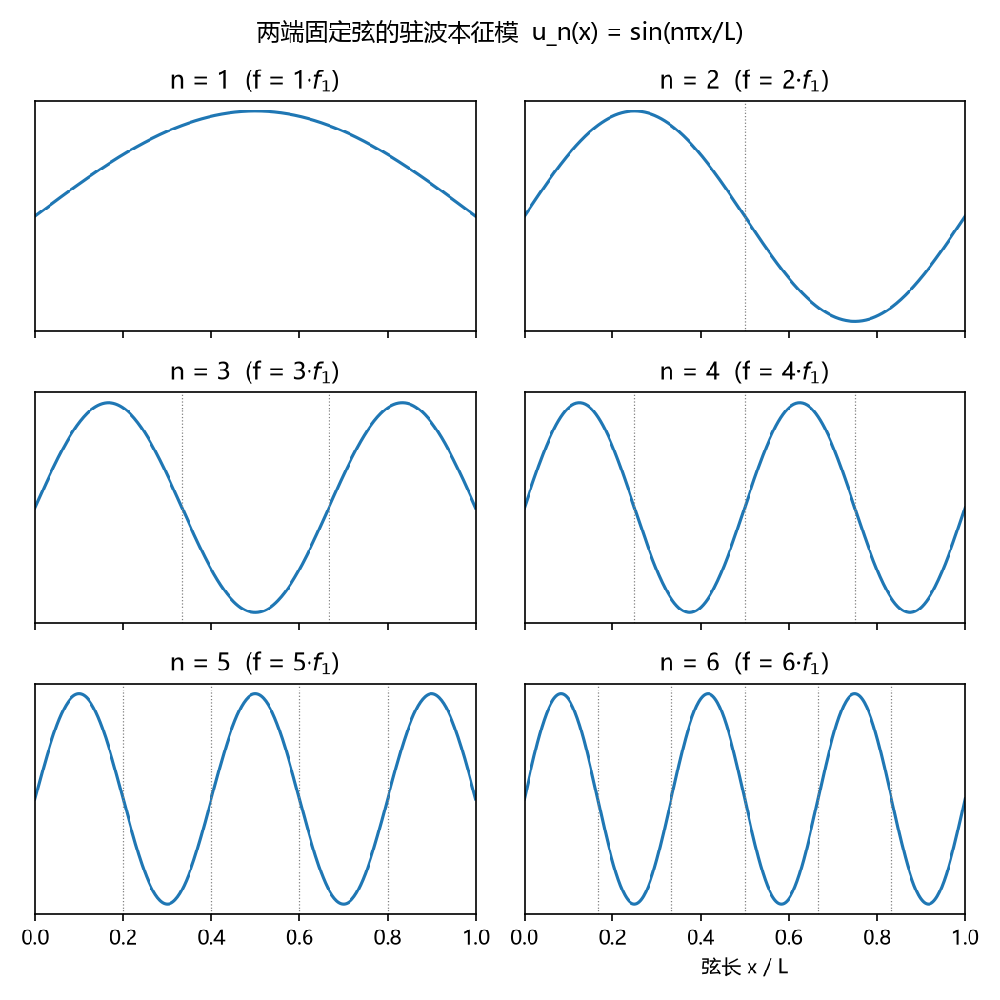
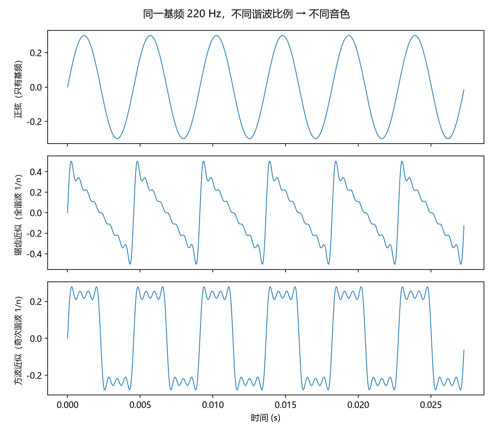
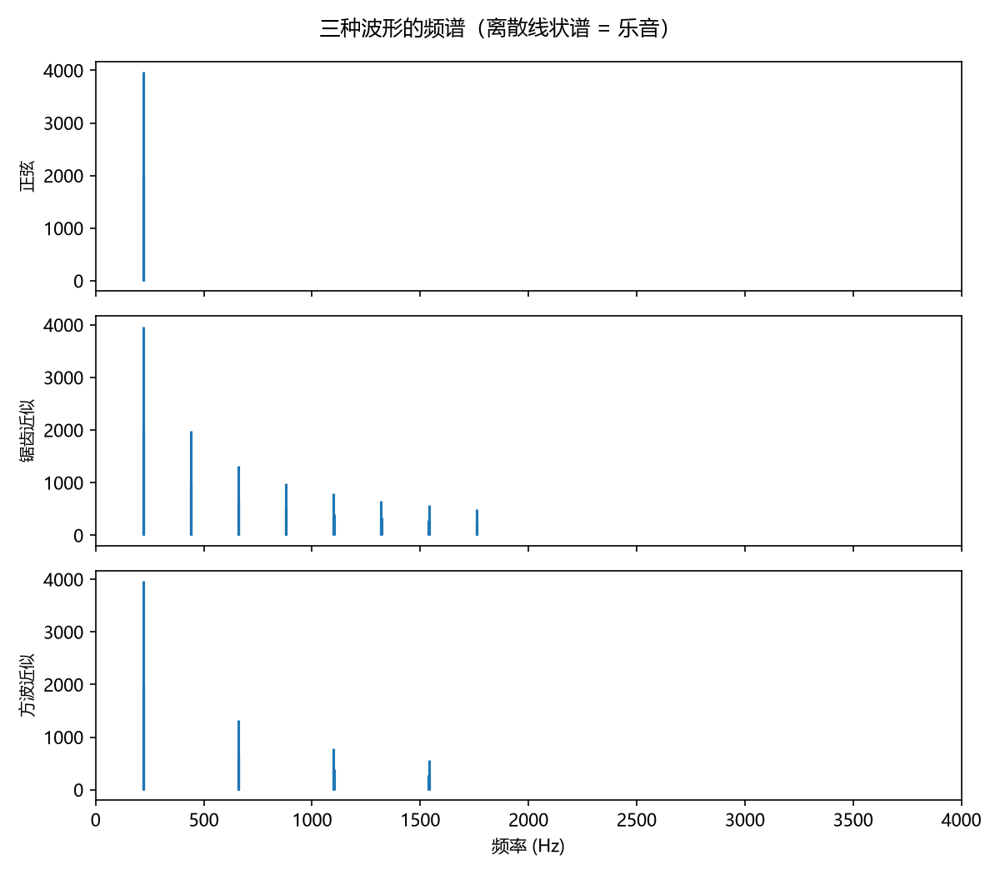

# 波动方程与驻波：谐波序列的物理起源
> ⬆ [上一章：导言：为什么乐理是频率的语言](00-intro.md)

乐理的第一课说"音有高低、长短、强弱、音色"，但一个音到底**是什么**？物理的回答非常朴素：空气压强的周期性波动。而最常见的发声源头之一就是**弦**——小提琴、吉他、琵琶、古筝，本质上都是一根（或几根）绷紧的弦：拨弦、拉弦、弹弦让它振动，再把振动传给琴体放大成声音。演奏者的手指按在弦上的位置一变，弦的**有效长度**就变，音高也跟着变——这个"按弦→变长→变音高"的经验，马上就会被下面的公式解释清楚。所以我们从一根最简单的弦入手：本章从一个最简模型——两端固定的理想弦——出发，基于下文的一维波动方程，严格推导出全书的第一个重要结论：

$$f_n = n\, f_1 \qquad (n = 1, 2, 3, \dots)$$

一根弦不可能发出任意频率；它只能发出 $f_1,\, 2f_1,\, 3f_1,\dots$ 这一串**成整数比**的频率。这就是谐波序列，也就是乐理教材里说的"分音列"。**整个乐音体系（音程、和弦、调式）之所以偏爱简单的整数比，根源就在这里。**

> **乐理小注**：对照 `keywords.md` 第二讲「复合音与分音列」。教材说一个乐音是"复合音"，由基音与若干泛音（分音）组成——所谓基音就是我们的 $f_1$，第 $n$ 分音就是 $n f_1$。这一章的推导将证明：这个结构不是约定，而是波动方程两端固定边界条件的必然结果。

## 一维波动方程

取弦的方向为 $x \in [0, L]$，$u(x,t)$ 表示弦上位置 $x$ 在时刻 $t$ 的横向位移。对理想柔性弦（张力均匀、无刚度、振幅小），$u$ 满足一维波动方程：

$$u_{tt} = c^2\, u_{xx}, \qquad c = \sqrt{\frac{T}{\mu}},$$

其中 $T$ 是张力，$\mu$ 是线密度。两端固定意味着边界条件

$$u(0,t) = 0, \qquad u(L,t) = 0.$$

我们用**分离变量法**求解。设 $u(x,t) = X(x) T(t)$，代入方程得

$$\frac{X''(x)}{X(x)} = \frac{1}{c^2}\frac{T''(t)}{T(t)} = -\lambda,$$

其中 $\lambda$ 是常数（左边只依赖 $x$，右边只依赖 $t$，只能都是常数）。于是 $X(x)$ 满足常微分方程

$$X'' + \lambda X = 0, \qquad X(0) = X(L) = 0.$$

这是经典的**本征值问题**。容易验证：只有当 $\lambda_n = (n\pi/L)^2$（$n=1,2,3,\dots$）时才有非平凡解：

$$X_n(x) = \sin\!\left(\frac{n\pi x}{L}\right).$$

> **乐理小注**：$n$ 从 1 开始而非从 0——这正是教材"分音列"从"第 1 分音"开始的物理原因：$n=0$ 对应恒为零的解，没有意义。对照 `keywords.md` 第二讲「复合音与分音列」。

## 驻波与本征频率

时间部分满足 $T'' + \lambda c^2 T = 0$，即简谐运动，角频率

$$\omega_n = \sqrt{\lambda_n}\, c = \frac{n\pi c}{L}.$$

频率 $f_n = \omega_n/2\pi$，于是

$$f_n = \frac{n c}{2L} = n\, f_1, \qquad f_1 = \frac{c}{2L}.$$

我们把解

$$u_n(x,t) = \sin\!\left(\frac{n\pi x}{L}\right)\cos(2\pi n f_1 t)$$

叫作**第 $n$ 阶驻波（本征模）**。它有 $n$ 个"鼓包"、$n-1$ 个静止不动的节点（位置 $x = kL/n$）。**驻波**的意思是：弦上各点的振动相位同步，只是振幅不同——波形不再"跑"，而是原地起伏。

一张图胜过千言——前 6 阶驻波的形状（`demo_01` 生成）：

▶ 动态版：一根弦从第 1 阶振到第 4 阶，注意节点越来越多、频率成倍升高：

<video controls src="../animations/media/videos/ch01_standing_waves/720p30/StandingWaves.mp4"></video>

## 一般解：音色从何而来

波动方程是线性的，任意解是各阶驻波的线性叠加：

$$u(x,t) = \sum_{n=1}^{\infty} A_n\, \sin\!\left(\frac{n\pi x}{L}\right)\cos(2\pi n f_1 t + \phi_n),$$

其中 $A_n$（振幅）与 $\phi_n$（相位）由初始拨弦方式决定。**这就是音色的数学来源**：同一个基频 $f_1$，不同的 $A_n$ 组合对应不同的波形——锯齿波、方波、或者任何一种你能想象的音色。`demo_01` 用前 8 个谐波分别叠加出锯齿与方波近似。先看时域波形（`demo_01` 生成）：三种波形共享 $f_1 = 220\,\mathrm{Hz}$（周期相同），形状却截然不同：

> **一句话规律**：对常见的拨弦/拉弦，**序号越小的谐波通常振幅越大**——第 1 次谐波（基频）往往最强，越高越弱。这不是物理定律，而是大多数弹拨/弓弦乐器"越粗的振动越容易被激发"的经验事实。它很重要：Ch4 讲纯律时，"第几次谐波重合"决定了两个音听起来的融合程度——越早（序数越小）重合的谐波越响，贡献越大。

它们的频谱（`demo_01` 生成）清楚显示：差别全在各谐波的相对强度——正弦只有基频一条线，锯齿波奇偶次谐波都强（$1/n$），方波只有奇次谐波：

> **乐理小注**：教材第一讲把"音色"列为音的性质之一，并说音色由"泛音的数量、相对强度"决定。对照 `keywords.md` 第一讲「音的性质」——这里的 $A_n$ 序列就是教材说的"泛音的相对强度"。细节（为什么频谱等于音色、乐音与噪音的谱差别）在 Ch2 用傅里叶变换给出。

> **数学注（刚度修正）**：理想弦给出精确的 $f_n = nf_1$。真实琴弦有刚度，频率修正为 $f_n \approx n f_1\sqrt{1 + B n^2}$（$B>0$ 与刚度有关），高次泛音会偏高——钢琴尤其明显，这叫做"非谐性"（inharmonicity）。它不影响本章结论的定性正确性，却是钢琴调律要"拉伸八度"的物理原因。
>
> **为什么"拉伸八度"？** 调律师调八度时，不是盯着基频（基频听感弱、且难对准），而是让**低音的 2 次泛音**与**高音的基频**重合（$2\times f_1$ 对齐）。但高音弦粗而硬，泛音偏高，如果让高音基频严格等于 $2 f_1$，它的第 1 次泛音会偏得更多，反而听不齐。于是调律师把高音八度**稍微调宽一点**，让"偏高的泛音"先对齐。结果就是：钢琴从中央区往高低两端，八度实际都比数学上的 $2:1$ 略宽，音域越向外"拉伸"得越多。这是弹奏与听感都接受的折中。

## 复合音与乐音/噪音的定性预告

一个振动系统（弦、管、鼓膜）的**本征频率集合**决定了它能发出什么音。若本征频率恰为整数倍（$f_1, 2f_1, 3f_1,\dots$），合成信号是**周期的**（周期 $T=1/f_1$），人耳听来有明确的音高——这就是**乐音**。若本征频率不成整数比（鼓、钹），信号不周期，听来无确定音高——这是**噪音**。上一节的频谱图已经给出了直观对比——三种音色共享离散的谱线（乐音），而鼓/钹的连续谱要到 Ch2 才画出来。

> **乐理小注**：对照 `keywords.md` 第一讲「乐音与噪音」。教材从听感区分二者；本书从波形给出更本质的标准：**乐音 = 周期信号 = 离散谐波序列；噪音 = 非周期信号 = 连续谱**。严格证明在 Ch2。

## 练习

**选择题**（答案见 [练习答案](answers.md#ch01)）：

1. 两端固定弦的本征频率满足什么关系？
   - A. $f_n=nf_1$　B. $f_n=nf_1/2$　C. $f_n=f_1/n$　D. $f_n=n^2f_1$
2. $f_1=c/2L$：弦长减半，基频如何变化？
   - A. 减半　B. 翻倍　C. 不变　D. 变为四倍
3. 为什么"一个音是复合音"？
   - A. 经验约定　B. 两端固定边界条件的必然　C. 人耳的习惯　D. 记谱的需要
4. 音色的信息藏在哪里？
   - A. 基频　B. 各阶驻波的振幅序列 $\{A_n\}$　C. 频率轴的范围　D. 振动时间
5. 乐音与噪音的信号差别是什么？
   - A. 周期信号 / 非周期信号　B. 单频 / 多频　C. 振幅大 / 振幅小　D. 弦乐 / 打击乐

**问答题**：

1. 从波动方程和"两端固定"的边界条件出发，解释为什么弦只能产生 $f_n=nf_1$ 的整数倍频率。
2. 泛音振幅 $A_n$ 通常随 n 增大如何变化？这与后文"谐波重合序数越小越强"有什么关系？
3. 同一根弦，手指按在不同位置音高就不同——用公式说明为什么。

> 答案见 [练习答案](answers.md#ch01)。

## 本章小结

- 波动方程 + 两端固定边界条件 ⟹ 本征频率 $f_n = nf_1$。
- "一个音是复合音"不是经验约定，而是边界条件的必然。
- 音色的全部信息都在各阶驻波的振幅 $A_n$ 里。
- 整数倍的本征频率 ⟹ 周期信号 ⟹ 乐音；否则 ⟹ 噪音。

### 乐理 ↔ 频率 对照表（第 1 章）

| 乐理术语 | 频率语言 | 数值/公式 | 讲次 |
|---|---|---|---|
| 基音 | 一阶本征模 | $f_1 = c/2L$ | 第二讲 |
| 第 n 分音（泛音） | 第 n 阶驻波 | $f_n = n f_1$ | 第二讲 |
| 复合音 | 各阶驻波的叠加 | $u = \sum_n A_n \sin(n\pi x/L)\cos(2\pi n f_1 t+\phi_n)$ | 第二讲 |
| 音色 | 谐波振幅序列 $\{A_n\}$ | 见 `figs/01_spectra.png` | 第一讲 |
| 乐音 / 噪音 | 周期信号 / 非周期信号 | 整数倍 / 非整数倍本征频率 | 第一讲 |

**试听**：同一个音高（220 Hz），三种不同的振幅组合——听出音色了吧？纯正弦只有一个频率，锯齿/方波泛音密集：

- 纯正弦（只有基频）：<audio controls src="../demos/audio/01_sine.wav"></audio>
- 锯齿波（奇偶次泛音都强）：<audio controls src="../demos/audio/01_saw.wav"></audio>
- 方波（只有奇次泛音）：<audio controls src="../demos/audio/01_square.wav"></audio>

**复现**：以上图片、音频与动画全部由 `demos/demo_01_wave_modes.py` 与 `animations/scenes/ch01_standing_waves.py` 生成，改动数值后重跑即可（见 `demos/README.md` 与 `animations/README.md`）。

---

**下一章** → [傅里叶变换：音色 = 频谱](02-fourier-and-timbre.md)
