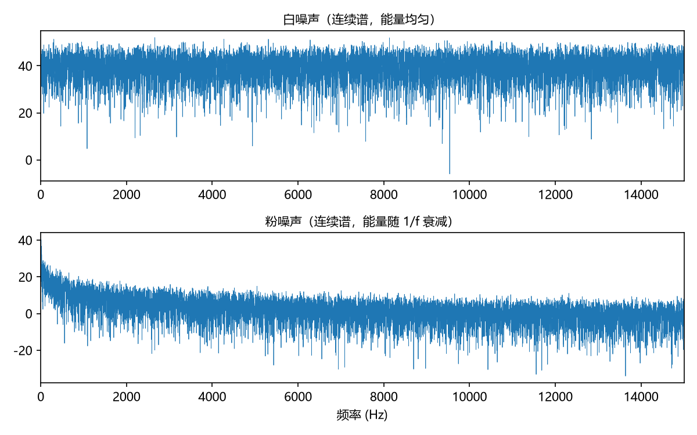
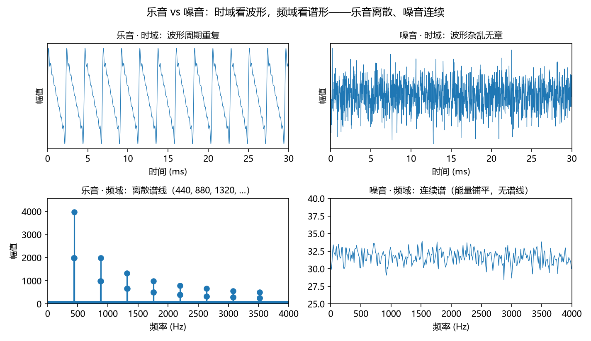
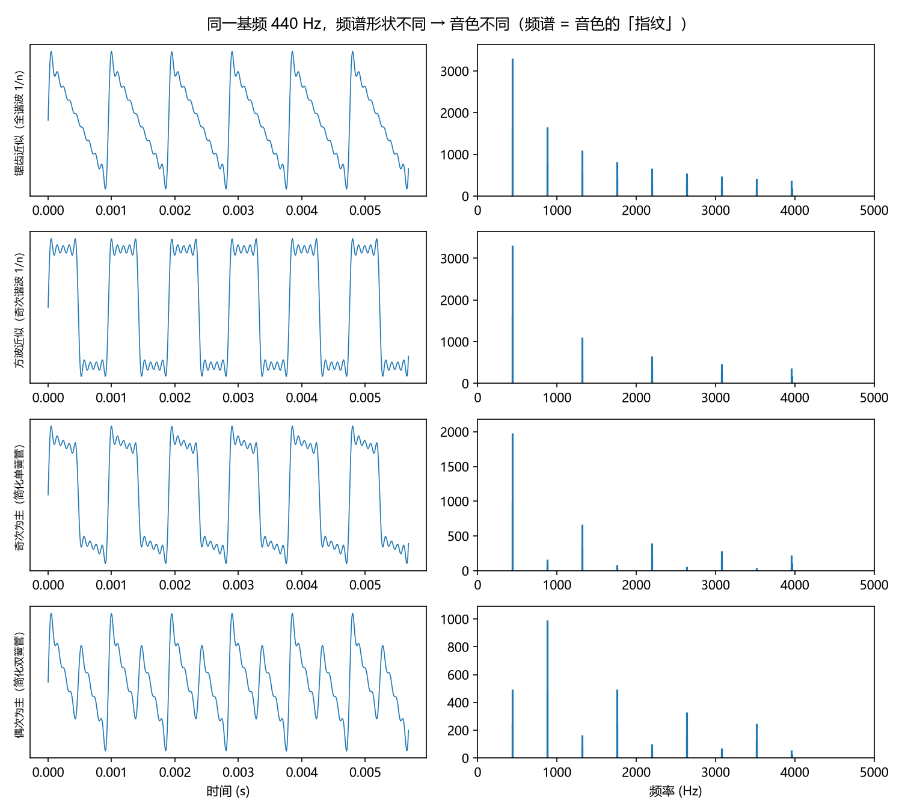
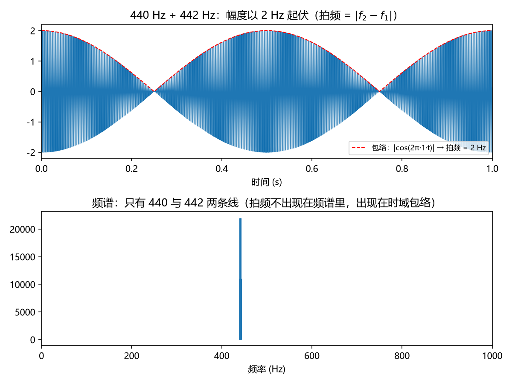

# 傅里叶变换：音色 = 频谱
> ⬆ [上一章：波动方程与驻波：谐波序列的物理起源](01-waves-and-stationary-modes.md)

Ch1 得到一串本征频率，却留下一个问题：这些频率以什么**强度**出现？振幅序列 $\{A_n\}$ 决定音色，但如何从任意一段声音里"读出"它的频率组成？答案就是本章的主角——**傅里叶变换**。它把一段时域信号 $f(t)$ 拆成无数正弦波分量的叠加，让我们能"看"到音色。

## 周期信号的傅里叶级数：离散谱

若 $f(t)$ 是周期为 $T_1 = 1/f_1$ 的**周期信号**（乐音正是如此），它可以写成傅里叶级数：

$$f(t) = \sum_{n=-\infty}^{\infty} c_n\, e^{i 2\pi n f_1 t}, \qquad
c_n = \frac{1}{T_1}\int_{0}^{T_1} f(t)\, e^{-i 2\pi n f_1 t}\, dt.$$

系数 $c_n$ 只在 $n$ 取整数时非零——频率只能取 $f_1$ 的整数倍。这就是**离散线状谱**：周期信号的能量集中在等间距的谱线上。

> **乐理小注**：对照 `keywords.md` 第一讲「乐音与噪音」。教材说乐音有确定的音高、由周期振动产生——傅里叶级数就是这句话的数学形式：**乐音 = 周期信号 = 离散谱**。你的耳朵（本质上是生物傅里叶分析器，见尾声）听到的"音高"就是 $f_1$，听到的"音色"就是 $\{|c_n|\}$ 的形状。

## 非周期信号的傅里叶变换：连续谱

把周期推向无穷（$T_1\to\infty$），离散谱线越来越密，求和变成积分。非周期信号 $f(t)$ 的**傅里叶变换**为

$$\hat f(\omega) = \int_{-\infty}^{\infty} f(t)\, e^{-i\omega t}\, dt,$$

频谱 $\hat f(\omega)$ 是 $\omega$ 的**连续函数**——任何频率都可能出现，能量铺满一段区间而非集中在几根谱线。**噪音**（无确定音高）正是如此。`demo_02` 画出白噪声与粉噪声的连续谱（下图）：白噪声能量随频率均匀，粉噪声按 $1/f$ 衰减——两者都**没有谱线**，这就是"听不出音高"的原因。

把两种谱放在一起，区别一眼可见——同一个乐音（440 Hz 加谐波）的频谱是**一根根离散的谱线**，一段白噪声的频谱是**一条铺满的连续曲线**。这就是全书唯一需要记住的判据：**乐音 = 离散谱，噪音 = 连续谱**。

> **乐理小注**：教材第一讲说"噪音没有固定的音高"。更准确的说法是：噪音的频谱是连续的，人耳无法把它归属到某根基频上。**乐音 vs 噪音 = 离散谱 vs 连续谱**，这是全书唯一需要记住的判据。对照 `keywords.md` 第一讲「乐音与噪音」。

## 反演：傅里叶变换的"合成"方向

频谱告诉我们"有哪些频率、各占多少"，反过来也能由频谱**合成**波形：

$$f(t) = \frac{1}{2\pi}\int_{-\infty}^{\infty} \hat f(\omega)\, e^{i\omega t}\, d\omega.$$

这正是合成器的原理。`demo_02` 用前 9 个谐波按不同比例叠加，就"造"出听感不同的音色（简化"单簧管"用奇次谐波为主，简化"双簧管"用偶次谐波为主）——下图的左右两列分别展示时域波形与频谱。同一基频 440 Hz，仅仅改变 $\{A_n\}$，音色就变了——**音色 = 频谱形状**。

> **乐理小注**：教材第一讲"音的性质"四要素——音高、音值、音强、音色——在频率语言里各有一个精确对应：音高 = 基频 $f_1$，音值 = 时值，音强 = 振幅（更精确是功率），音色 = 频谱 $\{|c_n|\}$。对照 `keywords.md` 第一讲「音的性质」。

## 拍频：两音接近时的"颤动"

若两个频率很接近的正弦同时响，会听到规律的强弱起伏——**拍频**。用积化和差立刻看清：

$$\cos\omega_1 t + \cos\omega_2 t
= 2\cos\!\left(\frac{\omega_1-\omega_2}{2}t\right)\cos\!\left(\frac{\omega_1+\omega_2}{2}t\right).$$

右端是两个因子的乘积：高频因子以平均频率 $(\omega_1+\omega_2)/2$ 振动，低频因子以**差频** $|\omega_1-\omega_2|/2$ 缓慢起伏，叠加后振幅以 $|\omega_1-\omega_2|$ 的频率（即差频）周期性涨落。`demo_02` 用 440 与 442 Hz 演示：听到的"呜呜"起伏每秒 2 次，正是 $442-440=2\,\mathrm{Hz}$（下图上排红色虚线包络）。

> **乐理小注**：拍频在 Ch9 是"协和/不协和"的核心机制——两音的分量太近时互相"打架"，产生粗糙感。现在先记住：**拍频 = 差频 = 振幅调制**，它出现在时域包络里，不出现在频谱里（440+442 的频谱只有两根谱线）。对照 `keywords.md` 第六讲「协和音程与不协和音程」的伏笔。

## 练习

**选择题**（答案见 [练习答案](answers.md#ch02)）：

1. 周期信号的频谱是哪种？
   - A. 连续谱　B. 离散谱　C. 没有谱　D. 拍频
2. 拍频等于什么？
   - A. 频率之和　B. 差频　C. 平均频率　D. 最小公倍数
3. 音色 = ？
   - A. 频谱形状　B. 基频　C. 时值　D. 响度
4. 440 Hz 与 442 Hz 叠加，拍频是多少？
   - A. 1 Hz　B. 2 Hz　C. 441 Hz　D. 882 Hz
5. 非周期信号的频谱是哪种？
   - A. 离散谱　B. 连续谱　C. 拍频　D. 谐波

**问答题**：

1. "乐音 = 离散谱、噪音 = 连续谱"背后的信号性质是什么？
2. 傅里叶变换的"反演"（合成方向）为什么重要？
3. 两个接近的频率叠加为什么会出现拍频？拍频的大小由什么决定？

> 答案见 [练习答案](answers.md#ch02)。

## 本章小结

- 傅里叶级数：周期信号 ⟹ 离散谱；傅里叶变换：非周期信号 ⟹ 连续谱。
- **乐音 = 离散谱，噪音 = 连续谱**。
- **音色 = 频谱形状**（谐波振幅序列）。
- **拍频 = 差频**：两个近频叠加，振幅以差频涨落。

### 乐理 ↔ 频率 对照表（第 2 章）

| 乐理术语 | 频率语言 | 数值/公式 | 讲次 |
|---|---|---|---|
| 乐音 | 周期信号，离散谱 | $f(t)=\sum_n c_n e^{i2\pi n f_1 t}$ | 第一讲 |
| 噪音 | 非周期信号，连续谱 | $\hat f(\omega)=\int f(t)e^{-i\omega t}dt$ | 第一讲 |
| 音色 | 频谱形状 $\{|c_n|\}$ | 见 `figs/02_wave_fft.png` | 第一讲 |
| 拍频 | 差频（振幅调制） | $440$ 与 $442\,\mathrm{Hz}$ → 拍频 $2\,\mathrm{Hz}$ | 第六讲(伏笔) |

**试听**：
- 简化"单簧管"（奇次谐波为主）：<audio controls src="../demos/audio/02_clarinet.wav"></audio>
- 简化"双簧管"（偶次谐波为主）：<audio controls src="../demos/audio/02_oboe.wav"></audio>
- 440 与 442 Hz 的拍频：<audio controls src="../demos/audio/02_beats.wav"></audio>

**动画**：谐波一项一项叠加，波形越来越接近目标方波（只取奇次谐波 1,3,5,7…）——"音色 = 谐波组合"的直观演示：

<video controls src="../animations/media/videos/ch02_fourier_timbre/720p30/FourierTimbre.mp4"></video>

**复现**：以上图片、音频与动画分别由 `demos/demo_02_fourier_timbre.py` 与 `animations/scenes/ch02_fourier_timbre.py` 生成。

---

**下一章** → [对数频率轴：音乐的天然坐标](03-log-frequency-axis.md)
