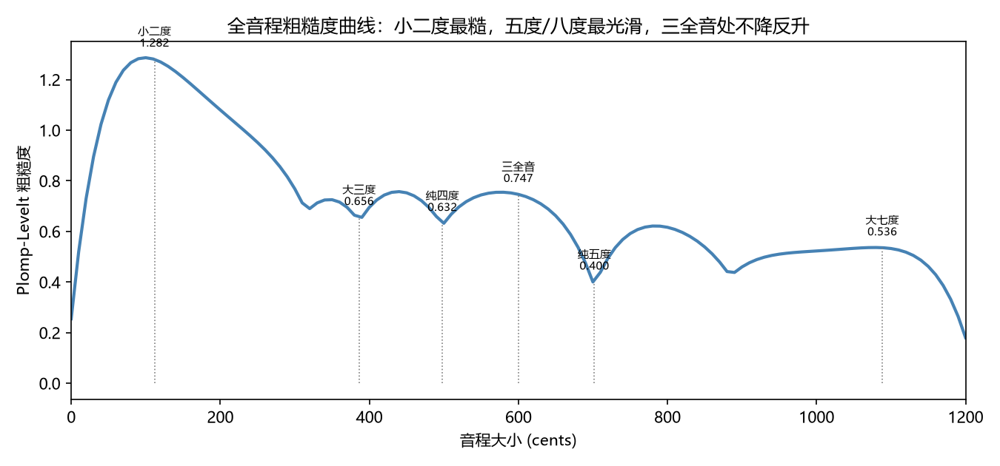
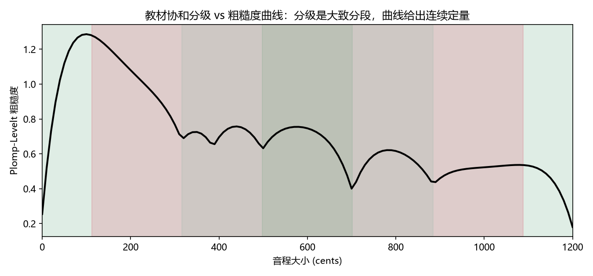

# 协和与不协和：粗糙度曲线
> ⬆ [上一章：音程 = 频率比](08-intervals.md)

第六讲把音程分成协和与不协和，并再细分完全协和、协和、不完全协和、不协和四级。分级从哪来？Ch8 的"谐波重合"只是启发式。本章给出定量的答案：**Plomp–Levelt 粗糙度模型**——两个音同时响时，它们的谐波分量越接近（但没重合），互相"打架"越厉害，听起来越粗糙；粗糙度是一条可以逐音分计算、逐音分画出来的曲线。协和与不协和不再是非此即彼的分类，而是一条连续曲线上的位置。

## 粗糙度的机制

Ch2 的拍频告诉过我们：频率接近的两个分量叠加会产生差频的强弱起伏。Plomp–Levelt（1965）发现，这个"粗糙"的程度随两个分量的**频率间隔相对临界带宽**先升后降：间隔太小（几乎重合）听不出粗糙；间隔渐大，粗糙度升至峰值；间隔再大，人耳能分辨两个分量，粗糙度反而下降。用 Sethares 对数据的拟合：

$$\text{dissonance}(d_s) = e^{-3.5\,d_s} - e^{-5.75\,d_s},
\qquad d_s = \frac{|f_1 - f_2|}{0.24 \cdot \min(f_1, f_2)}.$$

$d_s$ 以临界带宽为单位。一个音有多个谐波，就把**所有谐波分量两两之间**的粗糙度加起来（`common.py` 的 `roughness_plomp_levelt`）。`demo_09` 对主音 220 Hz、另一音从 0 扫到 1200 音分，每个音带前 6 个谐波，得到完整的粗糙度曲线。

## 曲线长什么样

`demo_09 --print-tables` 的关键读数，曲线见下图（图中竖线标出关键音程的位置）：

| 音程 | 音分 | 粗糙度 |
|---|---|---|
| 小二度 | 111.73 | **1.28**（全程最高） |
| 大二度 | 203.91 | 1.08 |
| 小三度 | 315.64 | 0.69 |
| 大三度 | 386.31 | 0.66 |
| 纯四度 | 498.04 | 0.63 |
| **三全音** | 600.00 | **0.75**（局部峰） |
| **纯五度** | 701.96 | **0.40**（低谷） |
| 大六度 | 884.36 | 0.44 |
| 小七度 | 1017.60 | 0.53 |
| **纯八度** | 1200.00 | **0.18**（全局最小） |

三个关键观察：

1. **小二度最糙**（1.28）：两个音只差 100 来音分，谐波互相叠压，正是"刺耳"的来源；
2. **五度、八度是低谷**（0.40 / 0.18）：谐波大量重合（Ch8 的 $\min(a,b)$ 小），粗糙度最低；
3. **三全音处不降反升**（0.75，局部峰）：600 音分处恰好没有低阶谐波重合，但高次谐波的对又不足以拉开到"清晰分辨"——**这就是"三全音最不协和"的机制**。

上面三个观察，各挑一个代表听一遍（都是 C4 上的双音，`demo_09` 合成）——小二度的"刺"、五度的"净"、三全音的"悬"：

- 小二度（C + C♯，粗糙度最高）：<audio controls src="../demos/audio/09_minor_second.wav"></audio>
- 纯五度（C + G，低谷）：<audio controls src="../demos/audio/09_fifth.wav"></audio>
- 三全音（C + F♯，局部峰）：<audio controls src="../demos/audio/09_tritone.wav"></audio>

> **乐理小注**：对照 `keywords.md` 第六讲「协和音程与不协和音程」。教材分四级（完全协和：纯一度/纯八度；协和：纯四/纯五；不完全协和：大小三度、大小六度；不协和：大小二、七度与增四/减五）。下图把教材分级着色叠到曲线上（`demo_09` 生成）——**分级是曲线的粗粒化，曲线是分级的连续化**。教材说"三全音最难听"（中世纪称"音乐中的魔鬼"），曲线给出原因：它落在粗糙度的高点。

## 简单整数比 = 启发式，不是定律

Ch8 的谐波重合（$\min(a,b)$ 小）与本章的粗糙度曲线基本一致：五度、八度、四度、三六度粗糙度低，二七度、三全音高。但两者**不是一回事**：

> **乐理小注**：对照 `keywords.md` 第六讲「协和音程、不协和音程」。教材说"协和音程听起来融合，不协和音程刺耳"，并通常暗示"协和 = 简单整数比"。本章的结论是：**整数比只是途径之一**。一个反例——平均律的纯五度（700.00c）与精确 3:2（701.96c）差近 2 音分，比值"不完美"，却依然极度协和；真正决定协和的是粗糙度（谐波是否落在临界带外）。所以把"简单整数比"当作协和的定义是危险的，粗糙度才是可测量的判据。

- 谐波重合是"几何"的（比值简单 ⟹ 泛音碰在一起），粗糙度是"心理声学"的（碰在一起的泛音若没完全重合就会打架）；
- 一个反例即可说明：平均律的纯五度（700.00c）离精确 3:2（701.96c）差 1.96 音分，谐波**不完全**重合，但粗糙度仍极低——因为 1.96 音分远小于临界带宽，人耳"当作"重合；
- 所以**协和不等于整数比**：整数比只是"接近谐波重合"的一种途径，粗糙度才是可测量的判据。这也是为什么平均律（Ch6）能在大致保留协和的同时获得移调自由——它只偏离理想比值不到 2 音分，粗糙度几乎不变。

## 一个诚实的注脚

教材的四级分类与曲线并非逐条吻合：比如小六度（0.61）比纯四度（0.63）还略"糙"，教材却把纯四度归"协和"、小六度归"不完全协和"。**任何连续模型都不可能完美还原离散分类**——分类反映的是音乐实践中的约定（四度是调性骨架），曲线反映的是物理声学。两者应互相参照，而非互相替代。

## 练习

**选择题**（答案见 [练习答案](answers.md#ch09)）：

1. 粗糙度曲线的全局最高峰在哪个音程？
   - A. 八度　B. 五度　C. 小二度　D. 三全音
2. 八度的粗糙度约为多少？
   - A. 0.18　B. 0.40　C. 0.75　D. 1.28
3. 三全音（600c）的粗糙度约为多少？
   - A. 0.18　B. 0.40　C. 0.75　D. 1.28
4. 协和的定量判据是什么？
   - A. 简单整数比　B. Plomp–Levelt 粗糙度　C. 拍频大小　D. 度数
5. 纯五度的粗糙度约为多少？
   - A. 0.18　B. 0.40　C. 0.75　D. 1.28

**问答题**：

1. 粗糙度模型如何把"五度协和"变成可计算的事实？
2. 为什么三全音是"局部峰"、而小二度是"全局峰"？
3. 教材的协和分级、简单整数比、粗糙度曲线三者之间是什么关系？

> 答案见 [练习答案](answers.md#ch09)。

## 本章小结

- 粗糙度 = 谐波分量两两之间的"打架"总量，逐音分可算。
- 曲线：小二度峰值、五度/八度低谷、三全音局部峰。
- 教材分级 = 曲线的粗粒化；简单整数比 = 启发式；粗糙度 = 定量判据。

### 乐理 ↔ 频率 对照表（第 9 章）

| 乐理术语 | 频率语言 | 数值/公式 | 讲次 |
|---|---|---|---|
| 协和音程 | 低粗糙度 | 五度 0.40、八度 0.18 | 第六讲 |
| 不协和音程 | 高粗糙度 | 小二度 1.28 | 第六讲 |
| 三全音 | 粗糙度局部峰 | 600c → 0.75 | 第六讲 |
| 协和分级 | 粗糙度曲线的分段 | 见 `09_consonance_grading.png` | 第六讲 |

**试听**：六个音程的双音完整听一遍，从最净到最刺（均以 C4 为根音）：

- 纯八度：<audio controls src="../demos/audio/09_octave.wav"></audio>
- 纯五度：<audio controls src="../demos/audio/09_fifth.wav"></audio>
- 大三度：<audio controls src="../demos/audio/09_major_third.wav"></audio>
- 大二度：<audio controls src="../demos/audio/09_major_second.wav"></audio>
- 三全音：<audio controls src="../demos/audio/09_tritone.wav"></audio>
- 小二度：<audio controls src="../demos/audio/09_minor_second.wav"></audio>

**动画**：粗糙度曲线逐音分画出的过程，看三全音如何落在局部峰上：

<video controls src="../animations/media/videos/ch09_roughness/720p30/RoughnessCurve.mp4"></video>

**复现**：以上图片、音频与动画分别由 `demos/demo_09_roughness.py` 与 `animations/scenes/ch09_roughness.py` 生成。

---

**下一章** → [和弦 = 频率比集合](10-chords.md)
