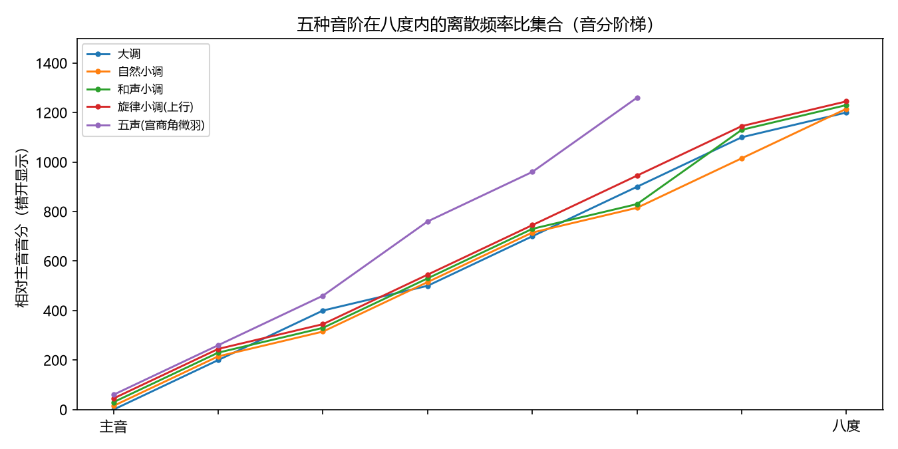
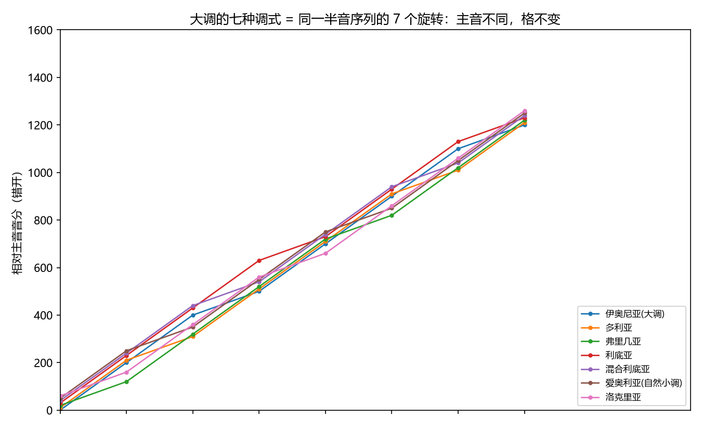
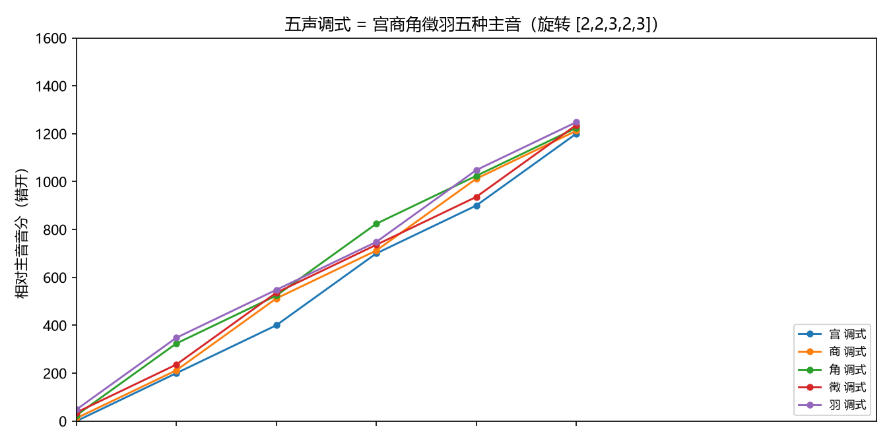

# 音阶与调式：八度的离散划分
> ⬆ [上一章：和弦 = 频率比集合](10-chords.md)

前三部分把单个音（频率）、音程（比值）、和弦（比值集合）都翻译成了频率语言。现在把视角拉远：**一首曲子不是一个音，而是一个"网格"上的游走**。音阶和调式回答的问题是：这个网格长什么样？用哪些频率比？谁说了算（主音）？

## 音阶 = 八度内的离散频率比集合

音乐用不着连续的所有频率——它在一把"阶梯"上行走。**音阶（scale）就是八度内一组离散的频率比**，从主音 $1$ 排到八度 $2$。它完全由"相邻音级的间隔"决定，而这个间隔通常用**半音数**（平均律下）或**音分数**（任意律下）记。

教科书第九讲的音阶，频率语言里就是一张半音序列的表（数值来自 `demos/demo_11_scales_modes.py --print-tables`）：

| 音阶 | 半音序列 | 各音级音分 |
|---|---|---|
| 自然大调 | $[2,2,1,2,2,2,1]$ | 0, 200, 400, 500, 700, 900, 1100 |
| 自然小调 | $[2,1,2,2,1,2,2]$ | 0, 200, 300, 500, 700, 800, 1000 |
| 和声小调 | $[2,1,2,2,1,3,1]$ | 0, 200, 300, 500, 700, 800, 1100 |
| 旋律小调（上行） | $[2,1,2,2,2,2,1]$ | 0, 200, 300, 500, 700, 900, 1100 |
| 五声（宫商角徵羽） | $[2,2,3,2,3]$ | 0, 200, 400, 700, 900 |

先听两条最常用的（`demo_11` 合成，C 起音上行）——大调音阶和五声音阶：

- 自然大调（C D E F G A B C）：<audio controls src="../demos/audio/11_major_scale.wav"></audio>
- 五声（宫商角徵羽，C D E G A）：<audio controls src="../demos/audio/11_pentatonic.wav"></audio>

注意最后一列就是 Ch3 的音分公式 $c = 1200\log_2(f/f_0)$ 应用到每个音级的**离散结果**——音阶是对数频率轴上的七个（或五个）点，下图（`demo_11` 生成）把它们画成错开的阶梯：

> **乐理小注**：对照 `keywords.md` 第九讲「音阶、主音、调性」。教材说"音阶按上行次序排列"；频率语言里"上行"就是音分数从 0 单调增到 1200。**主音是基准点**：音阶里所有音都"相对主音"标音分，主音就是那个 $0$。

## 大调与小调：同一把尺，两种刻度

大调和小调是西方音乐最常用的两把尺。它们的区别只是半音序列不同，而这直接决定了"第 3、6、7 级"落在哪里：

- **大调** $[2,2,1,2,2,2,1]$：第 3、4 级之间是半音（E–F），第 7、8 级之间是半音（B–C）。第 7 级**导音**距主音只差 100 音分（一个半音），是"吸向主音"的磁石（Ch15 展开）。
- **自然小调** $[2,1,2,2,1,2,2]$：第 2、3 级之间是半音。相比大调，第 3、6、7 级各低 100 音分——所以小调"暗"、大调"亮"。把这个印象说得更频谱化一点：小调把三度、六度、七度都往下挪了 100c，等于把"与主音的距离"从大音程换成小音程，而**小音程的谐波重合更晚**（Ch8 的 $\min(a,b)$：大三度 5:4 重合于第 4、5 谐波，小三度 6:5 重合于第 5、6 谐波——晚一级、弱一级），所以小调的第三度、第六度融合度略低、粗糙度略高（Ch9），听感偏"暗"；同时自然小调的第 7 级距主音 200c（大调导音只 100c），少了那份"吸向主音"的张力，结尾更"收"、更内向。
- **和声小调** $[2,1,2,2,1,3,1]$：把自然小调的第 7 级**升半音**（1000c→1100c）制造出导音，代价是第 6、7 级之间出现一个**增二度**（3 个半音 = 300c）——一个不在平均律"正常"刻度里的跨度，听感生硬却充满了向主音解决的能量。
- **旋律小调（上行）** $[2,1,2,2,2,2,1]$：上行时第 6、7 级都升高（避开增二度），下行又回到自然小调。频率语言里：**上行、下行是两条不同的曲线**——音阶在八度内不是固定点集，而是随方向变化的路径。

> **乐理小注**：对照 `keywords.md` 第九讲「自然大调式、三种小调式」。教材的和声小调"升高第 7 级"，正是 Ch14 调式变音思想的一个实例（Ch15 讲导音）。旋律小调上行/下行的不对称，是"音阶是路径而非点集"的最好例子。

## 调式 = 半音序列的旋转

**调式（mode）**是同一套间隔序列、不同主音的七个音阶。大调的七种调式 = 把 $[2,2,1,2,2,2,1]$ 循环移动 $k$ 位：

| 调式 | 半音序列（旋转后） | 各音级音分 |
|---|---|---|
| 伊奥尼亚（大调） | $[2,2,1,2,2,2,1]$ | 0, 200, 400, 500, 700, 900, 1100 |
| 多利亚 | $[2,1,2,2,2,1,2]$ | 0, 200, 300, 500, 700, 900, 1000 |
| 弗里几亚 | $[1,2,2,2,1,2,2]$ | 0, 100, 300, 500, 700, 800, 1000 |
| 利底亚 | $[2,2,2,1,2,2,1]$ | 0, 200, 400, 600, 700, 900, 1100 |
| 混合利底亚 | $[2,2,1,2,2,1,2]$ | 0, 200, 400, 500, 700, 900, 1000 |
| 爱奥利亚（自然小调） | $[2,1,2,2,1,2,2]$ | 0, 200, 300, 500, 700, 800, 1000 |
| 洛克里亚 | $[1,2,2,1,2,2,2]$ | 0, 100, 300, 500, 600, 800, 1000 |

频率语言的关键观察：**七个调式的音级集合（相对各自的第 0 级）都是同一序列的旋转，所以在同一把 $\mathbb{Z}_{12}$ 格子上"形状"相同、只有主音位置不同**（下图 `demo_11` 生成）。C 大调与 A 爱奥利亚用同一组白键，区别只是"谁算 $0$"——这就是 Ch12 关系大小调的前奏。

> **乐理小注**：对照 `keywords.md` 第九讲「调式、调性」。教材说"调式是几个音按一定关系组成的一个体系，以其中一个音为主音"。本章补充：**这组"关系"就是半音序列，主音就是序列的起点**。同一序列旋转出七种调式，"色彩"差异只来自第 3、6、7 级的音分位置。

## 五声调式：宫商角徵羽

五声音阶只用五个音。平均律半音序列 $[2,2,3,2,3]$（宫商角徵羽，C 宫 = C D E G A）旋转出五种调式：

| 调式 | 音分 |
|---|---|
| 宫 | 0, 200, 400, 700, 900 |
| 商 | 0, 200, 500, 700, 1000 |
| 角 | 0, 300, 500, 800, 1000 |
| 徵 | 0, 200, 500, 700, 900 |
| 羽 | 0, 300, 500, 700, 1000 |

（下图为五种五声调式在五格上的旋转，`demo_11` 生成）

观察：五声音阶**没有半音**（最小间隔 200c），所以五个音之间任意两两都不构成小二度——它是"没有紧张度"的平滑网格，这正是五声"平和、兼容"的声学根据。

**五声调式的音律不唯一**（红线：三分损益 / 纯律 / 平均律给出略有不同的五声）。在 C 宫下取纯律小整数比（局部最优）：

| 音级 | 比值 | 音分 |
|---|---|---|
| 宫 | $1$ | 0.00 |
| 商 | $9/8$ | 203.91 |
| 角 | $5/4$ | 386.31 |
| 徵 | $3/2$ | 701.96 |
| 羽 | $5/3$ | 884.36 |

三分损益法给商的 204 音分与纯律的 203.91 相差不到 1 音分（都是"大全音" 9:8），角在三分损益里是 81:64（407.82c，比纯律 5:4 高 21.51c）。**教材通常只给音级关系不给具体频率**；本章指出：五声是八度内的五点集，其精确频率依赖音律选择，属 Ch4–7 的主题在五音子集上的投影。

> **乐理小注**：对照 `keywords.md` 第九讲「五种五声调式」。教材说"宫商角徵羽五种调式"；本章的旋转模型直接给出五张音分表。宫、商、角、徵、羽的名称来自中国古代乐理，主音不同则调式不同——这与大调七调式的数学结构完全相同，只是格子只有五个点。

## 练习

**选择题**（答案见 [练习答案](answers.md#ch11)）：

1. 自然大调的半音序列是哪个？
   - A. $[2,2,1,2,2,2,1]$　B. $[2,1,2,2,1,2,2]$　C. $[2,2,3,2,3]$　D. $[1,3,1]$
2. 和声小调把哪个音级升高半音？
   - A. 第 3 级　B. 第 6 级　C. 第 7 级　D. 第 5 级
3. 五声音阶的半音序列是哪个？
   - A. $[2,2,1,2,2]$　B. $[2,2,3,2,3]$　C. $[2,1,2,2,1]$　D. $[3,1,2,3]$
4. 调式是半音序列的什么操作？
   - A. 平移　B. 旋转　C. 反转　D. 叠加
5. 小调为什么听感更"暗"（用频谱解释）？
   - A. 频率整体偏低　B. 3/6/7 级低 100c → 谐波重合更晚、粗糙度更高　C. 音的数量少　D. 没有导音

**问答题**：

1. "音阶 = 八度内离散频率比集合"——主音在其中的作用是什么？
2. 和声小调如何"制造"导音？付出的代价是什么？
3. 为什么五声音阶的"音律不唯一"？三种律制如何各给一套数值？

> 答案见 [练习答案](answers.md#ch11)。

## 本章小结

- 音阶 = 八度内离散频率比集合；由半音序列（或音分序列）完全决定。
- 大调 $[2,2,1,2,2,2,1]$；三种小调是它的变体（和声小调升第 7 级制造导音，旋律小调上下行不对称）。
- 调式 = 半音序列的旋转：七种大调调式、五种五声调式，主音即序列起点。
- 五声音阶无半音（无小二度），五声的音律不唯一（三分损益/纯律/平均律各有数值）。

### 乐理 ↔ 频率 对照表（第 11 章）

| 乐理术语 | 频率语言 | 数值/公式 | 讲次 |
|---|---|---|---|
| 音阶 | 八度内离散频率比集合 | 半音序列 $[2,2,1,\dots]$ | 第九讲 |
| 主音 | 序列起点（$0$ 音分） | 相对主音标音分 | 第九讲 |
| 大调 / 小调 | 不同的半音序列 | 大 $[2,2,1,2,2,2,1]$、小 $[2,1,2,2,1,2,2]$ | 第九讲 |
| 和声小调 | 升第 7 级 + 增二度 | $[\dots,1,3,1]$ | 第九讲 |
| 调式 | 半音序列的旋转 | 7 调式 / 5 五声调式 | 第九讲 |
| 五声音阶 | 无半音的五点集 | $[2,2,3,2,3]$；音律不唯一 | 第九讲 |

**动画**：音阶与调式如何在八度格子上铺开、旋转：

<video controls src="../animations/media/videos/ch11_scales_modes/720p30/ScalesAndModes.mp4"></video>

**复现**：以上图片、音频与动画分别由 `demos/demo_11_scales_modes.py` 与 `animations/scenes/ch11_scales_modes.py` 生成。

---

**下一章** → [五度循环与调关系：Z₁₂ 上的距离](12-circle-of-fifths-and-key-relations.md)
