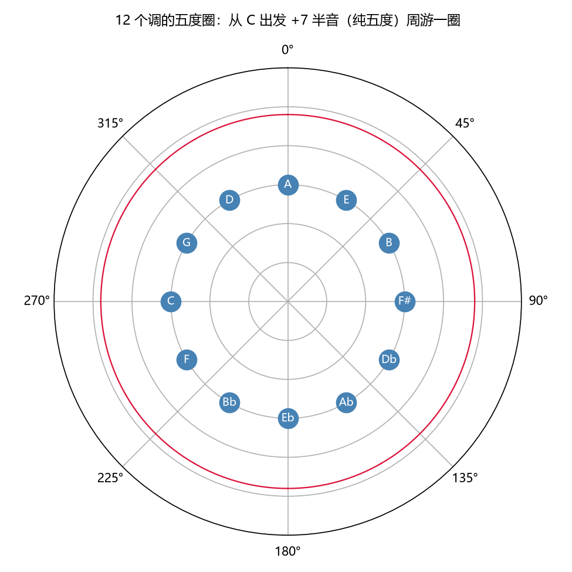
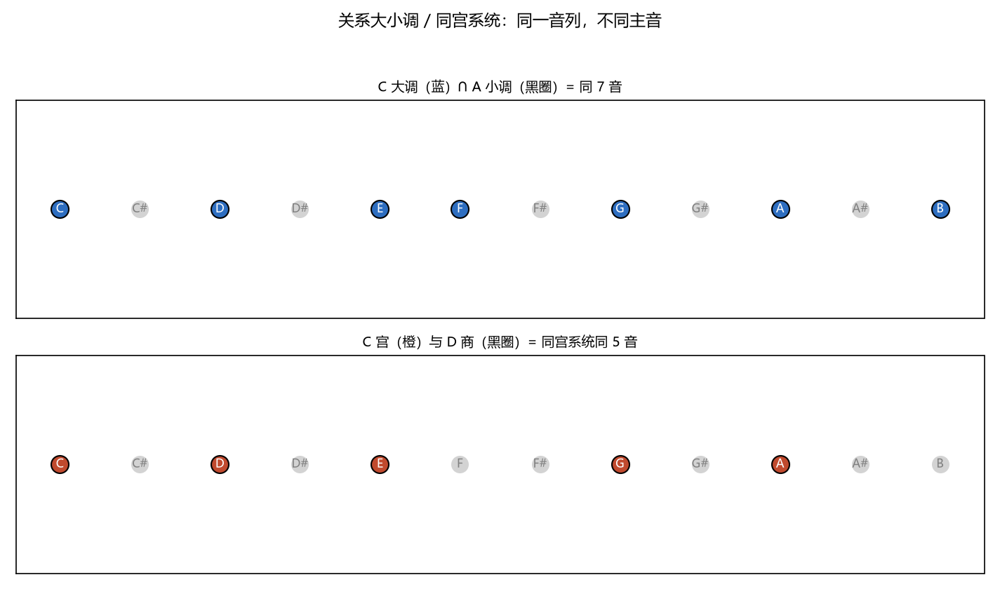
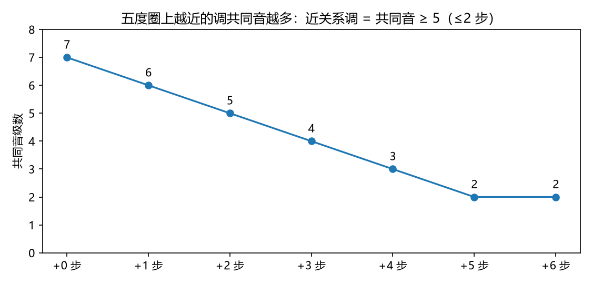

# 五度循环与调关系：$\mathbb{Z}_{12}$ 上的距离
> ⬆ [上一章：音阶与调式：八度的离散划分](11-scales-and-modes.md)

Ch11 说过：调式 = 半音序列 + 主音。把两者合起来就是**调（key）**。那么"哪些调关系近、哪些远"就变成一个纯数学问题：**在 $\mathbb{Z}_{12}$ 这张网格上，主音之间相距几步**。本章用第八、十两讲的术语，兑现这个距离观——尽量让每条结论都能"看图"和"听音"。

## 调 = 主音 + 半音序列

第八讲的"调"和第九讲的"调式"其实是同一个对象的两面：**调式定了半音序列的形状，主音定了它在频率轴上的起点**。频率语言里，一个调就是

$$\text{调} = (\text{半音序列},\ \text{主音音级}),$$

或者说：把 Ch11 的七点集平移到频率轴上的某个位置。C 大调 = (大调序列, C)；A 大调 = (大调序列, A)。"调式相同、主音不同"是同一形状的平移——这就是为什么**移调（Ch13）与换调式（Ch11）是两个正交的操作**。

> **乐理小注**：对照 `keywords.md` 第八讲「调」与第十讲「调与调式的组合」。教材把"调"从"调式"里单独拎出来讲（C 大调、D 大调……）；本章的二元组 $(\text{序列}, \text{主音})$ 把两者合成一个概念——这也解释了"调与调式的组合"为什么能生成 $7 \times 12$（或 $5\times 12$）种组合：序列种类 × 主音数。

## 调的五度循环：$\mathbb{Z}_{12}$ 的 +7 轨道

Ch6 已经建立：12 个音级 = 循环群 $\mathbb{Z}_{12}$，纯五度 = 生成元 $+7$。**调的五度循环就是把这 12 个调主音按 $+7$ 走一圈**——从 C 出发，每步加 7 个半音：

$$C \xrightarrow{+7} G \xrightarrow{+7} D \xrightarrow{+7} A \xrightarrow{+7} E \xrightarrow{+7} B \xrightarrow{+7} F^\sharp \xrightarrow{+7} \cdots \xrightarrow{+7} F \xrightarrow{+7} C.$$

下图（`demo_12` 生成，数值来自 `demos/demo_12_circle_of_fifths.py --print-tables`）把 12 个调画成圆环：

| 圈上位置 | 调 | 主音 | 调号 |
|---|---|---|---|
| 0 | C | 0 | +0# |
| 1 | G | 7 | +1# |
| 2 | D | 2 | +2# |
| 3 | A | 9 | +3# |
| 4 | E | 4 | +4# |
| 5 | B | 11 | +5# |
| 6 | F# | 6 | +6# |
| 7 | Db | 1 | −5b |
| 8 | Ab | 8 | −4b |
| 9 | Eb | 3 | −3b |
| 10 | Bb | 10 | −2b |
| 11 | F | 5 | −1b |

**调号就是轨道坐标**：每走一步加一个升号，过了 F# 改用降号名（等音调，见下）。为什么是五度而不是别的音程来排调？因为五度是"加一个调号"的最小生成步骤——它在 $\mathbb{Z}_{12}$ 上生成的轨道恰好穷尽 12 个调，且每个升/降号对应一次五度移动。

> **乐理小注**：对照 `keywords.md` 第八讲「升号调、降号调、调的五度循环」。教材按调号多少把调排成升号调、降号调两组；本章把它们放到同一个圆上——升号侧 C→G→D→…→F# 加升号，降号侧 C→F→Bb→…→Cb 加降号。**圆圈没有起点**：C 只是记谱上的对称中心，不是数学上的特殊点。

动画（`animations/scenes/ch12_circle_of_fifths.py`）把这段 +7 轨道一圈圈走给你看：

<video controls src="../animations/media/videos/ch12_circle_of_fifths/720p30/CircleOfFifths.mp4"></video>

## 关系大小调：同一音列，主音差 3 半音

C 大调与 A 小调（爱奥利亚/自然小调）用**同一组白键**，只是主音不同（C vs A，相距 3 个半音 / 小六度）：

$$C\ \text{大调} \longleftrightarrow A\ \text{小调},$$

下图左边（`demo_12` 生成）画出：C 大调的音级集合 $\{C,D,E,F,G,A,B\}$ 与 A 小调的 $\{A,B,C,D,E,F,G\}$ **是同一个 7 点集**——A 小调只是把 C 大调的第六级当主音。这类成对的大小调叫**关系大小调**（平行大小调、同名音列大小调）。频率语言：**音级集合相同、基准点（主音）移动 3 个半音**。

听一遍这层"换主音"的关系（`demo_12` 合成）：先是 C 大调音阶上行，停顿后是 A 自然小调——**同样的七个白键，换了个起点**：

<audio controls src="../demos/audio/12_relative.wav"></audio>

> **乐理小注**：对照 `keywords.md` 第十讲「关系大小调」。教材教"大调 VI 级上的小调即其关系小调"。本章的机制是：把大调序列 $[2,2,1,2,2,2,1]$ 从第六级重排，恰好得到自然小调序列 $[2,1,2,2,1,2,2]$——**不是"另一个音阶"，而是同一序列的旋转**（Ch11 的调式观）。因此关系大小调共享同一个五度圈位置。

## 同宫系统：五声的"关系调"

同理，宫商角徵羽的五声调式也成"关系"：**C 宫与 D 商共用同一组五音** $\{C,D,E,G,A\}$，只是主音不同（宫 0 音分 vs 商 200 音分，见上图右边）。这就是第十讲的**同宫系统**——同宫（同音列）内各调互为关系调：

| 调式 | 主音 | 相对宫的音分 |
|---|---|---|
| 宫 | C | 0 |
| 商 | D | 200 |
| 角 | E | 400 |
| 徵 | G | 700 |
| 羽 | A | 900 |

> **乐理小注**：对照 `keywords.md` 第十讲「同宫系统各调」。教材说"宫音相同的五个调式"；本章补充：同宫 = 同音列不同主音，与关系大小调是**同一个数学概念**（旋转），只是格子五点而非七点。宫、商、角、徵、羽五种调式的"色彩"差异（Ch11）在这里显形为"换主音"。

## 同主音调式与等音调

第十讲还有两个"同名"概念：

- **同主音调式**：主音相同、半音序列不同（C 大调 ↔ c 小调）。频率语言：起点相同，形状不同。这是"换格子不换位置"——与关系大小调正好正交。
- **等音调**：12 音格上同一位置、记谱不同（F# 大调 = Gb 大调，7 升 = 6 降）。这是 Ch6 $\mathbb{Z}_{12}$ 商结构的又一实例：**在平均律下，同一音级可以有升、降两种名字**；五度圈过了第 6 步，两个名字是同一个格子的两面。

> **乐理小注**：对照 `keywords.md` 第十讲「同主音调式、等音调式」。教材把"调式相同"与"主音相同"分开分类；本章给出二维格言：**主音 × 序列 = 调**，四个角落（关系大小调、同主音、同宫、等音）不过是"集合相同"与"基准相同"的四种组合。

## 调关系 = 五度圈上的距离

第八、十讲的**调关系**在频率语言里有了定量回答。设两调主音在五度圈上相距 $k$ 步，它们共用多少个音？对 7 音的大调/小调，下图（`demo_12` 生成）把共同音数画成随 $k$ 变化的曲线：

| 距离 k | 主音 | 共同音级数 | 称呼 |
|---|---|---|---|
| 0 | C | 7 | 自身 |
| 1 | G | **6** | 近关系 |
| 2 | D | **5** | 近关系 |
| 3 | A | 4 | 远关系 |
| 4 | E | 3 | 远关系 |
| 5 | B | 2 | 很远 |
| 6 | F# | 2 | 三全音关系（最远） |

教材的**近关系调**（转调最常见的目标调）就是五度圈上 $k \le 2$、共同音 $\ge 5$ 的调——因为共同音越多，"换基准"越顺滑。三全音关系（C ↔ F#）只共享 2 个音，正是 Ch9 最不协和的那对，因此是"最远"的调关系。

> **乐理小注**：对照 `keywords.md` 第八讲「调关系」、第十三讲「近关系调」（Ch13 详述）。教材说近关系调是"调号相差一个的调"；本章把"调号相差"翻译成"五度圈距离"，并给出共同音数这一更本质的度量——**调号是记谱投影，共同音数才是数学内容**。

## 练习

**选择题**（答案见 [练习答案](answers.md#ch12)）：

1. 五度循环是 $\mathbb{Z}_{12}$ 上的哪个轨道？
   - A. $+5$　B. $+7$　C. $+12$　D. $+2$
2. 关系大小调的主音相距几个半音？
   - A. 1　B. 3　C. 4　D. 7
3. 等音调（如 F♯ = G♭）的本质是什么？
   - A. 同一格子的升/降两种记谱　B. 同一音列　C. 同一主音　D. 同一半音序列
4. 近关系调定义为五度圈距离几步以内？
   - A. 1 步　B. 2 步　C. 3 步　D. 4 步
5. C 大调的关系小调是哪个？
   - A. c 小调　B. a 小调　C. g 小调　D. f 小调

**问答题**：

1. "调 = (半音序列, 主音)"——为什么必须同时给出这两个要素？
2. 关系大小调、同宫系统、同主音调式三者有何区别？
3. 为什么说"调关系 = 五度圈距离"？"共同音 ≥ 5"意味着什么？

> 答案见 [练习答案](answers.md#ch12)。

## 本章小结

- 调 = (半音序列, 主音)；调式定形状，主音定位置。
- 五度循环 = $\mathbb{Z}_{12}$ 的 $+7$ 轨道；调号是轨道坐标。
- 关系大小调 / 同宫系统 = 同音列不同主音（旋转）；同主音调式 = 同主音不同形状。
- 等音调 = $\mathbb{Z}_{12}$ 同一格子的升、降两种记谱。
- 调关系 = 五度圈距离：共同音 $\ge 5$（$k\le2$）为近关系调。

### 乐理 ↔ 频率 对照表（第 12 章）

| 乐理术语 | 频率语言 | 数值/公式 | 讲次 |
|---|---|---|---|
| 调 | (半音序列, 主音) | 序列 × 主音 | 第八、十讲 |
| 五度循环 | $\mathbb{Z}_{12}$ 的 $+7$ 轨道 | 12 调一圈 | 第八讲 |
| 升/降号调 | 轨道坐标 | 每步 ±1 记号 | 第八讲 |
| 等音调 | 同一格子的两种记谱 | F# = Gb | 第八讲 |
| 关系大小调 | 同音列，主音相距 3 半音 | C ↔ a | 第十讲 |
| 同宫系统 | 同音列，主音不同 | C 宫 ↔ D 商 | 第十讲 |
| 同主音调式 | 同主音，不同序列 | C 大 ↔ c 小 | 第十讲 |
| 近关系调 | 五度圈距离 ≤ 2 步 | 共同音 ≥ 5 | 第八、十三讲 |

**复现**：以上图片、音频与动画分别由 `demos/demo_12_circle_of_fifths.py` 与 `animations/scenes/ch12_circle_of_fifths.py` 生成。

---

**下一章** → [移调与转调：平移对称性](13-transposition-and-modulation.md)
