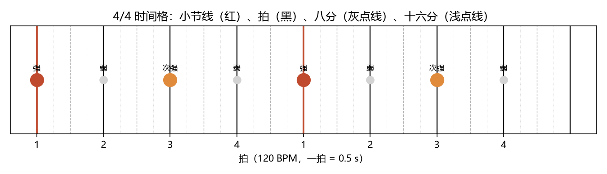
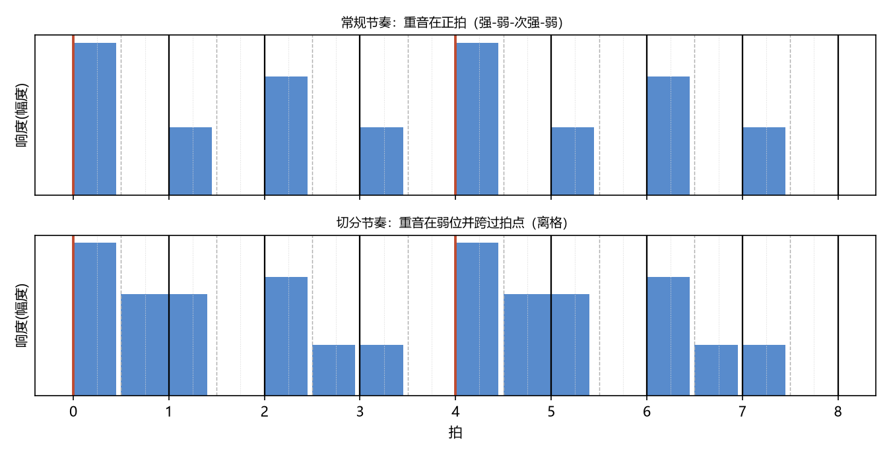
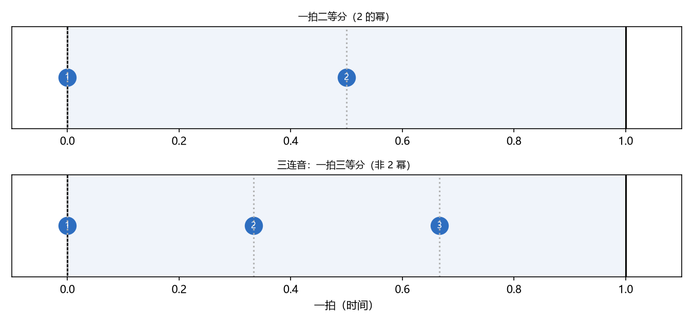
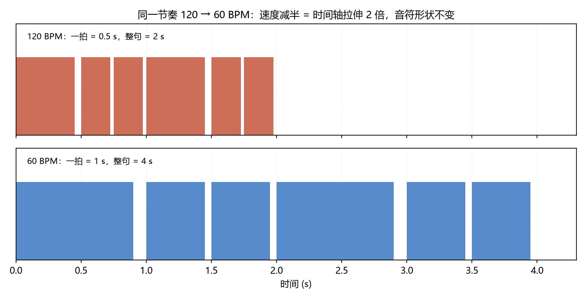
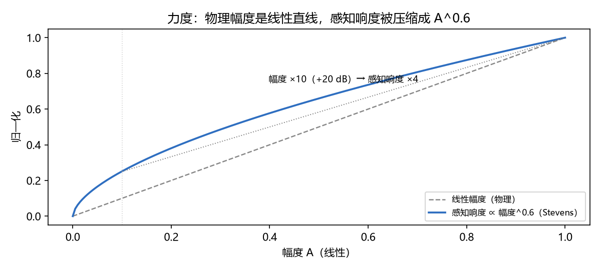

# 节奏、速度与力度：时间格与振幅
> ⬆ [上一章：移调与转调：平移对称性](13-transposition-and-modulation.md)

前 13 章讲的是"用什么音"（频率），本章补上"什么时候响、多响"（时间与振幅）。这两者不共享频率轴的数学结构，但它们同样有格子：**节奏是时间轴上的离散化，力度是振幅轴上的标度**。本章把第四、五两讲压缩成两块：时间格（节拍、切分、连音符）与振幅标度（力度、速度）。

## 时间格：节拍 = 时间轴的均匀离散化

音乐的时间不是连续的流，而是**分层的网格**。先看拍号——**4/4** 读作"四四拍"，分母的 4 说"以四分音符为一拍"，分子的 4 说"每小节有 4 拍"（3/4 就是每小节 3 拍，6/8 就是每小节 6 个八分音符）。4/4 因此给出一套均匀的时间格：每小节 4 拍，每拍可二等分、再二等分（八分、十六分）。下图（`demo_14` 生成）把它画出来：

| 层 | 时长（120 BPM） | 作用 |
|---|---|---|
| 小节 | 4 拍 = 2.0 s | 强拍循环 |
| 拍 | 1 拍 = 0.5 s | 基本单位 |
| 八分 | 0.5 拍 = 0.25 s | 拍内细分 |
| 十六分 | 0.25 拍 = 0.125 s | 进一步细分 |

**这是时间轴上的"平均律"**：所有时值都是 $1/2^k$ 拍（二分、四分、八分、十六分……）。强弱拍由"重音位置"标记：4/4 = 强、弱、次强、弱（第 1、3 拍重）。频率语言里，**重音 = 振幅的离散峰**：强拍振幅高、弱拍振幅低，形成周期性的振幅包络。

> **乐理小注**：对照 `keywords.md` 第四讲「节奏、节拍、拍子、节奏中的强弱关系」。教材说"节拍 = 有重音的相同时间片段的循环"；本章补充：这个"相同片段"就是均匀时间格，重音就是格点上周期性的振幅调制。拍号 4/4、3/4、6/8 不过是格子的取法不同。

## 切分：离开格子的重音

**切分（syncopation）**把重音从正拍挪到弱位，并让音持续跨过拍点：重音不再落在"格点"上，而是落在格子的"缝隙"里。下图（`demo_14` 生成）把常规节奏与切分节奏并排对比——注意切分那行的振幅峰落在两格之间：

听感上的"摇摆/失衡"来自哪里？从声学看，切分把振幅峰从时间格的周期位置**平移了半步**，破坏了"重音每 N 拍循环一次"的规则性——**节奏的张力 = 振幅包络偏离均匀格的量**。听一遍对比（`demo_14` 合成，先常规后切分）：

<audio controls src="../demos/audio/14_rhythm.wav"></audio>

> **乐理小注**：对照 `keywords.md` 第四讲「切分音、切分节奏、切分效果」。教材教"弱拍（弱位）开始、延续过强拍（强位）的音是切分音"。频率语言：切分 = 重音位置偏离时间格点半拍；它制造悬念，随后常"解决"到正拍——和 Ch15 导音解决是同一个原理（偏离网格 → 回到网格）。

## 连音符：非 2 幂的等分

常规时值都是 $2^{-k}$ 拍（二的幂）。**连音符**打破这个约束：**三连音把一拍分成三等分**（每份 $1/3$ 拍），五连音分五等分，等等。$1/3$ 不是 $2^{-k}$，所以三连音"挤"进了一拍的时间——它给均匀格插入了一个**非幂子格**（下图 `demo_14` 生成：同一拍，上面二等分、下面三等分）。记谱上用数字 3 标记；频率语言里它是时间格的一个"不规则细分"，就像纯律的 21.51c 音差是频率轴上的"不规则偏音"一样。

听这个"挤进去"的差别（`demo_14` 合成，先二连音后三连音，同样一拍）：

<audio controls src="../demos/audio/14_triplet.wav"></audio>

> **乐理小注**：对照 `keywords.md` 第四讲「连音符（音符均分的特殊形式）」。教材说"将音值自由均分，以代替基本划分"。本章：基本划分 = 2 幂，连音符 = 其他整数等分。三连音是一拍"被切成 3"而不是"切成 4"——数学上就是 $1/3$ 与 $1/4$ 的区别。

## 速度：时间轴的缩放

**速度（tempo）**不是节奏本身的改变，而是**整个时间轴的缩放**：60 BPM = 一拍 1.0 s，120 BPM = 一拍 0.5 s。同一段节奏，把时间轴压缩一半，就得到双倍速度（下图 `demo_14` 生成，同一段音符在两种速度下的时值分布）。这正是移调（Ch13 的 $T_\lambda$）在时间维的镜像：

同一段节奏先慢后快听一遍（`demo_14` 合成，60 BPM → 120 BPM）：

<audio controls src="../demos/audio/14_tempo.wav"></audio>

$$\text{速度加倍} = \text{时间轴乘 } \frac{1}{2},\qquad \text{移调} = \text{频率轴乘 } \lambda.$$

两者都是"坐标轴的均匀缩放"，都不改变形状——所以速度标记（Allegro、Presto……）是标度记法，与力度记号一样，是"量"的记号而非"质"的记号。

> **乐理小注**：对照 `keywords.md` 第五讲「速度、速度标记」。教材把速度标记分成精确（BPM）与表情（术语）两类；本章：BPM 是时间轴的显式缩放因子，表情术语是它的"心理刻度"。同样的缩放定律在频率轴上是移调——两个轴的对称性贯穿全书。

## 力度：振幅、分贝与 Stevens 幂律

**力度（dynamics）**的物理量是振幅 $A$，但人耳感知响度不是线性的。链条是：

$$A \;\xrightarrow{}\; \text{dB} = 20\log_{10}(A/A_0) \;\xrightarrow{}\; \text{响度} \propto A^{0.6}.$$

下图（`demo_14` 生成）画出这条链：物理幅度每 ×10，dB 加 20，但感知响度只 ×$10^{0.6}\approx 4$。

**Stevens 幂律**（感知响度 ∝ 物理强度的 0.3 次幂，即振幅的 0.6 次幂）说明：耳朵把大动态范围"压缩"成了小感知范围——这就是力度记号只有 pp–ff 几档、却要覆盖巨大音量差异的生理原因。

> **乐理小注**：对照 `keywords.md` 第五讲「力度、力度标记」。教材的力度从 pp 到 ff 是分级记法；本章：每一级约对应 +3~6 dB 的物理增幅，而感知是幂律压缩后的刻度。**注意**：力度记号不是 dB 的线性刻度，教材也从未如此声称——本章只是把"分级"翻译成"标度"。这与 Ch9 的粗糙度（连续曲线 vs 教材分级）是同一类诚实的对照。

## 练习

**选择题**（答案见 [练习答案](answers.md#ch14)）：

1. "4/4 拍"是什么意思？
   - A. 每小节 4 拍、以四分音符为一拍　B. 每小节 4 拍、以八分音符为一拍　C. 4 小节为一拍　D. 44 拍
2. 切分音的本质是什么？
   - A. 重音落在格点上　B. 重音偏离时间格点半拍（弱位起、跨强拍）　C. 三连音　D. 弱拍不出声
3. 三连音等于把一拍等分成几份？
   - A. 2　B. 3　C. 4　D. 6
4. 速度从 60 到 120 BPM，时间轴如何变化？
   - A. 拉长 2 倍　B. 压缩一半　C. 不变　D. 平移
5. 响度与振幅的关系近似为？
   - A. 正比　B. 响度 ∝ 振幅^0.6　C. 响度 ∝ 振幅²　D. 对数

**问答题**：

1. 节奏 = 时间轴的离散化。切分音如何"偏离格子"？
2. 速度（时间轴缩放）与移调（频率轴平移）如何互为镜像？
3. 为什么力度记号只要 pp→ff 几档就够了？物理动态范围如何被压缩？

> 答案见 [练习答案](answers.md#ch14)。

## 本章小结

- 节奏 = 时间轴的离散化：$2^{-k}$ 拍的均匀时间格 + 周期性重音（振幅峰）。
- 切分 = 重音偏离时间格点半拍；连音符 = 非 2 幂等分（三连音 = 1/3 拍）。
- 速度 = 时间轴缩放（60→120 BPM = 压缩一半），与移调互为时/频镜像。
- 力度 = 振幅标度：物理 dB 线性，感知响度是 Stevens 幂律（A^0.6）。

### 乐理 ↔ 频率 对照表（第 14 章）

| 乐理术语 | 频率语言 | 数值/公式 | 讲次 |
|---|---|---|---|
| 节拍 / 拍子 | 均匀时间格 | 4/4、3/4、6/8 | 第四讲 |
| 重音 / 强弱 | 格点上的振幅峰 | 强、弱、次强、弱 | 第四讲 |
| 切分音 | 重音偏离格点半步 | 弱位起、跨强拍 | 第四讲 |
| 连音符 | 非 2 幂等分 | 三连音 = 1/3 拍 | 第四讲 |
| 速度 | 时间轴缩放 | 120 BPM = 0.5 s/拍 | 第五讲 |
| 力度 | 振幅标度 | dB → 响度 ∝ A^0.6 | 第五讲 |

**动画**：时间格如何铺开，重音如何落在格点上循环：

<video controls src="../animations/media/videos/ch14_rhythm/720p30/RhythmMeter.mp4"></video>

**复现**：以上图片、音频与动画分别由 `demos/demo_14_rhythm_and_meter.py` 与 `animations/scenes/ch14_rhythm.py` 生成。

---

**下一章** → [调式变音、导音与旋律](15-chromatic-alteration-and-melody.md)
