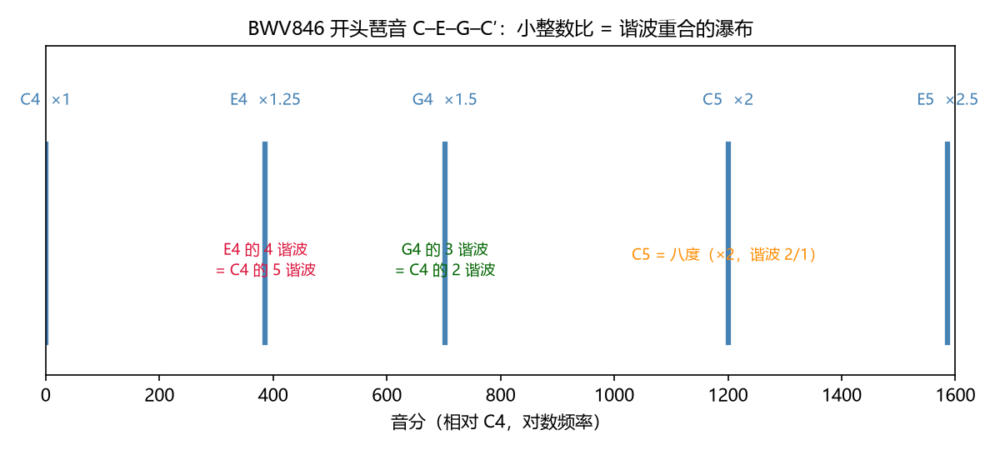
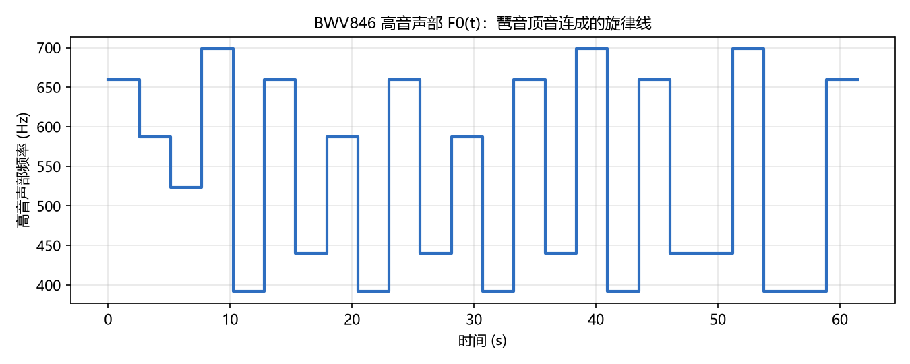
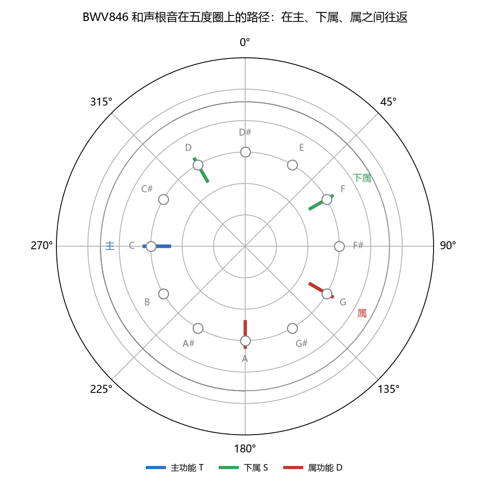

# 乐曲赏析：巴赫《平均律》C 大调前奏曲 BWV846
> ⬆ [上一章：调式变音、导音与旋律](15-chromatic-alteration-and-melody.md)

前面十五章的每一件工具——频率比、谐波重合、粗糙度曲线、五度循环、导音、F0(t)——都不是悬空的术语。这一章把它们全部用在一首真实的曲子上：巴赫《平均律钢琴曲集》第一卷的 C 大调前奏曲（BWV846）。选择它的理由很直接：**它几乎只用"琶音"这一种织体，就把大三和弦、五度循环、导音解决全部摊开在桌面上**——是教科书式的"可以拆给你看"的作品。

先整体听一遍（`demo_16` 合成，24 小节，约 61 秒；真实演奏是羽管键琴/钢琴，这里用合成拨弦音色还原和声骨架）：

<audio controls src="../demos/audio/16_bwv846.wav"></audio>

## 开头琶音：一个大三和弦的"瀑布"

曲子第一小节就是右手在 C 大三和弦上琶音：C4–E4–G4–C5–E5，低音 C3 持续。这就是 Ch4 的三和弦 $4:5:6$，再加一个八度 $2$。把它画成谐波梳（下图，`demo_16` 生成），Ch4/Ch8 的结论直接落地：

- **G4 = 3:2 × C4**：G 的 3 谐波与 C 的 2 谐波重合（五度的"骨骼"）；
- **E4 = 5:4 × C4**：E 的 5 谐波与 C 的 4 谐波重合（三度的"血肉"）；
- **C5 = 2:1 × C4**：八度重合（完全协和，Ch9 粗糙度全局最低 0.18）。

所以这首曲子**开篇第一个和弦就是把"谐波重合的瀑布"直接放给耳朵听**——四个音不是四个随便叠在一起的频率，而是同一根 C 弦的谐波骨架。这解释了为什么它听起来"天然地立得住"。

先听开头 6 小节（`demo_16` 合成：C → Cadd9 → Am → Dm → G7 → C，正好是一条顺滑的五度链）：

<audio controls src="../demos/audio/16_opening.wav"></audio>

## 持续低音 + 分解和弦：F0(t) 与谐波关系并行

全曲织体只有两层：

- **左手**：每小节一个低音（C3、A2、D3、G2……），整小节持续——这是**时间轴的稳定地基**（Ch14 的格点）；
- **右手**：十六分音符琶音，在一个八度上上下下——这是**频率轴上的游走**。

把每小节的琶音"顶音"连起来，就得到一条阶梯状的高音旋律线 F0(t)（下图，`demo_16` 生成）：

注意这条线**不怎么跳**：顶音几乎都在 E5、C5、D5 附近徘徊（±两三度），真正的和声变化藏在低音和和弦本身里。这正是 Ch15 的要点——**旋律是音高线，但音乐的信息远不止音高线**：同一时刻响着的谐波梳（和弦）才是"和声"的所在。

## 和声进行：沿着五度圈兜圈子

把 24 小节的和声骨架列出来（`demo_16 --print-tables`，功能用 T/S/D 标注）：

| 小节 | 和弦 | 功能 | 小节 | 和弦 | 功能 |
|---|---|---|---|---|---|
| 1–2 | C（第 2 小节 Cadd9） | 主 T | 13 | G7 | 属 D |
| 3 | Am | 主 T | 14 | C | 主 T |
| 4 | Dm | 下属 S | 15 | A7（属的属） | 属 D |
| 5 | G7 | 属 D | 16 | Dm | 下属 S |
| 6 | C | 主 T | 17 | G7 | 属 D |
| 7 | F | 下属 S | 18 | C | 主 T |
| 8 | Dm7 | 下属 S | 19 | F | 下属 S |
| 9 | G7 | 属 D | 20 | F/E（经过） | 下属 S |
| 10 | C | 主 T | 21 | Dm | 下属 S |
| 11 | Am7 | 主 T | 22–23 | G7 | 属 D |
| 12 | Dm7 | 下属 S | 24 | C | 主 T |

把每个和弦的**根音**放到五度圈上（下图，`demo_16` 生成）：主功能（C、A）在一角，下属（F、D）在另一角，属功能（G）把两者接起来——全曲就在这个"主–下属–属–主"的三角形里往返，一次都没有走远：

两个要点：

- **五度圈 = 调关系的距离表**（Ch12）：这里用到的根音 C(0)、A(9)、D(2)、G(7)、F(5) 全都在五度圈的"近邻区"，彼此相距 $\le 2$ 步——所以整曲听感"顺"，没有任何突兀的转调；
- **属功能是"发动机"**：每段音乐都以 G7 把张力堆到顶点、再落回 C 释放（m5→6、m9→10、m13→14、m17→18、m22–23→24）。T–S–D–T 这个循环，频率语言里就是 Ch13 说的"在五度圈上做短程旅行"。

## 属七和弦与经过音：导音的"磁力"

为什么 G7→C 特别有"解决感"？把 G7 拆开：G、B、D、F。其中藏着 Ch15 的主角——**导音 B**（距主音 C 仅 100 音分），还有一个**七音 F**（距 E 也是 100 音分）。B 和 F 之间是增四度/减五度——正是 Ch9 粗糙度曲线上那个 0.75 的局部峰（三全音，全曲唯一的"不协和点"）。

解决时，这两个音**向内收拢**：B 上行半音到 C（1100c→1200c），F 下行半音到 E（500c→400c）。一个半音、两个半音，把粗糙度峰值放平、把主音钉死——这就是"属七必须解决"的声学内容（Ch10、Ch12、Ch15 三章在这一小节里汇合）。

听这层收束（`demo_16` 合成，末 6 小节：F → F/E → Dm → G7 → C，低音从 F 一级级走到 C）：

<audio controls src="../demos/audio/16_ending.wav"></audio>

注意末段低音的走向：F → E（经过）→ D → G → C。这不是随机游走——它先是**级进下行**（F–E–D）铺出柔和的过渡，再交给属功能 G7 用"半音磁力"把整段拽回 C。第 20 小节的 F/E（低音 E）尤其妙：低音提前半步落到"主音下方 100 音分"的位置，等于让导音效果**提前闪现**，最后 4 小节的收束因此格外有力。

## 尾声：主音 = 收束吸引子

第 24 小节停在 C 大三和弦上，全曲终结。这不是随便一个终止——前面 23 小节反复做的都是同一件事：**从主音出发，绕到下属、推到属，再让导音把一切吸回来**。C 作为主音，是这条反复循环的"引力中心"（Ch15）。最后一个和弦回到开头的 C–E–G，把整首曲子"环"上了：

- 开头：C 琶音上行，"离开"主音去展示和声骨架；
- 中段：五度圈上往返，张力一次次堆起又释放；
- 结尾：G7→C，导音 B→C、F→E 双双收拢，**回到原点**。

用本书的语言总结：**这首前奏曲是"谐波重合（和声）+ 五度循环（进行）+ 半音引力（解决）"三样东西的完美示范**——没有一个复杂概念，但每一个都精确地"在了它该在的地方"。这就是为什么它可以放心地拿来当范例：把它的和声骨架翻译成频率比和五度圈坐标，几乎零损耗。

> **乐理小注**：对照全书各章——本曲"琶音 = 和弦分解"（Ch10）、"持续低音 = 时间格"（Ch14）、"顶音连成旋律"（Ch15）、"T–S–D–T = 五度圈短程旅行"（Ch12–13）、"属七解决 = 半音吸引子回归"（Ch10/15）。巴赫写这部曲集标题里的"平均律（wohltemperierte）"并不等于严格十二平均律（Ch6 的红线）；但我们在平均律下分析它的和声骨架，结论依然成立——因为本曲不依赖音律的细微差别，只依赖五度、三度、导音这些大尺度的结构。

## 练习

**选择题**（答案见 [练习答案](answers.md#ch16)）：

1. BWV846 开头琶音 C–E–G–C′–E′ 的频率比是哪个？
   - A. 4:5:6　B. 1、5:4、3:2、2、5:2　C. 2:3:4:5:6　D. 1、3:2、2、3:1、4:1
2. G7 和弦由哪些音组成？
   - A. G、B、D　B. G、A、D　C. G、B、C　D. G、B、D、F
3. G7→C 解决时两个半音如何收拢？
   - A. B→C、F→E　B. G→C、D→C　C. F→E、D→C　D. B→C、G→C
4. 全曲 24 小节的功能循环是？
   - A. T–S–D–T　B. T–D–S–T　C. S–T–D–T　D. D–T–S–D
5. B–F 构成的音程是什么？
   - A. 纯四度　B. 大六度　C. 小二度　D. 增四度（三全音）

**问答题**：

1. 为什么 BWV846 适合拿来当全书的"乐曲赏析"范例？它的和声骨架为什么"零损耗"？
2. 为什么 G7→C 比 G→C"更想解决"？请用导音与七音到主音的距离（音分）回答。
3. 第 20 小节的 F/E（低音 E）在五度圈上起什么作用？它如何让收束更有力？

> 答案见 [练习答案](answers.md#ch16)。

## 本章小结

- 一首"琶音织体"的曲子 = 把和弦分解 + 持续低音 + 顶音旋律三件事同时做。
- 和声进行 = 五度圈上的短程旅行（T–S–D–T），属功能是发动机。
- 属七解决 = 导音 B→C 与七音 F→E 的两个半音收拢，粗糙度峰值放平。
- 尾声回主音 = 整个循环的收束吸引子（Ch15 的主音概念）。

### 乐理 ↔ 频率 对照表（第 16 章）

| 乐理术语 | 频率语言 | 数值/公式 | 出处 |
|---|---|---|---|
| 琶音 = 和弦分解 | 把比值集合一个个顺序奏出 | 4:5:6 依次响 | Ch10 |
| 持续低音 | 时间格上的固定格点 | 每小节一个低音 | Ch14 |
| T–S–D–T | 五度圈上的短程往返 | 根音 C/A/D/G/F | Ch12–13 |
| 属七的解决 | 两个半音的向内收拢 | B→C、F→E（100c 各一步） | Ch10/15 |
| 主音收束 | 循环回到引力中心 | C 大三和弦（4:5:6） | Ch15 |

**复现**：以上图片与音频由 `demos/demo_16_bwv846.py` 生成（`--print-tables` 输出 24 小节和声表）。

---

**下一章** → [尾声：从频谱到感知](99-epilogue.md)
